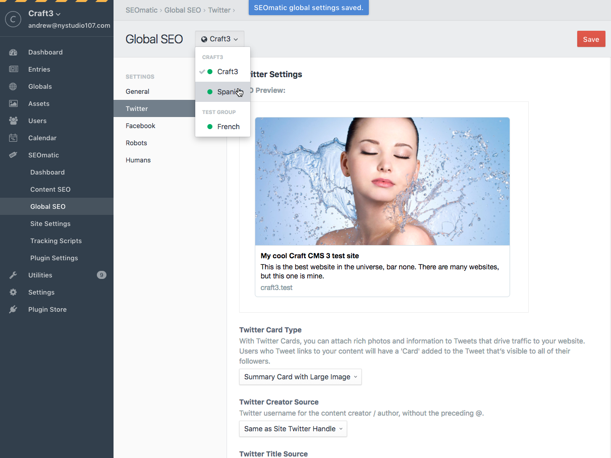
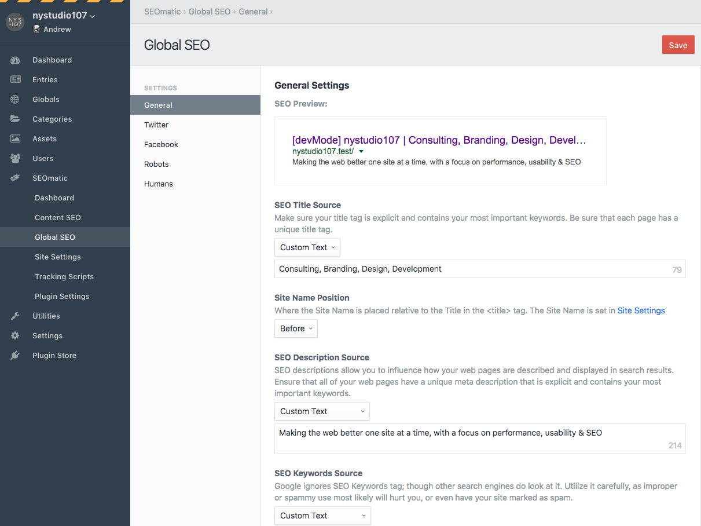
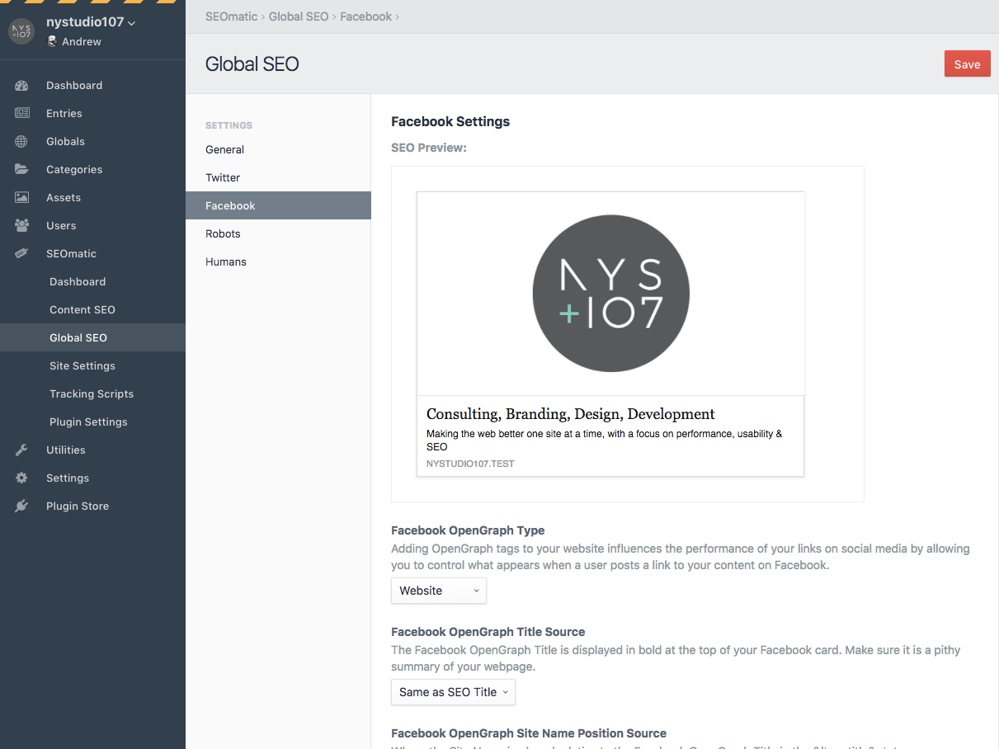
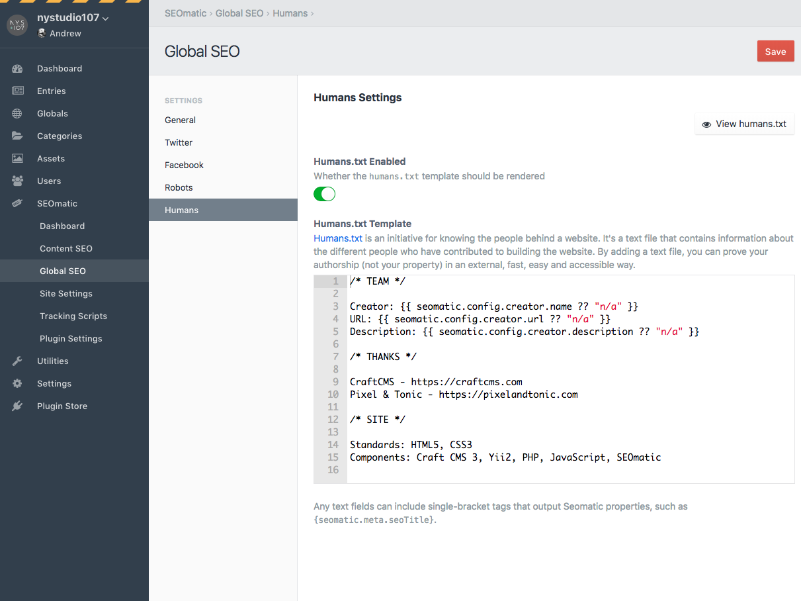
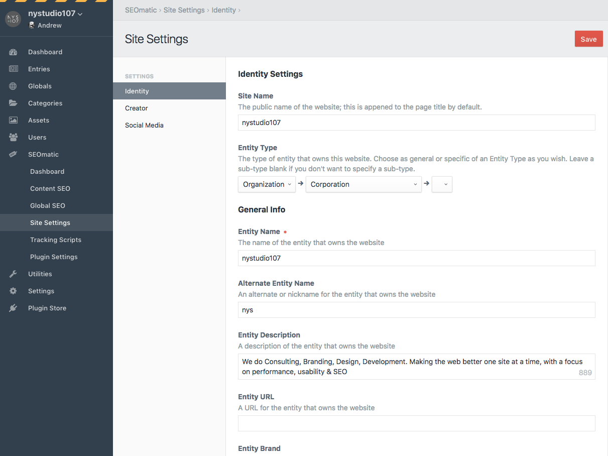
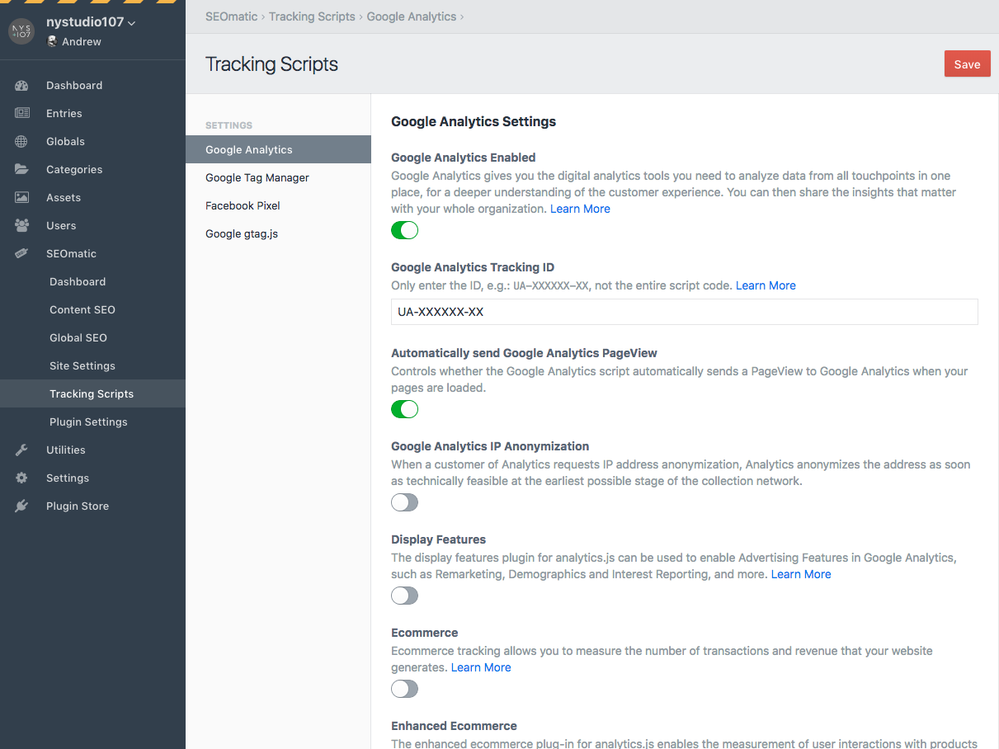
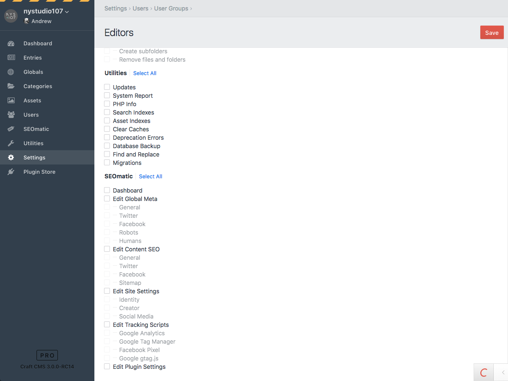

[](https://scrutinizer-ci.com/g/nystudio107/craft-seomatic/?branch=develop)[](https://scrutinizer-ci.com/g/nystudio107/craft-seomatic/?branch=develop)[](https://scrutinizer-ci.com/g/nystudio107/craft-seomatic/build-status/develop)[](https://scrutinizer-ci.com/code-intelligence)

# SEOmatic plugin for Craft CMS 3.x

SEOmatic facilitates [modern SEO best practices](https://nystudio107.com/blog/modern-seo-snake-oil-vs-substance) & implementation for Craft CMS 3. It is a turnkey SEO system that is comprehensive, powerful, and flexible.


Related: [SEOmatic for Craft 2.x](https://github.com/nystudio107/seomatic)

**Note**: This plugin may become a paid add-on when the Craft Plugin store becomes available.

## Requirements

This plugin requires Craft CMS 3.0.0-RC12 or later.

## Installation

To install SEOmatic, follow these steps:

1. Install with Composer via `composer require nystudio107/craft-seomatic:^3.0.0-beta.1`
2. Install plugin in the Craft Control Panel under Settings > Plugins

SEOmatic works on Craft 3.x.

## SEOmatic Beta Notes

SEOmatic for Craft CMS 3 is currently in beta; that means it _may_ be a little rough around the edges. Please report any issues you find to the [SEOmatic Issues](https://github.com/nystudio107/craft-seomatic/issues) page.

The following are currently works in progress:

* **Dashboard** - the Dashboard page doesn't show anything interesting at the moment
* **Content Analytics** - the Content Analytics sidebar doesn't show anything interesting yet
* **Documentation** - the documentation needs to be more fully fleshed out
* **Field** - there is no SEOmatic Field anymore; it's not necessary given the new architecture. Depending on demand, it may be brought back.

## SEOmatic Overview

SEOmatic facilitates [modern SEO best practices](https://nystudio107.com/blog/modern-seo-snake-oil-vs-substance) & implementation for Craft CMS 3. It is a turnkey SEO system that is comprehensive, powerful, and flexible.

SEOmatic allows you to quickly get a website up and running with a robust, comprehensive SEO strategy.  It is also implemented in a Craft-y way, in that it is also flexible and customizable.

It implements [JSON-LD](https://developers.google.com/schemas/formats/json-ld?hl=en) microdata, [Twitter Cards](https://dev.twitter.com/cards/overview) tags, [Facebook OpenGraph](https://developers.facebook.com/docs/sharing/opengraph) tags, [Sitemaps](https://www.sitemaps.org/protocol.html) of your content, [Robots.txt](http://www.robotstxt.org/robotstxt.html) bot directives, [Humans.txt](http://humanstxt.org) authorship accreditation, and as well as HTML meta tags.

SEOmatic populates your templates with SEO Meta in the same way that Craft populates your templates with `entry` variables, with a similar level of freedom and flexibility in terms of how you utilize them.

SEOmatic also caches each unique SEO Meta request so that your website performance is minimally impacted by the rich SEO Meta tags provided.

## Configuring SEOmatic

As soon as you install SEOmatic, it automatically will render meta data on your web pages, and create sitemaps for all of your Sections and Category Groups that have public URLs. You don't need to add any template code for this to happen.



All of SEOmatic's settings are multi-site aware, allowing you to have different settings for each site/language combination.

For SEOmatic to be truly useful, you need to configure it so that it knows where to _pull_ SEO content from.

### Dashboard

### Global SEO

**Global SEO** is where you set all of the default site-wide settings.

#### General



Best practices for modern SEO are for the meta information to _reflect your content_, so you should set up the fields that SEOmatic _pulls_ the **SEO Title**, **SEO Description**, and **SEO Image** from.

#### Twitter


By default, the Twitter and Facebook settings will mirror what you set in the **General** section, but you can customize them to your heart's content.

#### Facebook



By default, the Twitter and Facebook settings will mirror what you set in the **General** section, but you can customize them to your heart's content.

#### Robots


A `robots.txt` file is a file at the root of your site that indicates those parts of your site you don’t want accessed by search engine crawlers. The file uses the [Robots Exclusion Standard](http://www.robotstxt.org/robotstxt.html), which is a protocol with a small set of commands that can be used to indicate access to your site by section and by specific kinds of web crawlers (such as mobile crawlers vs desktop crawlers).

You shouldn't need to edit the default `robots.txt` Template, but you can if you like.

SEOmatic automatically handles requests for `/robots.txt`. For this to work, make sure that you do not have an actual `robots.txt` file in your `web/` folder (because that will take precedence).

If you are running Nginx, make sure that you don't have a line like:

    location = /robots.txt  { access_log off; log_not_found off; }
    
...in your config file.  A directive like this will prevent SEOmatic from being able to service the request for `/robots.txt`.  If you do have a line like this in your config file, just comment it out, and restart Nginx with `sudo nginx -s reload`.

The **View robots.txt** button lets you view your `robots.txt`.

#### Humans



[Humans.txt](http://humanstxt.org/) is an initiative for knowing the people behind a website. It's a text file that contains information about the different people who have contributed to building the website. By adding a text file, you can prove your authorship (not your property) in an external, fast, easy and accessible way.

Feel free to edit the default `humans.txt` Template to your heart's content.

#### Global SEO AdminCP Fields


The fields in the AdminCP Global SEO settings are parsed as Twig object templates, so in addition to plain old text, you can also put single and double bracket Twig expressions.

This is entirely optional; in typical usage the controls you have in the AdminCP for pulling from other fields will be all you need. But the ability is there if you need it.

For example, the following will output the contents of the **companyInfo** field from the **siteInfo** Global:

```twig
{{ siteInfo.companyInfo }}
```

You can even do complex expressions, such as the following which outputs the first field that isn't empty, or a default text:

```twig
{{ siteInfo.companyInfo ?? siteInfo.companySummary ?? "Some default text" }}
```

You can also access SEOmatic global variables (discussed below):

```twig
{seomatic.meta.seoTitle}
```
Normal Twig double bracket syntax is supported too, but you'll need to preface it with `object.` for any `seomatic` variables:

```twig
{{ object.seomatic.meta.seoTitle }}
```

### Content SEO


**Content SEO** is where you can configure each Section and Category Group that has public URLs. You'll see a list of all of your Sections and Category Groups that have public URLs, with status indicators letting you know what has been configured for each.

Click on a Section or Category Group name to edit its settings.

#### General


Best practices for modern SEO are for the meta information to _reflect your content_, so you should set up the fields that SEOmatic _pulls_ the **SEO Title**, **SEO Description**, and **SEO Image** from.

#### Twitter


By default, the Twitter and Facebook settings will mirror what you set in the **General** section, but you can customize them to your heart's content.

#### Facebook


By default, the Twitter and Facebook settings will mirror what you set in the **General** section, but you can customize them to your heart's content.

#### Sitemap


SEOmatic automatically creates a sitemap index for each of your Site Groups. This sitemap index points to individual sitemaps for each of your Sections and Category Groups.

Instead of one massive sitemap that must be updated any time anything changes, only the sitemap for the Section or Category group will be updated when something changes in it.

SEOmatic can automatically include files such as `.pdf`, `.xls`, `.doc` and other indexable file types in Asset fields or Asset fields in matrix blocks.

In addition, SEOmatic can automatically create [Image sitemaps](https://support.google.com/webmasters/answer/178636?hl=en) and [Video sitemaps](https://developers.google.com/webmasters/videosearch/sitemaps) from images & videos in Asset fields or Asset fields in matrix blocks

Sitemap Indexes are automatically submitted to search engines whenever a new Section/Category Group is added.

Section Sitemaps are automatically submitted to search engines whenever a new Element in that Section/Category Group is added.

#### Content SEO AdminCP Fields

The fields in the AdminCP Content SEO settings are parsed as Twig object templates, so in addition to plain old text, you can also put single and double bracket Twig expressions.

This is entirely optional; in typical usage the controls you have in the AdminCP for pulling from other fields will be all you need. But the ability is there if you need it.

For example, the following will output the contents of the **description** field from the current **Entry**:

```twig
{entry.description}
```

Normal Twig double bracket syntax is supported too, but you'll need to preface it with `object.`:

```twig
{{ object.entry.description }}
```

The same applies to any SEOmatic global variables (discussed below):

```twig
{seomatic.meta.seoTitle}
```
Is the same as:

```twig
{{ object.seomatic.meta.seoTitle }}
```

You can even do complex expressions, such as the following which outputs the first field that isn't empty, or a default text:

```twig
{entry.description ?? entry.summary ?? "Some default text"}
```
Is the same as:
```twig
{{ object.entry.description ?? object.entry.summary ?? "Some default text" }}
```

### Site Settings

#### Identity



#### Creator


#### Social Media


### Tracking Scripts

None of the Tracking Scripts are included on the page unless the SEOmatic environment is set to `live` production. If `devMode` is enabled, the SEOmatic environment is automatically set to `local` development.

#### Google Analytics



Google Analytics gives you the digital analytics tools you need to analyze data from all touchpoints in one place, for a deeper understanding of the customer experience. You can then share the insights that matter with your whole organization. [Learn More](https://www.google.com/analytics/analytics/#?modal_active=none)

#### Google `gtag.js`


The global site tag (gtag.js) is a JavaScript tagging framework and API that allows you to send event data to AdWords, DoubleClick, and Google Analytics. Instead of having to manage multiple tags for different products, you can use gtag.js and more easily benefit from the latest tracking features and integrations as they become available. [Learn More](https://developers.google.com/gtagjs/)

#### Google Tag Manager


Google Tag Manager is a tag management system that allows you to quickly and easily update tags and code snippets on your website. Once the Tag Manager snippet has been added to your website or mobile app, you can configure tags via a web-based user interface without having to alter and deploy additional code. [Learn More](https://support.google.com/tagmanager/answer/6102821?hl=en)

#### Facebook Pixel


The Facebook pixel is an analytics tool that helps you measure the effectiveness of your advertising. You can use the Facebook pixel to understand the actions people are taking on your website and reach audiences you care about. [Learn More](https://www.facebook.com/business/help/651294705016616)

#### Plugin Settings


The Plugin Settings lets you control various SEOmatic settings globally (across all sites/languages).

### Access Permissions



SEOmatic allows you to restrict access to various parts of the plugin based on User Group Permissions:

* Dashboard
* Edit Global Meta
  * General
  * Twitter
  * Facebook
  * Robots
  * Humans
* Edit Content SEO
  * General
  * Twitter
  * Facebook
  * Sitemap
* Edit Site Settings
  * Identity
  * Creator
  * Social Media
* Edit Tracking Scripts
  * Google Analytics
  * Google gtag.js
  * Google Tag Manager
  * Facebook Pixel
* Edit Plugin Settings

## Using SEOmatic

### Twig Templating

SEOmatic can work fully without any Twig templating code at all. However, it provides a robust API that you can tap into from your Twig templates should you desire to do so.

SEOmatic makes a global `seomatic` variable available in your Twig templates that allows you to work with the SEOmatic variables and functions.

#### SEOmatic Variables

All of the SEOmatic variables can be accessed as you would any normal Twig variable:

```twig
{{ seomatic.meta.seoTitle }}
```
or
```twig

```

They can also be changed by passing in a value with the Twig `` syntax:

```twig

```
or
```twig

```

You can also set multiple variables at once:

```twig

```

You can set SEOmatic variables anywhere in your templates, even in sub-templates you `include` from other templates. This works because SEOmatic dynamically injects the meta tags, scripts, links, and JSON-LD into your page after the template is done rendering.

SEOmatic variables can also reference other SEOmatic variables using single-bracket syntax:

 ```twig
 
 ```

You can also reference `entry` or `category` Craft variables, if they are present in your template:

 ```twig
 
 ```
or
```twig
 
```

#### Meta Variables: `seomatic.meta`

The `seomatic.meta` variable contains all of the meta variables that control the SEO that will be rendered on the site. They are pre-populated from your settings and content in the AdminCP, but you can change them as you see fit.

##### General Variables:

* **`seomatic.meta.seoTitle`** - the title that is used for the `<title>` tag
* **`seomatic.meta.siteNamePosition`** - controls where the `seomatic.site.siteName` appears relative to the `seomatic.meta.seoTitle` in the `<title>` tag. Valid values are `before`, `after`, or `none`.
* **`seomatic.meta.seoDescription`** - the description that is used for the `<meta name="description">` tag
* **`seomatic.meta.seoKeywords`** - the keywords that are used for the `<meta name="keywords">` tag. Note that this tag is _ignored_ by Google
* **`seomatic.meta.seoImage`** - the image URL that is used for SEO image
* **`seomatic.meta.seoImageDescription`** - a textual description of the SEO image
* **`seomatic.meta.canonicalUrl`** - the URL used for the `<link rel="canonical">` tag. By default, this is set to `{{ craft.app.request.pathInfo }}` or `{entry.url}`/`{category.url}`, but you can change it as you see fit
* **`seomatic.meta.robots`** - the setting used for the `<meta name="robots">` tag that controls how bots should index your website. This variable is also used to set the `X-Robots-Tag` HTTP header. [Learn More](https://developers.google.com/search/reference/robots_meta_tag)

##### Facebook OpenGraph Variables:

* **`seomatic.meta.ogType`** - the value used for the `<meta property="og:type">` tag, such as `website` or `article`
* **`seomatic.meta.ogTitle`** - the value used for the `<meta property="og:title">` tag. This defaults to `{seomatic.meta.seoTitle}`
* **`seomatic.meta.ogSiteNamePosition`** - controls where the `seomatic.site.siteName` appears relative to the `seomatic.meta.ogTitle` in the `<meta property="og:title">` tag. Valid values are `before`, `after`, or `none`.
* **`seomatic.meta.ogDescription`** - the value used for the `<meta property="og:description">` tag. This defaults to `{seomatic.meta.seoDescription}`
* **`seomatic.meta.ogImage`** - the value used for the `<meta property="og:image">` tag. This defaults to `{seomatic.meta.seoImage}`
* **`seomatic.meta.ogImageDescription`** - the value used for the `<meta property="og:image:alt">` tag. This defaults to `{seomatic.meta.seoImageDescription}`

##### Twitter Variables:

* **`seomatic.meta.twitterCard`** - the value used for the `<meta name="twitter:card">` tag, such as `summary` or `summary_large_image`
* **`seomatic.meta.twitterCreator`** - the value used for the `<meta name="twitter:creator">` tag. This defaults to `{seomatic.site.twitterHandle}`
* **`seomatic.meta.twitterTitle`** - the value used for the `<meta name="twitter:title">` tag. This defaults to `{seomatic.meta.seoTitle}`
* **`seomatic.meta.twitterSiteNamePosition` - controls where the `seomatic.site.siteName` appears relative to the `seomatic.meta.twitterTitle` in the `<meta name="twitter:title">` tag. Valid values are `before`, `after`, or `none`.
* **`seomatic.meta.twitterDescription`** - the value used for the `<meta name="twitter:description">` tag. This defaults to `{seomatic.meta.seoDescription}`
* **`seomatic.meta.twitterImage`** - the value used for the `<meta name="twitter:image">` tag. This defaults to `{seomatic.meta.seoImage}`
* **`seomatic.meta.twitterImageDescription`** - the value used for the `<meta name="twitter:image:alt">` tag. This defaults to `{seomatic.meta.seoImageDescription}`


#### Site Variables `seomatic.site`

The `seomatic.site` variable has site-wide settings that are available on a per-site basis for multi-site setups.

* **`seomatic.site.siteName`** - The name of the website
* **`seomatic.site.twitterHandle`** - The site Twitter handle
* **`seomatic.site.facebookProfileId`** - The site Facebook profile ID
* **`seomatic.site.facebookAppId`** - The site Facebook app ID
* **`seomatic.site.googleSiteVerification`** - The Google Site Verification code
* **`seomatic.site.bingSiteVerification`** - The Bing Site Verification code
* **`seomatic.site.pinterestSiteVerification`** - The Pinterest Site Verification code
* **`seomatic.site.sameAsLinks`** - Array of links for Same As... sites, indexed by the handle. So for example you could access the site Facebook URL via `{{ seomatic.site.sameAsLinks["facebook"]["url"] }}`. These links are used to generate the `<meta property="og:same_as">` tags, and are also used in the `sameAs` property in the `mainEntityOfPage` JSON-LD.

#### Config Variables `seomatic.config`

The `seomatic.config` variables are the global plugin configuration variables set in the `config.php` file. You can copy the `config.php` file to the Craft `config/` directory as `seomatic.php` to change them in a multi-environment friendly way.

* **`seomatic.config.pluginName`** - The public-facing name of the plugin
* **`seomatic.config.renderEnabled`** - Should SEOmatic render metadata?
* **`seomatic.config.environment`** - The server environment, either `live`, `staging`, or `local`
* **`seomatic.config.displayPreviewSidebar`** - Should SEOmatic display the SEO Preview sidebar?
* **`seomatic.config.displayAnalysisSidebar`** - Should SEOmatic display the SEO Analysis sidebar?
* **`seomatic.config.devModeTitlePrefix`** - If `devMode` is on, prefix the `<title>` with this string
* **`seomatic.config.separatorChar`** - The separator character to use for the `<title>` tag
* **`seomatic.config.maxTitleLength`** - The max number of characters in the `<title>` tag
* **`seomatic.config.maxDescriptionLength`** - The max number of characters in the `<meta name="description">` tag

#### Helper Functions `seomatic.helper`

* **`seomatic.helper.loadMetadataForUri(URI, SITE_ID)`** - Load the appropriate meta containers for the given `URI` and optional `SITE_ID`
* **`seomatic.helper.sitemapIndexForSiteId(SITE_ID)`** - Get the URL to the `SITE_ID`s sitemap index
* **`seomatic.helper.extractTextFromField(FIELD)`** - Extract plain text from a PlainText, Redactor, CKEdtior, Tags, or Matrix field
* **`seomatic.helper.extractKeywords(TEXT, LIMIT)`** - Extract up to `LIMIT` most important keywords from `TEXT`
* **`seomatic.helper.extractSummary(TEXT)`** - Extract the most important 3 sentences from `TEXT`
* **`seomatic.helper.socialTransform(ASSET, TRANSFORMNAME)`** - Transform the `ASSET` (either an Asset or an Asset ID) for social media sites in `TRANSFORMNAME`; valid values are `base`, `facebook`, `twitter-summary`, and `twitter-large`


#### SEOmatic Tags & Containers

All of the SEOmatic tags, links, scripts, title, and JSON-LD are meta objects that have their values set from the `seomatic.meta` variables.

These meta objects know what properties they should have, and can self-validate. If `devMode` is on, you can check the Yii2 Debug Toolbar's Log to see any validation warnings or errors with your tags.

All of SEOmatic's meta objects are stored in containers, and they can be accessed and manipulated directly. You can even dynamically create new tags via Twig at template render time.

All of the meta object (tags, scripts, links, title, and JSON-LD) have the same API to make it easy to use.

##### Meta Object `.get()`
```twig

```
...will return the `<meta name="description">` meta object to you in `descriptionTag`.

##### Meta Object Properties

You can access meta object properties just like you can any Twig variable:

```twig
{{ descriptionTag.content }}
```
or
```twig

```

They can also be changed by passing in a value with the Twig `` syntax:


```twig

```

All meta objects also have an `include` property that determines whether or not they should be included on your web page:

```twig

```

You could also chain this together in a single line:
```twig

```

And you can set multiple attributes at once:

```twig

```

##### Meta Object `.create()`

To create a new meta object, you pass in a key:value array of the attributes to use when creating it:

```twig

```

By default, newly created meta objects are added to the appropriate meta container, so they will be rendered on the page. Should you wish to create a meta object but _not_ have it added to a container, you can pass in an optional `false` parameter:

```twig

```

##### Meta Object Validation

All meta objects can self-validate:
```twig



    <p>Valid!</p>

    <ul>
        
            <li>
                {{ param ~ " " }}
                <ul>
                    
                        <li>
                            {{ error ~ " " }}
                        </li>
                    
                </ul>
            </li>
        
    </ul>

```

This will output:

* url
  * Must be one of these types: URL

Which tells you that the `url` parameter is invalid.  The default validation just ensures that all of the properties are correct.

You can also set the _scenario_ to display properties that Google requires/recommends:

```twig





    <p>Valid!</p>

    <ul>
        
            <li>
                {{ param ~ " " }}
                <ul>
                    
                        <li>
                            {{ error ~ " " }}
                        </li>
                    
                </ul>
            </li>
        
    </ul>

```

This will output:

* url
  * Must be one of these types: URL
* image
  * This property is recommended by Google.
* author
  * This property is required by Google.
* datePublished
  * This property is required by Google.
* headline
  * This property is required by Google.
* publisher
  * This property is required by Google.
* mainEntityOfPage
  * This property is recommended by Google.
* dateModified
  * This property is recommended by Google.

If the website has `devMode` on, all of the meta objects are automatically validated as they are rendered, with the results displayed in the Yii Debug Toolbar. The Yii Debug Toolbar can be enabled in your account settings page.

#### JSON-LD Meta Object Functions `seomatic.jsonLd`

* **`seomatic.jsonLd.get(META_HANDLE)`** Returns the JSON-LD meta object of the handle `META_HANDLE` or `null` if it is not found
* **`seomatic.jsonLd.create()`** Creates a JSON-LD meta object from an array of key/value properties. The `type` can be any of the [Schema.org](http://schema.org/docs/full.html) types.
* **`seomatic.jsonLd.add(META_OBJECT)`** Adds the `META_OBJECT` to the JSON-LD container to be rendered
* **`seomatic.jsonLd.render()`** Renders all of the JSON-LD meta objects to your template. This is only needed if you have turned off **Automatic Render** in Plugin Settings
* **`seomatic.jsonLd.container()`** Returns the container that holds an array of all of the JSON-LD meta objects

##### JSON-LD Meta Object Examples:

Create a new [Article](http://schema.org/Article) JSON-LD meta object:
```twig

```

#### Link Meta Object Functions `seomatic.link`

* **`seomatic.link.get(META_HANDLE)`** Returns the Link meta object of the handle `META_HANDLE` or `null` if it is not found
* **`seomatic.link.create(CONFIG_ARRAY)`** Creates a Link meta object from an array of key/value properties
* **`seomatic.link.add(META_OBJECT)`** Adds the `META_OBJECT` to the Link container to be rendered
* **`seomatic.link.render()`** Renders all of the Link meta objects to your template. This is only needed if you have turned off **Automatic Render** in Plugin Settings
* **`seomatic.link.container()`** Returns the container that holds an array of all of the Link meta objects

##### Link Meta Object Examples:

Change the `<link rel="canonical">`:
```twig

```

Note that you can achieve the same result with:
```twig

```

...since the `canonicalUrl` populates the `<link rel="canonical">` Link meta object

#### Script Meta Object Functions `seomatic.script`

* **`seomatic.script.get(META_HANDLE)`** Returns the Script meta object of the handle `META_HANDLE` or `null` if it is not found 
* **`seomatic.script.create()`** Creates a Script meta object from an array of key/value properties
* **`seomatic.script.add(META_OBJECT)`** Adds the `META_OBJECT` to the Script container to be rendered
* **`seomatic.script.render()`** Renders all of the Script meta objects to your template. This is only needed if you have turned off **Automatic Render** in Plugin Settings
* **`seomatic.script.container()`** Returns the container that holds an array of all of the Script meta objects

##### Script Meta Object Examples:

Don't include the Google Analytics script on the page:
```twig

```

#### Tag Meta Object Functions `seomatic.tag`

* **`seomatic.tag.get(META_HANDLE)`** Returns the Tag meta object of the handle `META_HANDLE` or `null` if it is not found
* **`seomatic.tag.create()`** Creates a Tag meta object from an array of key/value properties
* **`seomatic.tag.add(META_OBJECT)`** Adds the `META_OBJECT` to the Tag container to be rendered
* **`seomatic.tag.render()`** Renders all of the Tag meta objects to your template. This is only needed if you have turned off **Automatic Render** in Plugin Settings
* **`seomatic.tag.container()`** Returns the container that holds an array of all of the Tag meta objects

##### Tag Meta Object Examples:

Change the `<meta name="twitter:title">`:

```twig

```

Note that you can achieve the same result with:
```twig

```

...since the `twitterTitle` populates the `<meta name="twitter:title">` Tag meta object

#### Title Meta Object Functions `seomatic.title`

* **`seomatic.title.get(META_HANDLE)`** Returns the Title meta object of the handle `META_HANDLE` or `null` if it is not found
* **`seomatic.title.create()`** Creates a Title meta object from an array of key/value properties
* **`seomatic.title.add(META_OBJECT)`** Adds the `META_OBJECT` to the Title container to be rendered
* **`seomatic.title.render()`** Renders Title meta object to your template. This is only needed if you have turned off **Automatic Render** in Plugin Settings
* **`seomatic.title.container()`** Returns the container that holds an array with the Title meta object in it

##### Tag Meta Object Examples:

Change the `<title>`:

```twig

```

Note that you can achieve the same result with:
```twig

```

...since the `seoTitle` populates the `<title">` Title meta object

## Config File Customization

### Config Settings

SEOmatic supports the standard `config.php` multi-environment friendly config file for the plugin settings. Just copy the `config.php` to your Craft `config/` directory as `seomatic.php` and you can configure the settings in a multi-environment friendly way.

These are the same settings that are configured in the **Plugin Settings** in the AdminCP.

### Meta Bundle / Container Settings

The directory `vendor/nystudio107/seomatic/src/seomatic-config` contains a number of files that are used when initially configuring SEOmatic.


You can copy this entire directory to your Craft `config/` directory, and customize the files to your heart's content. SEOmatic will first look in the `config/` directory for any given file, and then fall back on its own internal `seomatic-config` files.

Note that these files are only used when initially creating a meta bundle. That is, whenever the plugin is installed, or new Section or Category Groups are created. Once meta bundles have been created, changing the settings in the file will have no effect.

You can bump the `Bundle.php`'s `bundleVersion` setting if you want it to re-read your config settings.

## Headless SPA API

SEOmatic allows you to fetch the meta information for any page via a controller API endpoint, so you can render the meta data via a frontend framework like VueJS or React.

### Meta Container API Endpoints

To get all of the meta containers for a given URI, the controller action is:

```twig
/actions/seomatic/meta-container/all-meta-containers/?uri=/
```
...where `uri` is the path to obtain the meta information from.

This will return to you an array of meta containers, with the render-ready meta tags in each:

```json
{
    "MetaTitleContainer": "<title>[devMode] Craft3 | Homepage</title>",
    "MetaTagContainer": "<meta name=\"generator\" content=\"SEOmatic\"><meta name=\"referrer\" content=\"no-referrer-when-downgrade\"><meta name=\"robots\" content=\"all\">",
    "MetaLinkContainer": "<link href=\"http://craft3.test/\" rel=\"canonical\"><link type=\"text/plain\" href=\"/humans.txt\" rel=\"author\"><link href=\"http://craft3.test/\" rel=\"alternate\" hreflang=\"es\">",
    "MetaScriptContainer": "",
    "MetaJsonLdContainer": "<script type=\"application/ld+json\">{\"@context\":\"http://schema.org\",\"@type\":\"WebPage\",\"image\":{\"@type\":\"ImageObject\",\"height\":\"804\",\"width\":\"1200\"},\"inLanguage\":\"en-us\",\"mainEntityOfPage\":\"http://craft3.test/\",\"name\":\"Homepage\",\"url\":\"http://craft3.test/\"}</script><script type=\"application/ld+json\">{\"@context\":\"http://schema.org\",\"@type\":\"BreadcrumbList\",\"description\":\"Breadcrumbs list\",\"itemListElement\":[{\"@type\":\"ListItem\",\"item\":{\"@id\":\"http://craft3.test/\",\"name\":\"Homepage\"},\"position\":1}],\"name\":\"Breadcrumbs\"}</script>"
}
```

Should you wish to have the items in the meta containers return as an array of data instead, you can do that with the optional `asArray=true` parameter:

```
/actions/seomatic/meta-container/all-meta-containers/?uri=/&asArray=true
```

Which will return the data in array form:
```json
{
    "MetaTitleContainer": {
        "title": {
            "title": "[devMode] Craft3 | Homepage"
        }
    },
    "MetaTagContainer": {
        "generator": {
            "content": "SEOmatic",
            "name": "generator"
        },
        "referrer": {
            "content": "no-referrer-when-downgrade",
            "name": "referrer"
        },
        "robots": {
            "content": "all",
            "name": "robots"
        }
    },
    "MetaLinkContainer": {
        "canonical": {
            "href": "http://craft3.test/",
            "rel": "canonical"
        },
        "author": {
            "href": "/humans.txt",
            "rel": "author",
            "type": "text/plain"
        },
        "alternate": {
            "href": "http://craft3.test/",
            "hreflang": "es",
            "rel": "alternate"
        }
    },
    "MetaScriptContainer": [],
    "MetaJsonLdContainer": {
        "WebPage": {
            "@context": "http://schema.org",
            "@type": "WebPage",
            "image": {
                "@type": "ImageObject",
                "height": "804",
                "width": "1200"
            },
            "inLanguage": "en-us",
            "mainEntityOfPage": "http://craft3.test/",
            "name": "Homepage",
            "url": "http://craft3.test/"
        },
        "BreadcrumbList": {
            "@context": "http://schema.org",
            "@type": "BreadcrumbList",
            "description": "Breadcrumbs list",
            "itemListElement": [
                {
                    "@type": "ListItem",
                    "item": {
                        "@id": "http://craft3.test/",
                        "name": "Homepage"
                    },
                    "position": 1
                }
            ],
            "name": "Breadcrumbs"
        }
    }
}
```

You can also request individual meta containers.

Title container:

```
/actions/seomatic/meta-container/meta-title-container/?uri=/
```

...will return just the Title container:
```json
{
    "MetaTitleContainer": "<title>[devMode] Craft3 | Homepage</title>"
}
```

Tag container:

```
/actions/seomatic/meta-container/meta-tag-container/?uri=/
```

...will return just the Tag container:
```json
{
     "MetaTagContainer": "<meta name=\"generator\" content=\"SEOmatic\"><meta name=\"referrer\" content=\"no-referrer-when-downgrade\"><meta name=\"robots\" content=\"all\">"
 }
```

Script container:

```
/actions/seomatic/meta-container/meta-script-container/?uri=/
```

...will return just the Script container:
```json
{
    "MetaScriptContainer": ""
}
```

Link container:

```
/actions/seomatic/meta-container/meta-link-container/?uri=/
```

...will return just the Link container:
```json
{
    "MetaLinkContainer": "<link href=\"http://craft3.test/\" rel=\"canonical\"><link type=\"text/plain\" href=\"/humans.txt\" rel=\"author\"><link href=\"http://craft3.test/\" rel=\"alternate\" hreflang=\"es\">"
}
```

JSON-LD container:

```
/actions/seomatic/meta-container/meta-json-ld-container/?uri=/
```

...will return just the JSON-LD container:
```json
{
    "MetaJsonLdContainer": "<script type=\"application/ld+json\">{\"@context\":\"http://schema.org\",\"@type\":\"WebPage\",\"image\":{\"@type\":\"ImageObject\",\"height\":\"804\",\"width\":\"1200\"},\"inLanguage\":\"en-us\",\"mainEntityOfPage\":\"http://craft3.test/\",\"name\":\"Homepage\",\"url\":\"http://craft3.test/\"}</script><script type=\"application/ld+json\">{\"@context\":\"http://schema.org\",\"@type\":\"BreadcrumbList\",\"description\":\"Breadcrumbs list\",\"itemListElement\":[{\"@type\":\"ListItem\",\"item\":{\"@id\":\"http://craft3.test/\",\"name\":\"Homepage\"},\"position\":1}],\"name\":\"Breadcrumbs\"}</script>"
}
```

All of the individual container controller API endpoints also accept the `&asArray=true` parameter if you'd like the data in array form.
 
### Schema.org API Endpoints

To get a key/value array of a given [Schema.org](http://schema.org/docs/full.html) type:

```
/actions/seomatic/json-ld/get-type?schemaType=Article
```

To get a decomposed version of a given [Schema.org](http://schema.org/docs/full.html) type, with the properties grouped by each inherited type:

```
/actions/seomatic/json-ld/get-decomposed-type?schemaType=Article
```


## SEOmatic Meta Object Roadmap

Some things to do, and ideas for potential features:

* Release it

## SEOmatic Changelog

### 3.0.0-beta.1 -- 2018.03.13

* Initial beta release

Brought to you by [nystudio107](https://nystudio107.com/)
