[](https://scrutinizer-ci.com/g/nystudio107/craft-seomatic/?branch=v3) [](https://scrutinizer-ci.com/g/nystudio107/craft-seomatic/?branch=v3) [](https://scrutinizer-ci.com/g/nystudio107/craft-seomatic/build-status/v3) 
[](https://scrutinizer-ci.com/code-intelligence)

# SEOmatic plugin for Craft CMS 3.x

SEOmatic facilitates [modern SEO best practices](https://nystudio107.com/blog/modern-seo-snake-oil-vs-substance) & implementation for Craft CMS 3. It is a turnkey SEO system that is comprehensive, powerful, and flexible.


Related: [SEOmatic for Craft 2.x](https://github.com/nystudio107/seomatic). SEOmatic for Craft CMS 3 is a complete re-write & re-architecture from scratch.

**Note**: _The license fee for this plugin is $99.00 via the Craft Plugin Store._

One SEO-related topic that SEOmatic _does not_ cover is 404 redirects; for that we recommend our [Retour plugin](https://github.com/nystudio107/craft-retour).

## Used By


SEOmatic is the SEO tool that the SEO experts at [Moz.com](https://moz.com/) and the creators of Craft CMS, Pixel & Tonic, rely on to handle their SEO!

## Requirements

This plugin requires Craft CMS 3.0.20 or later.

## Installation

To install SEOmatic, follow these steps:

1. Install with Composer via `composer require nystudio107/craft-seomatic`
2. Install plugin in the Craft Control Panel under Settings > Plugins

You can also install SEOmatic via the **Plugin Store** in the Craft Control Panel.

SEOmatic works on Craft 3.x.

## SEOmatic Usage Notes

### Issues

Please report any issues you find to the [SEOmatic Issues](https://github.com/nystudio107/craft-seomatic/issues) page.

### Upgrading from SEOmatic 1.x for Craft CMS 2.x

If you are upgrading a site from Craft CMS 2.x to Craft CMS 3.x that used the older SEOmatic plugin, here's what you need to know.

SEOmatic will migrate your old Craft 2.x Field settings & data in the following ways:
 
 * The Content SEO settings for each Section where you had an old SEOmatic Meta FieldType will be migrated for you.
 
* If you add a new SEO Settings Field to a section that had an old SEOmatic Meta field in it, it will migrate any custom data you had entered on a per-Entry basis

**Important:** Keep your old Craft 2.x Seomatic_Meta fields intact; don't delete them or change the Field type to the new SEO Settings field type. Instead, create a new SEO Settings field in the same Section, Category Group, or Commerce Product Type. It will automatically look for and migrate data from the old Seomatic_Meta Field.

SEOmatic for Craft CMS 3 is a complete re-write and re-architecture from scratch of the plugin. This allowed us to take what we learned from SEOmatic 1.x, and rebuild it with a much more robust and extendable architecture.

If feasible, we think the best way to update sites using SEOmatic is to start fresh, and explore how the conceptual changes in the plugin affect how you use it. In most cases, you don't even need to use an SEOmatic Field, and the setup is cleaner and easier without it! We hope you love it!

**N.B.:** The Twig templating syntax has changed (but you may not need to use Twig at all with the new version), so give the docs a once-over.

## SEOmatic Overview

SEOmatic facilitates [modern SEO best practices](https://nystudio107.com/blog/modern-seo-snake-oil-vs-substance) & implementation for Craft CMS 3. It is a turnkey SEO system that is comprehensive, powerful, and flexible.

SEOmatic allows you to quickly get a website up and running with a robust, comprehensive SEO strategy.  It is also implemented in a Craft-y way, in that it is also flexible and customizable.

It implements [JSON-LD](https://developers.google.com/schemas/formats/json-ld?hl=en) microdata, [Twitter Cards](https://dev.twitter.com/cards/overview) tags, [Facebook OpenGraph](https://developers.facebook.com/docs/sharing/opengraph) tags, [Sitemaps](https://www.sitemaps.org/protocol.html) of your content, [Robots.txt](http://www.robotstxt.org/robotstxt.html) bot directives, [Humans.txt](http://humanstxt.org) authorship accreditation, and as well as HTML meta tags.

SEOmatic populates your templates with SEO Meta in the same way that Craft populates your templates with `entry` variables, with a similar level of freedom and flexibility in terms of how you utilize them.

SEOmatic works automatically with Craft Commerce 2 as well, providing metadata, JSON-LD structured data, and sitemaps for your Products.

SEOmatic also caches each unique SEO Meta request so that your website performance is minimally impacted by the rich SEO Meta tags provided.

## SEO Resources

### Crafting Modern SEO Presentation:

[](http://dotall.com/sessions/seo-best-practices-from-a-developers-point-of-view)

* [Crafting Modern SEO slide deck](https://speakerdeck.com/nystudio107/crafting-modern-seo)

### Articles on SEO/SEOmatic:

* [Advanced SEOmatic Tips](https://nystudio107.com/blog/tips-for-using-seomatic-effectively)

* [Modern SEO: Snake Oil vs. Substance](https://nystudio107.com/blog/modern-seo-snake-oil-vs-substance)

* [JSON-LD, Structured Data and Erotica](https://nystudio107.com/blog/json-ld-structured-data-and-erotica)

## Configuring SEOmatic

As soon as you install SEOmatic, it automatically will render meta data on your web pages, and create sitemaps for all of your Sections, Category Groups, and Commerce Product Types that have public URLs. You don't need to add any template code for this to happen.


All of SEOmatic's settings are multi-site aware, allowing you to have different settings for each site/language combination.

For SEOmatic to be truly useful, you need to configure it so that it knows where to _pull_ SEO content from.

**N.B.** Please ensure that you set up your [Multi-Environment Config Settings](#multi-environment-config-settings) if you will be using SEOmatic across multiple environments.

### Dashboard

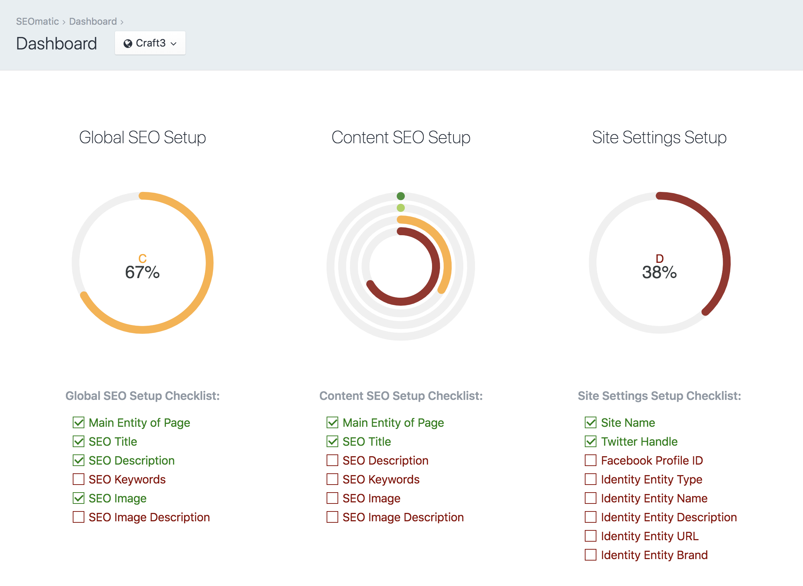

The Dashboard gives you an overview of how fully set up your SEO setting in SEOmatic are, for Global SEO, Content SEO, and Site Settings.

Click on any of the graphs to jump to the section in question to fill things out in more detail.

### Global SEO

**Global SEO** is where you set all of the default site-wide settings.

#### General


Best practices for modern SEO are for the meta information to _reflect your content_, so you should set up the fields that SEOmatic _pulls_ the **SEO Title**, **SEO Description**, and **SEO Image** from.

#### Twitter

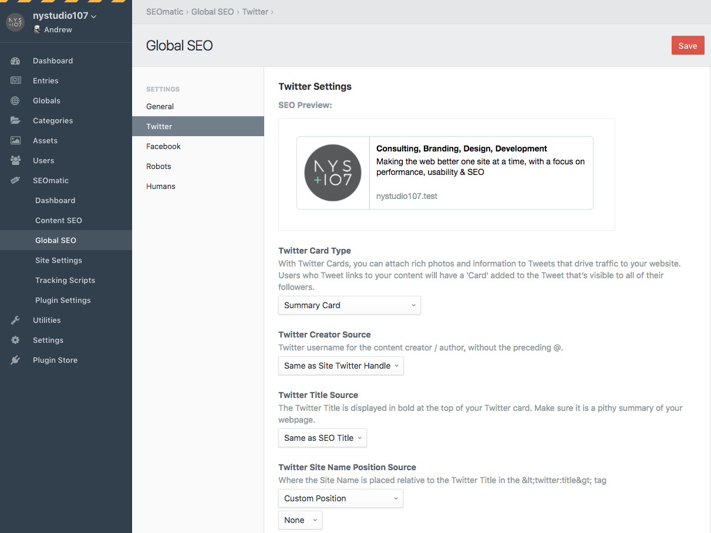

By default, the Twitter and Facebook settings will mirror what you set in the **General** section, but you can customize them to your heart's content.

#### Facebook


By default, the Twitter and Facebook settings will mirror what you set in the **General** section, but you can customize them to your heart's content.

#### Robots

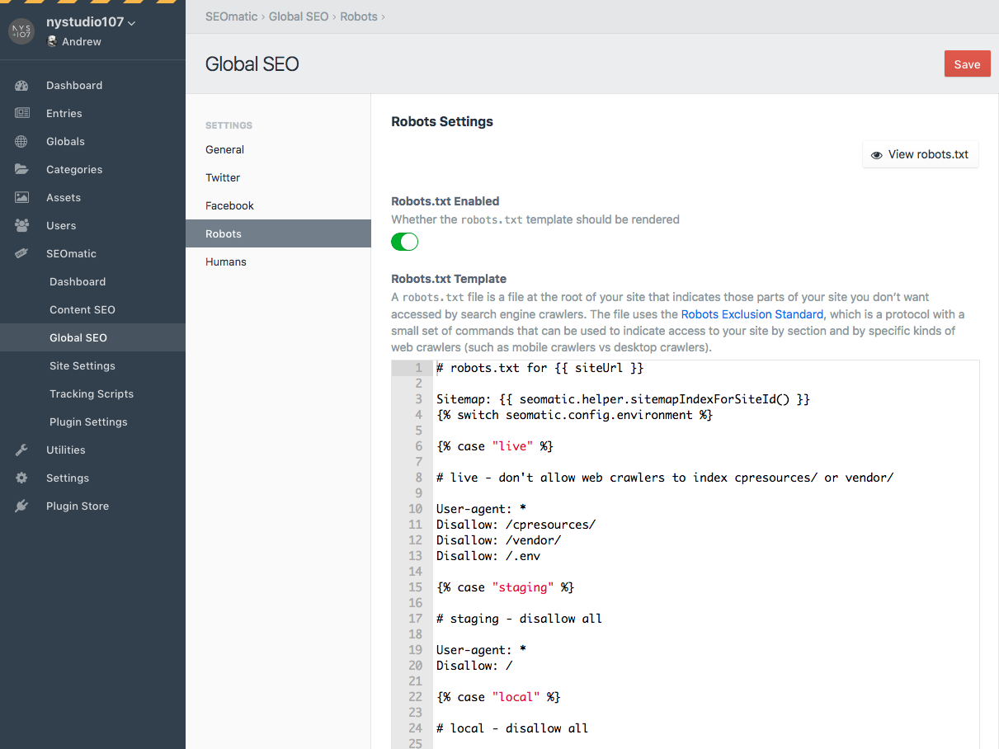

A `robots.txt` file is a file at the root of your site that indicates those parts of your site you don’t want accessed by search engine crawlers. The file uses the [Robots Exclusion Standard](http://www.robotstxt.org/robotstxt.html), which is a protocol with a small set of commands that can be used to indicate access to your site by section and by specific kinds of web crawlers (such as mobile crawlers vs desktop crawlers).

You shouldn't need to edit the default `robots.txt` Template, but you can if you like.

SEOmatic automatically handles requests for `/robots.txt`. For this to work, make sure that you do not have an actual `robots.txt` file in your `web/` folder (because that will take precedence).

If you are running Nginx, make sure that you don't have a line like:

    location = /robots.txt  { access_log off; log_not_found off; }
    
...in your config file.  A directive like this will prevent SEOmatic from being able to service the request for `/robots.txt`.  If you do have a line like this in your config file, just comment it out, and restart Nginx with `sudo nginx -s reload`.

The **View robots.txt** button lets you view your rendered `robots.txt`.

#### Humans


[Humans.txt](http://humanstxt.org/) is an initiative for knowing the people behind a website. It's a text file that contains information about the different people who have contributed to building the website. By adding a text file, you can prove your authorship (not your property) in an external, fast, easy and accessible way.

Feel free to edit the default `humans.txt` Template to your heart's content.

The **View humans.txt** button lets you view your rendered `humans.txt`.

#### Ads

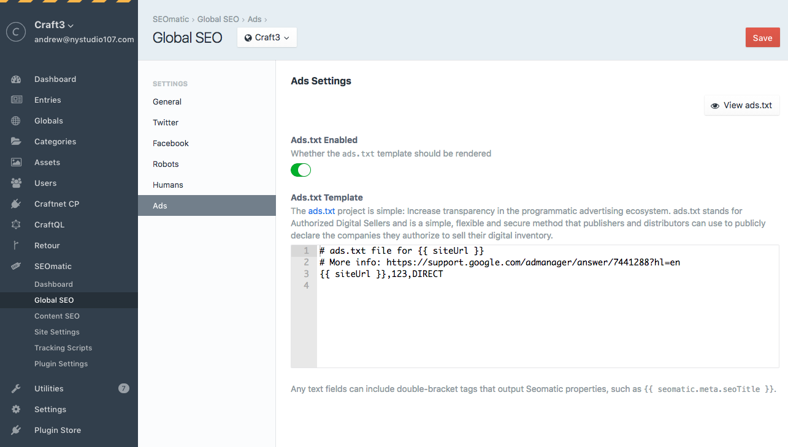

The [ads.txt](https://iabtechlab.com/ads-txt/) project is simple: Increase transparency in the programmatic advertising ecosystem. ads.txt stands for Authorized Digital Sellers and is a simple, flexible and secure method that publishers and distributors can use to publicly declare the companies they authorize to sell their digital inventory.

Feel free to edit the default `ads.txt` Template to your heart's content.

The **View ads.txt** button lets you view your rendered `ads.txt`.

#### Global SEO Control Panel Fields

The fields in the Control Panel Global SEO settings are parsed as Twig object templates, so in addition to plain old text, you can also put single and double bracket Twig expressions.

SEOmatic fields are also parsed for aliases, and in Craft 3.1, for [environment variables](https://docs.craftcms.com/v3/config/environments.html#control-panel-settings) as well.

This is entirely optional; in typical usage the controls you have in the Control Panel for pulling from other fields will be all you need. But the ability is there if you need it.

For example, the following will output the contents of the **companyInfo** field from the **siteInfo** Global:

```twig
{{ siteInfo.companyInfo }}
```

You can even do complex expressions, such as the following which outputs the first field that isn't empty, or a default text:

```twig
{{ siteInfo.companyInfo ??? siteInfo.companySummary ??? "Some default text" }}
```

The above uses the `???` empty coalesce operator that comes with SEOmatic; check out [SEOmatic's ??? Empty Coalesce operator](#seomatics--empty-coalesce-operator) for details.

You can also access SEOmatic global variables (discussed below):

```twig
{seomatic.meta.seoTitle}
```
Normal Twig double bracket syntax is supported too, but you'll need to preface it with `object.` for any `seomatic` variables:

```twig
{{ object.seomatic.meta.seoTitle }}
```
The single bracket syntax is just a shortcut that automatically prefixes any variables with `object.`, and it used for micro-template parsing.

### Content SEO

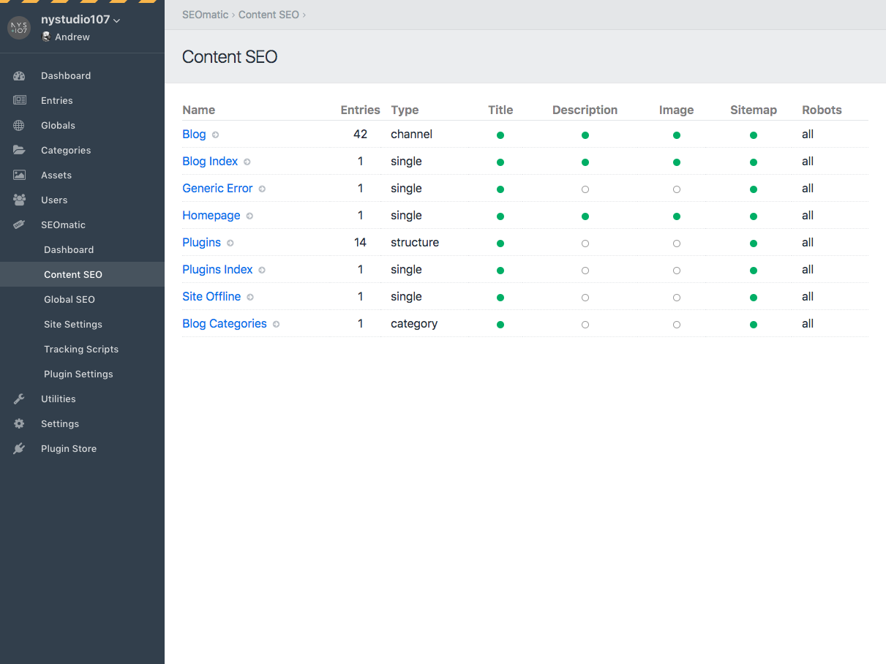

**Content SEO** is where you can configure each Section, Category Group and Commerce Product Type that has public URLs. You'll see a list of all of your Sections, Category Groups, and Commerce Product Types that have public URLs, with status indicators letting you know what has been configured for each.

Click on a Section, Category Group, or Commerce Product Type name to edit its settings.

#### General

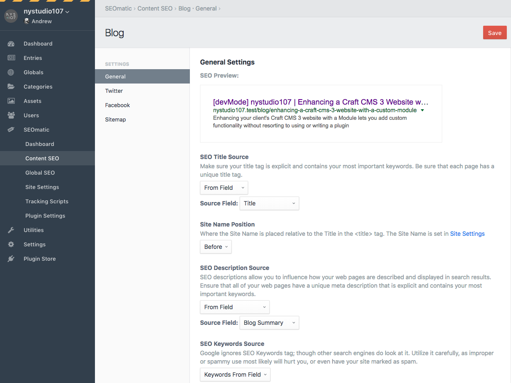

Best practices for modern SEO are for the meta information to _reflect your content_, so you should set up the fields that SEOmatic _pulls_ the **SEO Title**, **SEO Description**, and **SEO Image** from.

#### Twitter

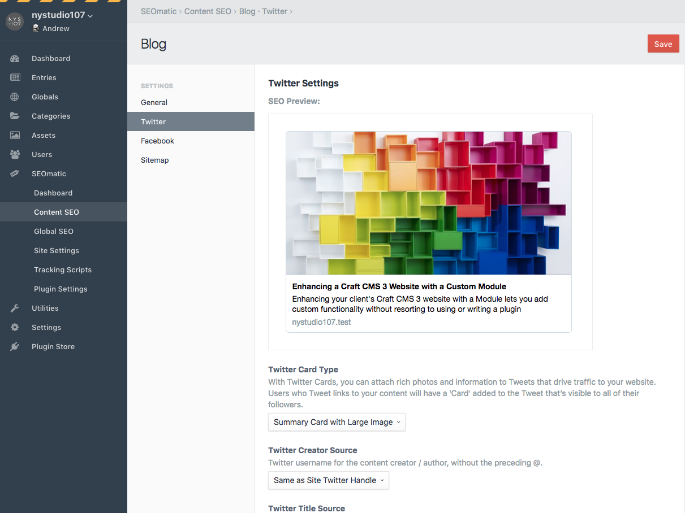

By default, the Twitter and Facebook settings will mirror what you set in the **General** section, but you can customize them to your heart's content.

#### Facebook

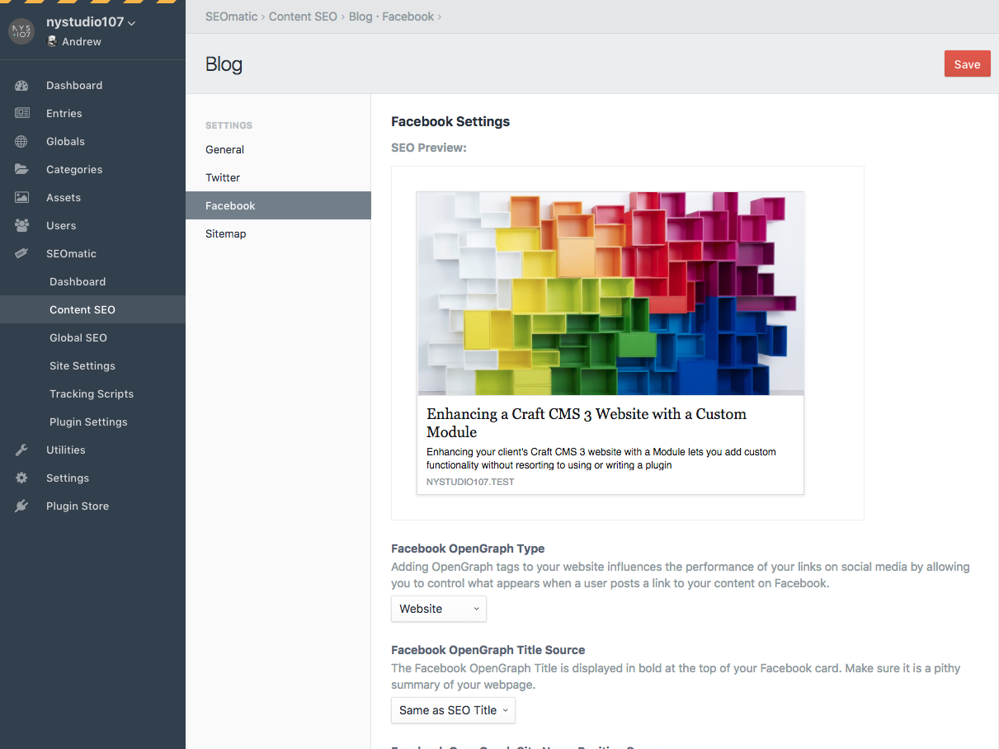

By default, the Twitter and Facebook settings will mirror what you set in the **General** section, but you can customize them to your heart's content.

#### Sitemap

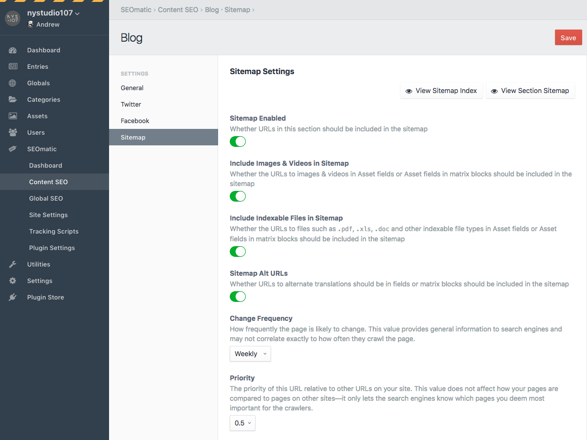

SEOmatic automatically creates a sitemap index for each of your Site Groups. This sitemap index points to individual sitemaps for each of your Sections, Category Groups, and Commerce Product Types.

Instead of one massive sitemap that must be updated any time anything changes, only the sitemap for the Section, Category Group, or Commerce Product Type will be updated when something changes in it.

SEOmatic can automatically include files such as `.pdf`, `.xls`, `.doc` and other indexable file types in Asset fields or Asset fields in matrix or Neo blocks.

In addition, SEOmatic can automatically create [Image sitemaps](https://support.google.com/webmasters/answer/178636?hl=en) and [Video sitemaps](https://developers.google.com/webmasters/videosearch/sitemaps) from images & videos in Asset fields or Asset fields in matrix or Neo blocks

Sitemap Indexes are automatically submitted to search engines whenever a new Section, Category Group, or Commerce Product Type is added.

Section Sitemaps are automatically submitted to search engines whenever a new Element in that Section, Category Group, or Commerce Product Type is added.

##### Sitemap Generation

Because XML sitemaps can be quite time-intensive to generate as the number of entries scales up, SEOmatic creates your sitemaps via a Queue job, and caches the result. The cache is automatically broken whenever something in that sitemap is changed, and a new Queue job is created to regenerate it.

If `runQueueAutomatically` is set to `false` in [General Config Settings](https://docs.craftcms.com/v3/config/config-settings.html#runqueueautomatically) the Queue job to create the sitemap will not be run during the http request for the sitemap. You'll need to run it manually via whatever means you use to run the Queue.

Normally SEOmatic will regenerate the sitemap for a Section, Category Group, or Product any time you save an element. However, if you are importing a large number of elements, or prefer to regenerate the sitemap manually you can set disable the **Regenerate Sitemaps Automatically** option in SEOmatic's Plugin Settings.


You can then regenerate the sitemap via CLI. This will regenerate all sitemaps:

```bash
./craft seomatic/sitemap/generate
```

You can also limit it to a specific Section, Category Group, or Product handle:

```bash
./craft seomatic/sitemap/generate --handle=blog
```

...or you can regenerate all sitemaps for a specific `siteId`:

```bash
./craft seomatic/sitemap/generate --siteId=1
```

...or both:

```bash
./craft seomatic/sitemap/generate --handle=blog --siteId=1
```
**N.B.:** If you do disable **Regenerate Sitemaps Automatically** sitemaps will _not_ be updated unless you do so manually via the CLI, or clear SEOmatic's sitemap caches via Utilities->Clear Caches.

##### Additional Sitemaps

If you have custom sitemaps that are not in the CMS, you can manually add them to their own Sitemap Index via **Site Settings** → **Sitemap**.

You can also add to it via a plugin:

```php
use nystudio107\seomatic\events\RegisterSitemapsEvent;
use nystudio107\seomatic\models\SitemapIndexTemplate;
use yii\base\Event;
Event::on(SitemapIndexTemplate::class, SitemapIndexTemplate::EVENT_REGISTER_SITEMAPS, function(RegisterSitemapsEvent $e) {
    $e->sitemaps[] = [
        'loc' => $url,
        'lastmod' => $lastMod,
    ];
});
```

##### Additional Sitemap URLs

If you have custom URLs that are not in the CMS, you can manually add them to their own Sitemap Index via **Site Settings** → **Sitemap**.

You can also add to it via a plugin:

```php
use nystudio107\seomatic\events\RegisterSitemapUrlsEvent;
use nystudio107\seomatic\models\SitemapCustomTemplate;
use yii\base\Event;
Event::on(SitemapCustomTemplate::class, SitemapCustomTemplate::EVENT_REGISTER_SITEMAP_URLS, function(RegisterSitemapUrlsEvent $e) {
    $e->sitemapUrls[] = [
         'loc' => $url,
         'changefreq' => $changeFreq,
         'priority' => $priority,
         'lastmod' => $lastMod,
     ];
 });
```

#### Content SEO Control Panel Fields

The fields in the Control Panel Content SEO settings are parsed as Twig object templates, so in addition to plain old text, you can also put single and double bracket Twig expressions.

SEOmatic fields are also parsed for aliases, and in Craft 3.1, for [environment variables](https://docs.craftcms.com/v3/config/environments.html#control-panel-settings) as well.

This is entirely optional; in typical usage the controls you have in the Control Panel for pulling from other fields will be all you need. But the ability is there if you need it.

For example, the following will output the contents of the **description** field from the current **Entry**:

```twig
{entry.description}
```

Normal Twig double bracket syntax is supported too, but you'll need to preface it with `object.`:

```twig
{{ object.entry.description }}
```
The single bracket syntax is just a shortcut that automatically prefixes any variables with `object.`, and it used for micro-template parsing.

The same applies to any SEOmatic global variables (discussed below):

```twig
{seomatic.meta.seoTitle}
```
Is the same as:

```twig
{{ object.seomatic.meta.seoTitle }}
```

You can even do complex expressions, such as the following which outputs the first field that isn't empty, or a default text:

```twig
{entry.description ??? entry.summary ??? "Some default text"}
```
Is the same as:
```twig
{{ object.entry.description ??? object.entry.summary ??? "Some default text" }}
```

The above uses the `???` empty coalesce operator that comes with SEOmatic; check out [SEOmatic's ??? Empty Coalesce operator](#seomatics--empty-coalesce-operator) for details.

### Site Settings

#### Identity


These Site Identity settings are used to globally define the identity and ownership of the website.

They are used in combination with the SEO Template Meta settings to generate [JSON-LD](https://developers.google.com/schemas/formats/json-ld?hl=en) microdata.

The Site Owner type determines the JSON-LD schema that will be used to identity the website to search engines.

Leave any fields blank that aren't applicable or which you do not want as part of the SEO schema.

#### Creator

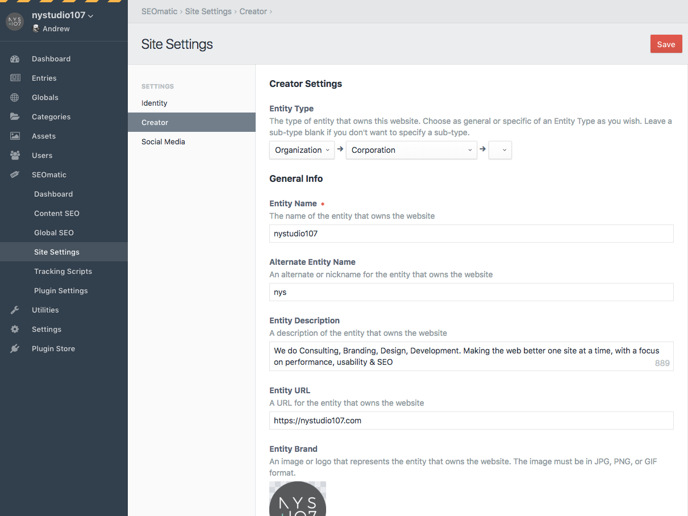

These Site Creator settings are used to globally define the _creator_ (such as the agency or freelancer) of the website.

They are used in combination with the SEO Template Meta settings to generate [JSON-LD](https://developers.google.com/schemas/formats/json-ld?hl=en) microdata as well as the `humans.txt` file.

The Site Creator type determines the JSON-LD schema that will be used to identity the website to search engines.

Leave any fields blank that aren't applicable or which you do not want as part of the SEO schema.

#### Social Media

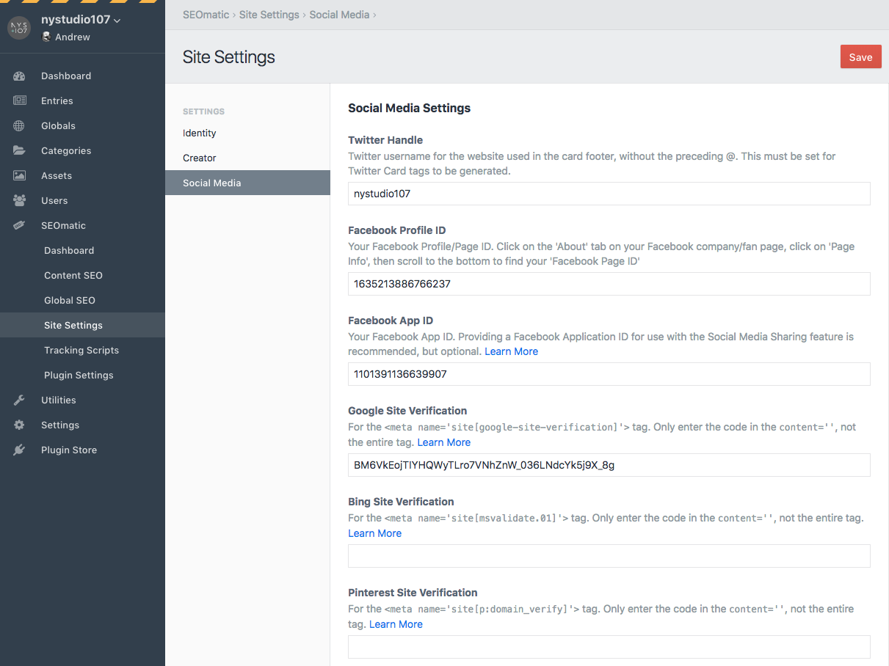

The social media settings connect your website to its other points of pressence on the Internet. They also facilitate attaching your branding to social media posts via Twitter Cards and Facebook OpenGraph.


### Tracking Scripts

None of the Tracking Scripts are included on the page unless the SEOmatic environment is set to `live` production. If `devMode` is enabled, the SEOmatic environment is automatically set to `local` development.

#### Google Analytics


Google Analytics gives you the digital analytics tools you need to analyze data from all touchpoints in one place, for a deeper understanding of the customer experience. You can then share the insights that matter with your whole organization. [Learn More](https://www.google.com/analytics/analytics/#?modal_active=none)

If you want to include the Google Analytics script despite `devMode` being enabled, you can do:

```twig

```

#### Google `gtag.js`

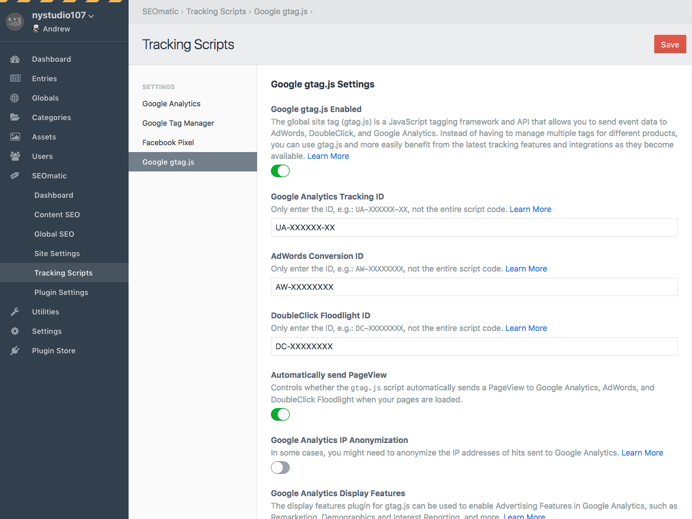

The global site tag (gtag.js) is a JavaScript tagging framework and API that allows you to send event data to AdWords, DoubleClick, and Google Analytics. Instead of having to manage multiple tags for different products, you can use gtag.js and more easily benefit from the latest tracking features and integrations as they become available. [Learn More](https://developers.google.com/gtagjs/)

If you want to include the gtag script despite `devMode` being enabled, you can do:

```twig

```

#### Google Tag Manager

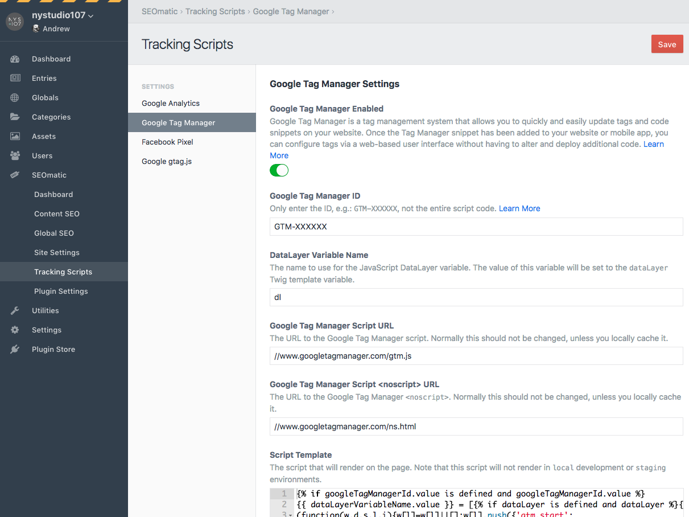

Google Tag Manager is a tag management system that allows you to quickly and easily update tags and code snippets on your website. Once the Tag Manager snippet has been added to your website or mobile app, you can configure tags via a web-based user interface without having to alter and deploy additional code. [Learn More](https://support.google.com/tagmanager/answer/6102821?hl=en)

You can set the `dataLayer` passed in to Google Tag Manager via Twig:

```twig

```

If you want to include the Google Tag Manager script despite `devMode` being enabled, you can do:

```twig

```

#### Facebook Pixel

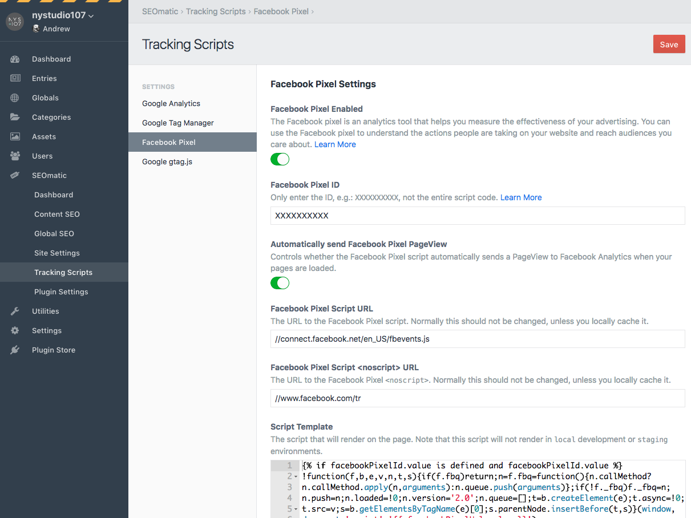

The Facebook pixel is an analytics tool that helps you measure the effectiveness of your advertising. You can use the Facebook pixel to understand the actions people are taking on your website and reach audiences you care about. [Learn More](https://www.facebook.com/business/help/651294705016616)

If you want to include the Facebook Pixel script despite `devMode` being enabled, you can do:

```twig

```

#### Plugin Settings

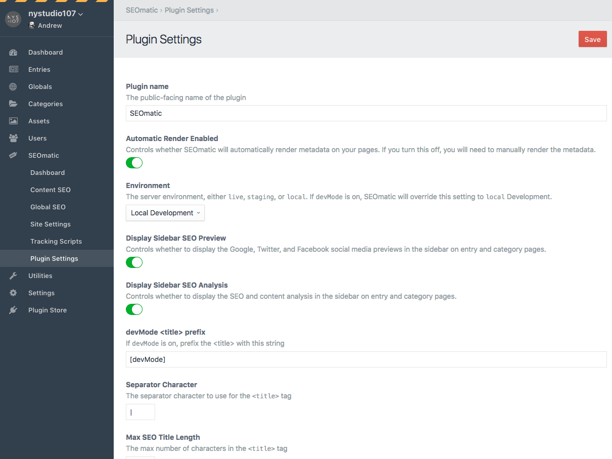

The Plugin Settings lets you control various SEOmatic settings globally (across all sites/languages).

* **Plugin name** - This is the name that will be used for the plugin everywhere it is referenced in the Control Panel GUI
* **Automatic Render Enabled** - Controls whether SEOmatic will automatically render metadata on your pages. If you turn this off, you will need to manually render the metadata via `{{ seomatic.tag.render() }}`, `{{ seomatic.link.render() }}`, etc. You can selectively disable rendering via Twig with `
* **Sitemaps Enabled** - Controls whether SEOmatic will automatically render frontend sitemaps for your website.
* **HTTP Headers Enabled** - Controls whether SEOmatic will automatically add `X-Robots-Tag`, `canonical`, & `Referrer-Policy` to the http response headers.
* **Environment** - The server environment, either `live`, `staging`, or `local`. If `devMode` is on, SEOmatic will override this setting to local Development. This setting controls whether certain things render; for instance only in the `live` production environment will Google Analytics and other tracking tags send analytics data. SEOmatic also automatically sets the `robots` tag to `none` for everything but the `live` production environment.
* **Display Sidebar SEO Preview** - Controls whether to display the Google, Twitter, and Facebook social media previews in the sidebar on entry. category, and product pages.
* **devMode `<title>` prefix** - If devMode is on, prefix the `<title>` with this string
* **Control Panel `<title>` prefix** - Prefix the Control Panel `<title>` with this string
* **devMode Control Panel `<title>` prefix** - If devMode is on, prefix the Control Panel `<title>` with this string
* **Separator Character** - The separator character to use for the `<title>` tag
* **Max SEO Title Length** - The max number of characters in the `<title>` tag; anything beyond this will be truncated on word boundaries
* **Max SEO Description Length** - The max number of characters in the `meta description` tag
* **Site Groups define logically separate sites** - If you are using Site Groups to logically separate 'sister sites', turn this on.
* **Add `hreflang` Tags** - Controls whether SEOmatic will automatically add `hreflang` and `og:locale:alternate` tags.
* **Generator Enabled** - Controls whether SEOmatic will include the meta `generator` tag and `X-Powered-By` header

##### Multi-Environment Config Settings

If you're using a multi-environment config, you can map your environment settings using SEOmatic's `config.php` something like this:

```php
<?php 
return [
    '*' => [
    // The public-facing name of the plugin
    'pluginName' => 'SEOmatic',

    // Should SEOmatic render metadata?
    'renderEnabled' => true,

    // Should SEOmatic render frontend sitemaps?
    'sitemapsEnabled' => true,

    // Should sitemaps be regenerated automatically?
    'regenerateSitemapsAutomatically' => true,

    // The server environment, either `live`, `staging`, or `local`
    'environment' => 'live',

    // Should SEOmatic display the SEO Preview sidebar?
    'displayPreviewSidebar' => true,

    // Should SEOmatic display the SEO Analysis sidebar?
    'displayAnalysisSidebar' => true,

    // If `devMode` is on, prefix the <title> with this string
    'devModeTitlePrefix' => '&#x1f6a7; ',

    // The separator character to use for the `<title>` tag
    'separatorChar' => '|',

    // The max number of characters in the `<title>` tag
    'maxTitleLength' => 70,

    // The max number of characters in the `<meta name="description">` tag
    'maxDescriptionLength' => 155,
    ],
    'local' => [
        'environment' => 'local',
    ],
    'staging' => [
        'environment' => 'staging',
    ],
    'live' => [
        'environment' => 'live',
    ],
];
```
Just copy the `config.php` to your Craft `config/` directory as `seomatic.php` and you can configure the settings in a multi-environment friendly way. See the [Craft Environments](https://docs.craftcms.com/v3/config/environments.html#config-files) page for details, and **N.B.:**

> The `'*'` key is required here so Craft knows to treat it as a multi-environment key, but the other keys are up to you

This is how you can make your multi-environment nomenclature to SEOmatic's. This works exactly like Craft's [multi-environment config](https://docs.craftcms.com/v3/configuration.html#application-config) files such as `general.php` and `db.php`. See SEOmatic's `config.php` for details.

### Access Permissions


SEOmatic allows you to restrict access to various parts of the plugin based on User Group Permissions:

* Dashboard
* Edit Global Meta
  * General
  * Twitter
  * Facebook
  * Robots
  * Humans
  * Ads
* Edit Content SEO
  * General
  * Twitter
  * Facebook
  * Sitemap
* Edit Site Settings
  * Identity
  * Creator
  * Social Media
  * Miscellaneous
* Edit Tracking Scripts
  * Google Analytics
  * Google gtag.js
  * Google Tag Manager
  * Facebook Pixel
* Edit Plugin Settings

## SEOmatic Fields

### SEO Settings Field

SEOmatic has an SEO Settings Field that you can add to your Field Layouts. For most sites, the Field is not needed; instead set up the fields to pull from in the Content SEO settings for each Section.

Modern SEO works best if it actually reflects what is on the page, visible to the user, so pulling from your page's content will work well in most cases.

#### Using SEO Settings Fields

However, in some cases you may want more control over page SEO for specific entries. That's where the SEO Settings field comes in. Add it to your Section's Field Layout, and you can override specific SEO settings on a per-entry basis.

Any setting that you leave blank or empty in the SEO Settings field will just default to the Content SEO and/or Global SEO setting.

The Field settings let you control exactly what fields will appear and be visible for you or your client to override:


By default, just a few sensible settings are made visible in the Field:

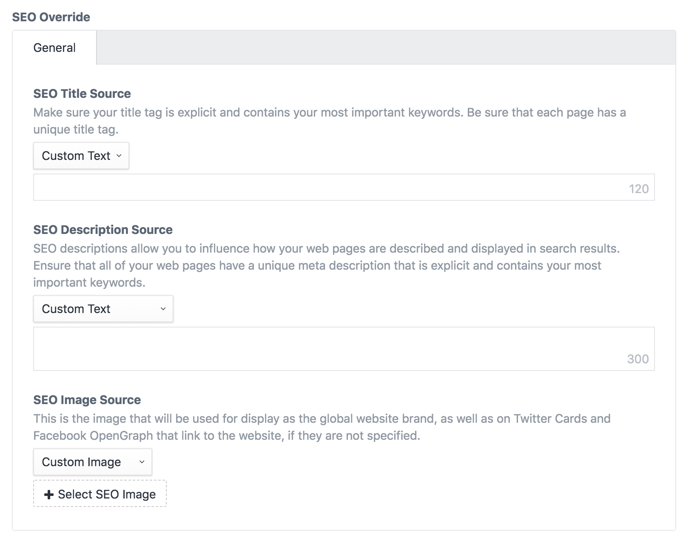

Any setting left blank will just fall back on the Content SEO settings for that Section, so you can use the Field only for the exceptional cases.

You can enable every possible field to be displayed in the SEO Settings field if you like:


But it's probably best to limit it to just the things that you or your client might want to change on a per-entry basis.

If you enable an SEO Settings field in an Element Index's Table Columns, you'll see an SEO preview there as well:

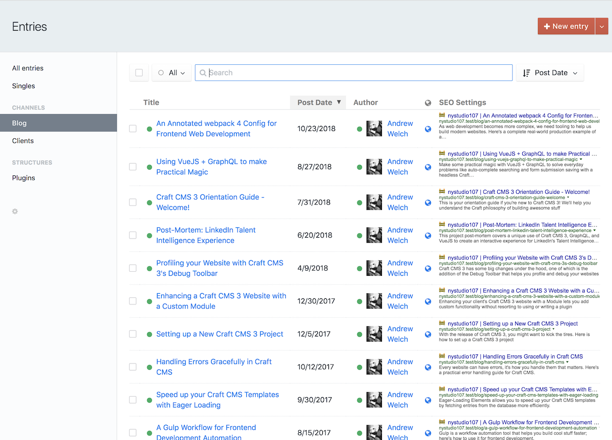

You can control whether the preview will be from Google, Facebook, or Twitter in the Field Settings.

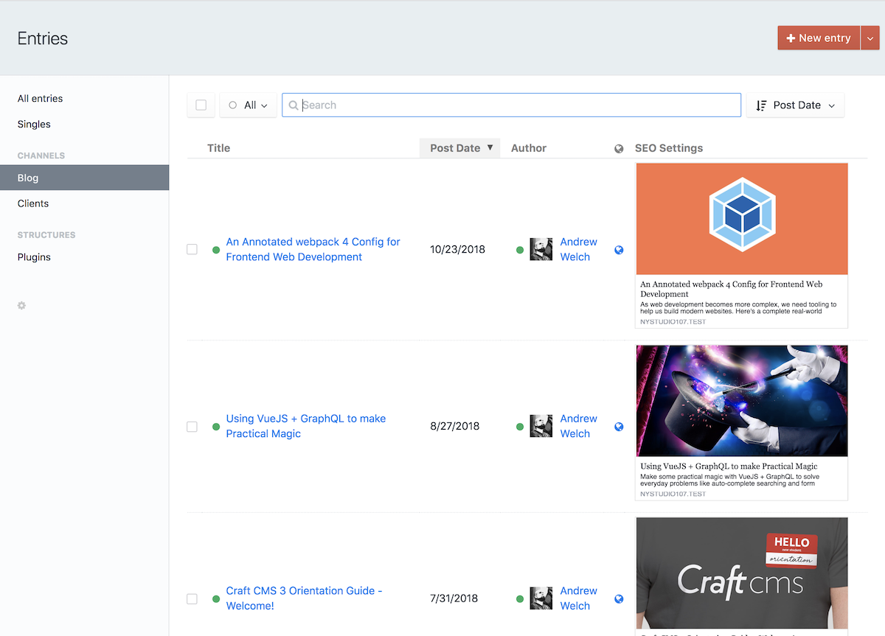

#### Template Access

If you need to access your SEOmatic field's data directly in a template, you can do so via:

```twig
{{ entry.mySeoSettingsField.metaGlobalVars.seoTitle }}
```

All of the variables listed in the [General Variables](#general-variables) can be accessed in this manner.

## Pagination and SEO

If you are using paginated entries, you'll want to add some additional markup to your templates to make Google et al aware of this. Fortunately, SEOmatic makes that easy, you simply do:

```twig

```
 
 The `PAGEINFO` here is the variable from the `` tag as [described here](https://docs.craftcms.com/v3/templating/tags/paginate.html#the-pageInfo-variable), this will properly set the `canonicalUrl`, as well as adding the `<link rel='prev'>` and `<link rel='next'>` tags for you.

A complete example (just a modified version of the [Craft 3 Documentation on ](https://docs.craftcms.com/v3/templating/tags/paginate.html#the-pageInfo-variable)) might look like this:

```twig




    <article>
        <h1>{{ entry.title }}</h1>
        {{ entry.body }}
    </article>


<a href="{{ pageInfo.prevUrl }}">Previous Page</a>
<a href="{{ pageInfo.nextUrl }}">Next Page</a>
```
More info: [SEO Guide to Google Webmaster Recommendations for Pagination](https://moz.com/blog/seo-guide-to-google-webmaster-recommendations-for-pagination)

## Multi-Site Language/Locale Support

SEOmatic comes with multi-site support baked in. Each site has its own localized settings that can be different on a per-site basis.

Craft CMS [defines Sites](https://docs.craftcms.com/v3/sites.html) as any combination of site settings and locale (language). But there needs to be some way to organize these sites to define a relationship between them. That's what [Site Groups](https://github.com/craftcms/cms/issues/1668) are for.

SEOmatic treats each Site Group as a separate entity, and any sites contained in that site group are treated as localizations of the same site.

This is necessary because there needs to be some way to let SEOmatic know what the relationship is between the various sites.

So for example, you might have:

```
├── Primary Site Group
│   ├── English Site
│   ├── Chinese Site
|   └── German Site
├── Sister Site Group
│   ├── English Site
|   └── German Site
```

While you technically don't have to organize your Site Groups in this manner, SEOmatic currently requires it so that it can understand the relationship between your sites.

This is necessary because for a variety of SEO-related things, we need to tell search engines what is really just another localization/translation of the same thing.

If you _don't_ want to organize your sites in this manner, you'll need to turn off the **Site Groups define logically separate sites** setting on the Plugin Settings page.

Sites that are grouped together under the same Site Group will have `<link rel="alternate" hreflang="XX">` & `<meta content="xx_XX" property="og:locale:alternate">` URLs added automatically in the HTML.

If you want to disable SEOmatic's automatic rendering of these tags, you can do:
```twig


```

Sites that are grouped together under the same Site Group will also be included in the appropriate sitemap indexes, and have `<xhtml:link rel="alternate" hreflang="xx-xx">` tags added to the respective sitemaps.

If you want to disable the generation of the `<xhtml:link rel="alternate" hreflang="xx-xx">` on a per-Entry basis, you can do this by adding an SEO Settings to the Section/Category Group/Product in question, and turn off **Sitemap Enabled** on a per-entry basis.

## Emoji Support

SEOmatic supports using Emojis in any of the fields in SEOmatic, so you could use one in the SEO Description, for instance:

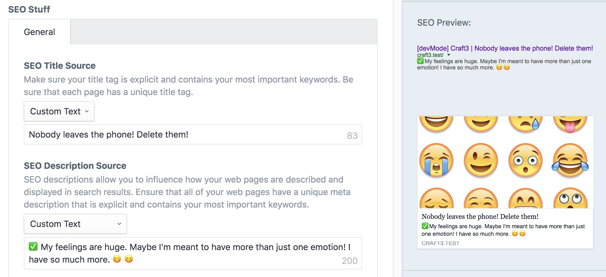

It's up to Google whether or not to display the emojis that you add to your SEO meta, but used effectively, they can help make your entries in the SERP stand out from others. Learn more: [Why Use Emojis in Your SEO / PPC Strategy?](https://www.jellyfish.net/en-us/news-and-views/why-use-emojis-in-your-seo-ppc-strategy)


On the Mac, you can invoke an Emoji keyboard inside of any text field by hitting Command Control Space. This works in any Mac application, not just web browsers or SEOmatic.

## Google AMP Support

SEOmatic works great with [Google AMP](https://www.ampproject.org/)! In fact, it will provide the [JSON-LD structured data](https://www.ampproject.org/docs/fundamentals/spec) that is _required_ by the AMP spec.

You do however need to [Make your page discoverable](https://www.ampproject.org/docs/fundamentals/discovery):

Add the following to the non-AMP template to tell Google where the AMP version of the page is; `yourAmpPageLink` the URL to your AMP page:

```twig

```

And this to the AMP template to tell Google where the canonical HTML page is:

```twig

```

Since AMP [doesn't allow for third-party JavaScript](https://medium.com/google-developers/how-to-avoid-common-mistakes-when-publishing-accelerated-mobile-pages-9ea61abf530f), you might want to add this to your AMP templates:
```twig

```

This will cause SEOmatic to not render _any_ custom scripts you might have enabled (such as Google Analytics, gtag, etc.)

Then you can include Google AMP Analytics as per [Adding Analytics to your AMP pages](https://developers.google.com/analytics/devguides/collection/amp-analytics/) (this assumes you're using `gtag`):
```


<amp-analytics type="googleanalytics">
    <script type="application/json">
        {
            "vars": {
                "account": "{{ analyticsId }}"
            },
            "triggers": {
                "trackPageview": {
                    "on": "visible",
                    "request": "pageview"
                }
            }
        }
    </script>
</amp-analytics>
```

The above uses the `???` empty coalesce operator that comes with SEOmatic; check out [SEOmatic's ??? Empty Coalesce operator](#seomatics--empty-coalesce-operator) for details.

## Single Page App (SPA) Support

SEOmatic fully supports working with SPAs, allowing you to receive the metadata needed for a given route either as an array, or as DOM elements ready to be inserted.

See the **Headless SPA API** section for details.

## Using SEOmatic

### SEOmatic's ??? Empty Coalesce operator

SEOmatic adds the `???` operator to Twig that will return the first thing that is defined, not null, and not empty. This allows you to safely "cascade" empty text/image values.

This can be used both in Twig templates, and in any of SEOmatic's fields, which are parsed as Twig templates as well.

This is particularly useful for SEO fields (both text & images), where you're dealing with a number of fallback/default values that may or may not exist, and may or may not be empty.

The `???` Empty Coalescing operator is similar to the `??` [null coalescing operator](https://nystudio107.com/blog/handling-errors-gracefully-in-craft-cms#coalescing-the-night-away), but also ignores empty strings (`""`) and empty arrays (`[]`) as well.

The problem is that to [code defensively](https://nystudio107.com/blog/handling-errors-gracefully-in-craft-cms#defensive-coding-in-twig), you want to make sure that all of these things are defined, not null, and also have a value. So you end up with something like:

```twig

    

    

    

```

This gets quite verbose and quite tiresome quickly. There are other ways you can do something similar, such as using using the `?:` [ternary operator](https://twig.symfony.com/doc/2.x/templates.html#other-operators) and the [default filter](https://twig.symfony.com/doc/2.x/filters/default.html), but this too gets a bit unwieldy.

You can use the [null coalescing operator](https://nystudio107.com/blog/handling-errors-gracefully-in-craft-cms#coalescing-the-night-away), which picks the first thing that is defined and not null:

```twig

```

But the problem here is it'll _just_ pick the first thing that is defined and not `null`. So if `entry.description` is an empty string, it'll use that, which is rarely what you want.

Enter the Empty Coalescing operator, and it becomes:

```twig

```

Now the first thing that is defined, not null, _and_ not empty will be what `description` is set to.

Nice. Simple. Readable. And most importantly, likely the result you're expecting.

The examples presented here use the `???` operator for SEOmatic functions, but you can use them for anything you like.

We've submitted a [pull request](https://github.com/twigphp/Twig/pull/2787) in the hopes of making this part of Twig core. This functionality is also available separately in the [Empty Coalesce](https://nystudio107.com/plugins/empty-coalesce) plugin.

### Twig Templating

SEOmatic can work fully without any Twig templating code at all. However, it provides a robust API that you can tap into from your Twig templates should you desire to do so.

SEOmatic makes a global `seomatic` variable available in your Twig templates that allows you to work with the SEOmatic variables and functions.

#### A Word About `` Tags

If you use Craft's built-in `` tags, ensure that you don't have any of SEOmatic's tags (listed below) inside of them. The reason is that SEOmatic dynamically generates the tags on each request, using its own caching system for performance reasons.

When you surround any Twig code in a `` tag, that code will only ever be executed once. On subsequent runs, the HTML result of what was inside of the `` tag is just returned, and the Twig code inside of it is never executed.

For more information on how the `` tag works, see the [The Craft  Tag In-Depth](https://nystudio107.com/blog/the-craft-cache-tag-in-depth) article.

#### SEOmatic Variables

All of the SEOmatic variables can be accessed as you would any normal Twig variable:

```twig
{{ seomatic.meta.seoTitle }}
```
or
```twig

```

They can also be changed by passing in a value with the Twig `` syntax:

```twig

```
or
```twig

```

You can also set multiple variables at once using array syntax:

```twig

```

Or you can chain them together:

```twig

```

These do the same thing, so use whichever you prefer.

You can set SEOmatic variables anywhere in your templates, even in sub-templates you `include` from other templates. This works because SEOmatic dynamically injects the meta tags, scripts, links, and JSON-LD into your page after the template is done rendering.

SEOmatic variables can also reference other SEOmatic variables using single-bracket syntax:

 ```twig
 
 ```

You can also reference `entry`, `category`, or `product` Craft variables, if they are present in your template:

 ```twig
 
 ```
or
```twig
 
```

But most of the time, you'll want to just set them like you would regular variables:

 ```twig
 
 ```
or
```twig
 
```
...so that there is no additional Twig parsing that needs to be done.

SEOmatic variables are also parsed for aliases, and in Craft 3.1, for [environment variables](https://docs.craftcms.com/v3/config/environments.html#control-panel-settings) as well.

There may be occasions where you want to output the final parsed value of an SEOmatic variable on the frontend. You can do that via `seomatic.meta.parsedValue()`. For example:

```twig
{{ seomatic.meta.parsedValue('seoDescription') }}
```

This will output the final parsed value of the `seomatic.meta.seoDescription` variable.

This parsing is done automatically by SEOmatic just before the meta information is added to your page.

#### Meta Variables: `seomatic.meta`

The `seomatic.meta` variable contains all of the meta variables that control the SEO that will be rendered on the site. They are pre-populated from your settings and content in the Control Panel, but you can change them as you see fit.

##### General Variables:

* **`seomatic.meta.mainEntityOfPage`** - the [schema.org](http://schema.org/docs/full.html) type that represents the main entity of the page
* **`seomatic.meta.seoTitle`** - the title that is used for the `<title>` tag
* **`seomatic.meta.siteNamePosition`** - controls where the `seomatic.site.siteName` appears relative to the `seomatic.meta.seoTitle` in the `<title>` tag. Valid values are `before`, `after`, or `none`.
* **`seomatic.meta.seoDescription`** - the description that is used for the `<meta name="description">` tag
* **`seomatic.meta.seoKeywords`** - the keywords that are used for the `<meta name="keywords">` tag. Note that this tag is _ignored_ by Google
* **`seomatic.meta.seoImage`** - the image URL that is used for SEO image
* **`seomatic.meta.seoImageWidth`** - the width of the SEO image
* **`seomatic.meta.seoImageHeight`** - the height of the SEO image
* **`seomatic.meta.seoImageDescription`** - a textual description of the SEO image
* **`seomatic.meta.canonicalUrl`** - the URL used for the `<link rel="canonical">` tag. By default, this is set to `{seomatic.helper.safeCanonicalUrl()}` or `{entry.url}`/`{category.url}`/`{product.url}`, but you can change it as you see fit. This variable is also used to set the `link rel="canonical"` HTTP header.
* **`seomatic.meta.robots`** - the setting used for the `<meta name="robots">` tag that controls how bots should index your website. This variable is also used to set the `X-Robots-Tag` HTTP header. [Learn More](https://developers.google.com/search/reference/robots_meta_tag)

##### Facebook OpenGraph Variables:

* **`seomatic.meta.ogType`** - the value used for the `<meta property="og:type">` tag, such as `website` or `article`
* **`seomatic.meta.ogTitle`** - the value used for the `<meta property="og:title">` tag. This defaults to `{seomatic.meta.seoTitle}`
* **`seomatic.meta.ogSiteNamePosition`** - controls where the `seomatic.site.siteName` appears relative to the `seomatic.meta.ogTitle` in the `<meta property="og:title">` tag. Valid values are `before`, `after`, or `none`.
* **`seomatic.meta.ogDescription`** - the value used for the `<meta property="og:description">` tag. This defaults to `{seomatic.meta.seoDescription}`
* **`seomatic.meta.ogImage`** - the value used for the `<meta property="og:image">` tag. This defaults to `{seomatic.meta.seoImage}`
* **`seomatic.meta.ogImageWidth`** - the width of the ogImage. This defaults to `{seomatic.meta.seoImageWidth}`
* **`seomatic.meta.ogImageHeight`** - the height of the ogImage. This defaults to `{seomatic.meta.seoImageHeight}`
* **`seomatic.meta.ogImageDescription`** - the value used for the `<meta property="og:image:alt">` tag. This defaults to `{seomatic.meta.seoImageDescription}`

##### Twitter Variables:

* **`seomatic.meta.twitterCard`** - the value used for the `<meta name="twitter:card">` tag, such as `summary` or `summary_large_image`
* **`seomatic.meta.twitterCreator`** - the value used for the `<meta name="twitter:creator">` tag. This defaults to `{seomatic.site.twitterHandle}`
* **`seomatic.meta.twitterTitle`** - the value used for the `<meta name="twitter:title">` tag. This defaults to `{seomatic.meta.seoTitle}`
* **`seomatic.meta.twitterSiteNamePosition`** - controls where the `seomatic.site.siteName` appears relative to the `seomatic.meta.twitterTitle` in the `<meta name="twitter:title">` tag. Valid values are `before`, `after`, or `none`.
* **`seomatic.meta.twitterDescription`** - the value used for the `<meta name="twitter:description">` tag. This defaults to `{seomatic.meta.seoDescription}`
* **`seomatic.meta.twitterImage`** - the value used for the `<meta name="twitter:image">` tag. This defaults to `{seomatic.meta.seoImage}`
* **`seomatic.meta.twitterImageWidth`** - the width of the Twitter image. This defaults to `{seomatic.meta.seoImageWidth}`
* **`seomatic.meta.twitterImageHeight`** - the height of the Twitter image. This defaults to `{seomatic.meta.seoImageHeight}`
* **`seomatic.meta.twitterImageDescription`** - the value used for the `<meta name="twitter:image:alt">` tag. This defaults to `{seomatic.meta.seoImageDescription}`

#### Site Variables `seomatic.site`

The `seomatic.site` variable has site-wide settings that are available on a per-site basis for multi-site setups.

* **`seomatic.site.siteName`** - The name of the website
* **`seomatic.site.twitterHandle`** - The site Twitter handle
* **`seomatic.site.facebookProfileId`** - The site Facebook profile ID
* **`seomatic.site.facebookAppId`** - The site Facebook app ID
* **`seomatic.site.googleSiteVerification`** - The Google Site Verification code
* **`seomatic.site.bingSiteVerification`** - The Bing Site Verification code
* **`seomatic.site.pinterestSiteVerification`** - The Pinterest Site Verification code
* **`seomatic.site.sameAsLinks`** - Array of links for Same As... sites, indexed by the handle. So for example you could access the site Facebook URL via `{{ seomatic.site.sameAsLinks["facebook"]["url"] }}`. These links are used to generate the `<meta property="og:same_as">` tags, and are also used in the `sameAs` property in the `mainEntityOfPage` JSON-LD.
* **`seomatic.site.siteLinksSearchTarget`** - Google Site Links search target. [Learn More](https://developers.google.com/search/docs/data-types/sitelinks-searchbox)
* **`seomatic.site.siteLinksQueryInput`** - Google Site Links query input. [Learn More](https://developers.google.com/search/docs/data-types/sitelinks-searchbox)

##### Site Identity Variables `seomatic.site.identity`

The `seomatic.site.identity` variable is used to create [JSON-LD Structured Data](https://developers.google.com/search/docs/guides/intro-structured-data) that _can_ appear as [Rich Snippets](https://developers.google.com/search/docs/guides/mark-up-content) on Google Search Engine Results Pages (SERP). JSON-LD Structured Data helps computers understand context and relationships, and is also read by other social media sites and apps.

The `seomatic.site.identity` encapsulates all of the information associated with the owner of the website.

* **`seomatic.site.identity.siteType`** - The schema.org general type
* **`seomatic.site.identity.siteSubType`** - The schema.org sub-type
* **`seomatic.site.identity.siteSpecificType`** - The schema.org specific type
* **`seomatic.site.identity.computedType`** - The computed most specific schema.org type
* **`seomatic.site.identity.genericName`** - The name of the entity that owns the website
* **`seomatic.site.identity.genericAlternateName`** - An alternate or nickname for the entity that owns the website
* **`seomatic.site.identity.genericDescription`** - A description of the entity that owns the website
* **`seomatic.site.identity.genericUrl`** - A URL for the entity that owns the website
* **`seomatic.site.identity.genericImage`** - A URL to an image or logo that represents the entity that owns the website. The image must be in JPG, PNG, or GIF format.
* **`seomatic.site.identity.genericImageWidth`** - The width of the entity image
* **`seomatic.site.identity.genericImageHeight`** - The height of the entity image
* **`seomatic.site.identity.genericImageIds`** - Asset ID array for the entity image
* **`seomatic.site.identity.genericTelephone`** - The primary contact telephone number for the entity that owns the website
* **`seomatic.site.identity.genericEmail`** - The primary contact email address for the entity that owns the website
* **`seomatic.site.identity.genericStreetAddress`** - The street address of the entity that owns the website, e.g.: 123 Main Street
* **`seomatic.site.identity.genericAddressLocality`** -  locality of the entity that owns the website, e.g.: Portchester
* **`seomatic.site.identity.genericAddressRegion`** - The region of the entity that owns the website, e.g.: New York or NY
* **`seomatic.site.identity.genericPostalCode`** - The postal code of the entity that owns the website, e.g.: 14580
* **`seomatic.site.identity.genericAddressCountry`** - The country in which the entity that owns the website is located, e.g.: US
* **`seomatic.site.identity.genericGeoLatitude`** - The latitude of the location of the entity that owns the website, e.g.: -120.5436367
* **`seomatic.site.identity.genericGeoLongitude`** - The longitude of the location of the entity that owns the website, e.g.: 80.6033588
* **`seomatic.site.identity.personGender`** - Only for entities of the type Person, the gender of the person
* **`seomatic.site.identity.personBirthPlace`** - Only for entities of the type Person, the place where the person was born
* **`seomatic.site.identity.organizationDuns`** - Only for entities of the type Organization, the DUNS (Dunn & Bradstreet) number of the organization that owns the website
* **`seomatic.site.identity.organizationFounder`** - Only for entities of the type Organization, the name of the founder of the organization
* **`seomatic.site.identity.organizationFoundingDate`** - Only for entities of the type Organization, the date the organization/company/restaurant was founded in [ISO 8601 date format](http://schema.org/Date), e.g.: `2018-03-26`
* **`seomatic.site.identity.organizationFoundingLocation`** - Only for entities of the type Organization, the location where the organization was founded
* **`seomatic.site.identity.organizationContactPoints`** - Only for entities of the type Organization, an array of contact points for the organization. [Learn More](https://developers.google.com/search/docs/guides/enhance-site#provide-business-contact-markup)
* **`seomatic.site.identity.corporationTickerSymbol`** - Only for entities of the type Corporation, the exchange ticker symbol of the corporation
* **`seomatic.site.identity.localBusinessPriceRange`** - Only for entities of the type LocalBusiness, the approximate price range of the goods or services offered by this local business
* **`seomatic.site.identity.localBusinessOpeningHours`** - Only for entities of the type LocalBusiness, an array of the opening hours for this local business. [Learn More][https://developers.google.com/search/docs/data-types/local-business]
* **`seomatic.site.identity.restaurantServesCuisine`** - Only for entities of the type Food Establishment, the primary type of cuisine that the food establishment serves
* **`seomatic.site.identity.restaurantMenuUrl`** - Only for entities of the type Food Establishment, a URL to the food establishment's menu
* **`seomatic.site.identity.restaurantReservationsUrl`** - Only for entities of the type Food Establishment, a URL to the food establishment's reservations page

##### Site Creator Variables `seomatic.site.creator`

The `seomatic.site.creator` variable is used to create [JSON-LD Structured Data](https://developers.google.com/search/docs/guides/intro-structured-data) that _can_ appear as [Rich Snippets](https://developers.google.com/search/docs/guides/mark-up-content) on Google Search Engine Results Pages (SERP). JSON-LD Structured Data helps computers understand context and relationships, and is also read by other social media sites and apps.

The `seomatic.site.creator` encapsulates all of the information associated with the creator of the website. This information is also used in the `humans.txt` page

* **`seomatic.site.creator.siteType`** - The schema.org general type
* **`seomatic.site.creator.siteSubType`** - The schema.org sub-type
* **`seomatic.site.creator.siteSpecificType`** - The schema.org specific type
* **`seomatic.site.creator.computedType`** - The computed most specific schema.org type
* **`seomatic.site.creator.genericName`** - The name of the entity that created the website
* **`seomatic.site.creator.genericAlternateName`** - An alternate or nickname for the entity that created the website
* **`seomatic.site.creator.genericDescription`** - A description of the entity that created the website
* **`seomatic.site.creator.genericUrl`** - A URL for the entity that created the website
* **`seomatic.site.creator.genericImage`** - A URL to an image or logo that represents the entity that created the website. The image must be in JPG, PNG, or GIF format.
* **`seomatic.site.creator.genericImageWidth`** - The width of the entity image
* **`seomatic.site.creator.genericImageHeight`** - The height of the entity image
* **`seomatic.site.creator.genericImageIds`** - Asset ID array for the entity image
* **`seomatic.site.creator.genericTelephone`** - The primary contact telephone number for the entity that created the website
* **`seomatic.site.creator.genericEmail`** - The primary contact email address for the entity that created the website
* **`seomatic.site.creator.genericStreetAddress`** - The street address of the entity that created the website, e.g.: 123 Main Street
* **`seomatic.site.creator.genericAddressLocality`** -  locality of the entity that created the website, e.g.: Portchester
* **`seomatic.site.creator.genericAddressRegion`** - The region of the entity that created the website, e.g.: New York or NY
* **`seomatic.site.creator.genericPostalCode`** - The postal code of the entity that created the website, e.g.: 14580
* **`seomatic.site.creator.genericAddressCountry`** - The country in which the entity that created the website is located, e.g.: US
* **`seomatic.site.creator.genericGeoLatitude`** - The latitude of the location of the entity that created the website, e.g.: -120.5436367
* **`seomatic.site.creator.genericGeoLongitude`** - The longitude of the location of the entity that created the website, e.g.: 80.6033588
* **`seomatic.site.creator.personGender`** - Only for entities of the type Person, the gender of the person
* **`seomatic.site.creator.personBirthPlace`** - Only for entities of the type Person, the place where the person was born
* **`seomatic.site.creator.organizationDuns`** - Only for entities of the type Organization, the DUNS (Dunn & Bradstreet) number of the organization that created the website
* **`seomatic.site.creator.organizationFounder`** - Only for entities of the type Organization, the name of the founder of the organization
* **`seomatic.site.creator.organizationFoundingDate`** - Only for entities of the type Organization, the date the organization/company/restaurant was founded in [ISO 8601 date format](http://schema.org/Date), e.g.: `2018-03-26`
* **`seomatic.site.creator.organizationFoundingLocation`** - Only for entities of the type Organization, the location where the organization was founded
* **`seomatic.site.creator.organizationContactPoints`** - Only for entities of the type Organization, an array of contact points for the organization. [Learn More](https://developers.google.com/search/docs/guides/enhance-site#provide-business-contact-markup)
* **`seomatic.site.creator.corporationTickerSymbol`** - Only for entities of the type Corporation, the exchange ticker symbol of the corporation
* **`seomatic.site.creator.localBusinessPriceRange`** - Only for entities of the type LocalBusiness, the approximate price range of the goods or services offered by this local business
* **`seomatic.site.creator.localBusinessOpeningHours`** - Only for entities of the type LocalBusiness, an array of the opening hours for this local business. [Learn More][https://developers.google.com/search/docs/data-types/local-business]
* **`seomatic.site.creator.restaurantServesCuisine`** - Only for entities of the type Food Establishment, the primary type of cuisine that the food establishment serves
* **`seomatic.site.creator.restaurantMenuUrl`** - Only for entities of the type Food Establishment, a URL to the food establishment's menu
* **`seomatic.site.creator.restaurantReservationsUrl`** - Only for entities of the type Food Establishment, a URL to the food establishment's reservations page

#### Config Variables `seomatic.config`

The `seomatic.config` variables are the global plugin configuration variables set in the `config.php` file. You can copy the `config.php` file to the Craft `config/` directory as `seomatic.php` to change them in a multi-environment friendly way.

* **`seomatic.config.pluginName`** - The public-facing name of the plugin
* **`seomatic.config.renderEnabled`** - Should SEOmatic render metadata?
* **`seomatic.config.environment`** - The server environment, either `live`, `staging`, or `local`
* **`seomatic.config.displayPreviewSidebar`** - Should SEOmatic display the SEO Preview sidebar?
* **`seomatic.config.displayAnalysisSidebar`** - Should SEOmatic display the SEO Analysis sidebar?
* **`seomatic.config.devModeTitlePrefix`** - If `devMode` is on, prefix the `<title>` with this string
* **`seomatic.config.separatorChar`** - The separator character to use for the `<title>` tag
* **`seomatic.config.maxTitleLength`** - The max number of characters in the `<title>` tag
* **`seomatic.config.maxDescriptionLength`** - The max number of characters in the `<meta name="description">` tag

#### Helper Functions `seomatic.helper`

* **`seomatic.helper.paginate(PAGEINFO)`** - Given the `PAGEINFO` variable from the `` tag as [described here](https://docs.craftcms.com/v3/templating/tags/paginate.html#the-pageInfo-variable), this will properly set the `canonicalUrl`, as well as adding the `<link rel='prev'>` and `<link rel='next'>` tags for you.
* **`seomatic.helper.truncate(TEXT, LENGTH, SUBSTR)`** - Truncates the `TEXT` to a given `LENGTH`. If `SUBSTR` is provided, and truncating occurs, the string is further truncated so that the substring may be appended without exceeding the desired length.
* **`seomatic.helper.truncateOnWord(TEXT, LENGTH, SUBSTR)`** - Truncates the `TEXT` to a given `LENGTH`, while ensuring that it does not split words. If `SUBSTR` is provided, and truncating occurs, the string is further truncated so that the substring may be appended without exceeding the desired length.
* **`seomatic.helper.getLocalizedUrls(URI, SITE_ID)`** - Return a list of localized URLs for a given `URI` that are in the `SITE_ID` site's group. Both `URI` and `SITE_ID` are optional, and will use the current request's `URI` and the current site's `SITE_ID` if omitted.
* **`seomatic.helper.loadMetadataForUri(URI, SITE_ID)`** - Load the appropriate meta containers for the given `URI` and optional `SITE_ID`
* **`seomatic.helper.sitemapIndexForSiteId(SITE_ID)`** - Get the URL to the `SITE_ID`s sitemap index
* **`seomatic.helper.extractTextFromField(FIELD)`** - Extract plain text from a PlainText, Redactor, CKEdtior, Tags, Matrix, or Neo field
* **`seomatic.helper.extractKeywords(TEXT, LIMIT)`** - Extract up to `LIMIT` most important keywords from `TEXT`
* **`seomatic.helper.extractSummary(TEXT)`** - Extract the most important 3 sentences from `TEXT`
* **`seomatic.helper.socialTransform(ASSET, TRANSFORMNAME)`** - Transform the `ASSET` (either an Asset or an Asset ID) for social media sites in `TRANSFORMNAME`; valid values are `base`, `facebook`, `twitter-summary`, and `twitter-large`
* **`seomatic.helper.seoFileLink(FILE_URL, ROBOTS, CANONICAL, INLINE)`** - Generates a link to a local or remote file that allows you to set the `X-Robots-Tag` header via `ROBOTS` (defaults to `all`) and `Link` canonical header via `CANONICAL` (defaults to `''`) as per [Advanced rel="canonical" HTTP Headers](https://moz.com/blog/how-to-advanced-relcanonical-http-headers). `INLINE` controls whether the file will be displayed inline or downloaded. If any values are empty `''`, the headers will not be included.

#### SEOmatic Tags & Containers

All of the SEOmatic tags, links, scripts, title, and JSON-LD are meta objects that have their values set from the `seomatic.meta` variables.

These meta objects know what properties they should have, and can self-validate. If `devMode` is on, you can check the Yii2 Debug Toolbar's Log to see any validation warnings or errors with your tags.

All of SEOmatic's meta objects are stored in containers, and they can be accessed and manipulated directly. You can even dynamically create new tags via Twig at template render time.

All of the meta object (tags, scripts, links, title, and JSON-LD) have the same API to make it easy to use.

##### Meta Object `.get()`
```twig

```
...will return the `<meta name="description">` meta object to you in `descriptionTag`.

##### Meta Object Properties

You can access meta object properties just like you can any Twig variable:

```twig
{{ descriptionTag.content }}
```
or
```twig

```

They can also be changed by passing in a value with the Twig `` syntax:


```twig

```

All meta objects also have an `include` property that determines whether or not they should be included on your web page:

```twig

```

You could also chain this together in a single line:
```twig

```

And you can set multiple attributes at once using an array syntax:

```twig

```

Which is the same as doing:


```twig

```

So use whatever you like better.

##### Meta Object `.create()`

To create a new meta object, you pass in a key:value array of the attributes to use when creating it:

```twig

```

By default, newly created meta objects are added to the appropriate meta container, so they will be rendered on the page. Should you wish to create a meta object but _not_ have it added to a container, you can pass in an optional `false` parameter:

```twig

```

##### Meta Object Validation

All meta objects can self-validate:
```twig



    <p>Valid!</p>

    <ul>
        
            <li>
                {{ param ~ " " }}
                <ul>
                    
                        <li>
                            {{ error ~ " " }}
                        </li>
                    
                </ul>
            </li>
        
    </ul>

```

This will output:

* url
  * Must be one of these types: URL

Which tells you that the `url` parameter is invalid.  The default validation just ensures that all of the properties are correct.

You can also set the _scenario_ to display properties that Google requires/recommends:

```twig





    <p>Valid!</p>

    <ul>
        
            <li>
                {{ param ~ " " }}
                <ul>
                    
                        <li>
                            {{ error ~ " " }}
                        </li>
                    
                </ul>
            </li>
        
    </ul>

```

This will output:

* url
  * Must be one of these types: URL
* image
  * This property is recommended by Google.
* author
  * This property is required by Google.
* datePublished
  * This property is required by Google.
* headline
  * This property is required by Google.
* publisher
  * This property is required by Google.
* mainEntityOfPage
  * This property is recommended by Google.
* dateModified
  * This property is recommended by Google.

If the website has `devMode` on, all of the meta objects are automatically validated as they are rendered, with the results displayed in the Yii Debug Toolbar. The Yii Debug Toolbar can be enabled in your account settings page.

#### JSON-LD Meta Object Functions `seomatic.jsonLd`

* **`seomatic.jsonLd.get(META_HANDLE)`** Returns the JSON-LD meta object of the handle `META_HANDLE` or `null` if it is not found
* **`seomatic.jsonLd.create()`** Creates a JSON-LD meta object from an array of key/value properties. The `type` can be any of the [Schema.org](http://schema.org/docs/full.html) types.
* **`seomatic.jsonLd.add(META_OBJECT)`** Adds the `META_OBJECT` to the JSON-LD container to be rendered
* **`seomatic.jsonLd.render()`** Renders all of the JSON-LD meta objects to your template. This is only needed if you have turned off **Automatic Render** in Plugin Settings
* **`seomatic.jsonLd.container()`** Returns the container that holds an array of all of the JSON-LD meta objects

##### JSON-LD Meta Object Examples:

Create a new [Article](http://schema.org/Article) JSON-LD meta object:
```twig

```

Get the existing **MainEntityOfPage** as set in the Global SEO or Content SEO Control Panel section to modify it (schema.org: [mainEntityOfPage](http://schema.org/docs/datamodel.html#mainEntityBackground)):
```twig

```

If you want to add something to the existing **MainEntityOfPage** (in this case an [Offer](https://schema.org/Offer)), you can do it like this:
```twig





```

The `, false` parameter tells it to create the JSON-LD object, but to _not_ automatically add it to the JSON-LD container. We do this because we don't want it rendered on its own, we want it as part of the existing `mainEntityOfPage` JSON-LD object.

Get the existing **BreadcrumbList** as generated automatically by SEOmatic to modify them (schema.org: [BreadcrumbList](http://schema.org/BreadcrumbList)):
```twig

```

Display the breadcrumbs on the page:

```twig


    <a href="{{ crumb.item['@id'] }}">{{ crumb.item['name'] }}</a>
    &raquo;

```

To entirely replace the existing **BreadcrumbList** on a page:
```twig
{% set crumbList = seomatic.jsonLd.create({
    'type': 'BreadcrumbList',
    'name': 'Breadcrumbs',
    'description': 'Breadcrumbs list',
    'itemListElement': [
        {
            'type': 'ListItem',
            'item': {
                '@id': 'http://example.com/',
                'name': 'Homepage'
            },
        },
        {
            'type': 'ListItem',
            'item': {
                '@id': 'http://example.com/blog/',
                'name': 'Our blog'
            },
        },
        {
            'type': 'ListItem',
            'item': {
                '@id': 'http://example.com/blog/tech',
                'name': 'Technology blogs'
            },
        },
    ]
}) %}
```

Get the existing **Identity** as set in the Site Settings Control Panel section to modify it:
```twig

```

Let's say you want to add a [Brand](https://schema.org/Brand) to the **Identity**, you'd do this:

```twig





```

The `, false` parameter tells it to create the JSON-LD object, but to _not_ automatically add it to the JSON-LD container. We do this because we don't want it rendered on its own, we want it as part of the existing `mainEntityOfPage` JSON-LD object.

Get the existing **Creator** as set in the Site Settings Control Panel section to modify it:
```twig

```

#### Link Meta Object Functions `seomatic.link`

* **`seomatic.link.get(META_HANDLE)`** Returns the Link meta object of the handle `META_HANDLE` or `null` if it is not found
* **`seomatic.link.create(CONFIG_ARRAY)`** Creates a Link meta object from an array of key/value properties
* **`seomatic.link.add(META_OBJECT)`** Adds the `META_OBJECT` to the Link container to be rendered
* **`seomatic.link.render()`** Renders all of the Link meta objects to your template. This is only needed if you have turned off **Automatic Render** in Plugin Settings
* **`seomatic.link.container()`** Returns the container that holds an array of all of the Link meta objects

##### Link Meta Object Examples:

Change the `<link rel="canonical">`:
```twig

```

Note that you can achieve the same result with:
```twig

```

...since the `canonicalUrl` populates the `<link rel="canonical">` Link meta object

If you want to check what `alternate` links are rendered:

```twig
    
    
```

#### Script Meta Object Functions `seomatic.script`

* **`seomatic.script.get(META_HANDLE)`** Returns the Script meta object of the handle `META_HANDLE` or `null` if it is not found 
* **`seomatic.script.create()`** Creates a Script meta object from an array of key/value properties
* **`seomatic.script.add(META_OBJECT)`** Adds the `META_OBJECT` to the Script container to be rendered
* **`seomatic.script.render()`** Renders all of the Script meta objects to your template. This is only needed if you have turned off **Automatic Render** in Plugin Settings
* **`seomatic.script.container()`** Returns the container that holds an array of all of the Script meta objects

##### Script Meta Object Examples:

Don't include the Google Analytics script on the page:
```twig

```

#### Tag Meta Object Functions `seomatic.tag`

* **`seomatic.tag.get(META_HANDLE)`** Returns the Tag meta object of the handle `META_HANDLE` or `null` if it is not found
* **`seomatic.tag.create()`** Creates a Tag meta object from an array of key/value properties
* **`seomatic.tag.add(META_OBJECT)`** Adds the `META_OBJECT` to the Tag container to be rendered
* **`seomatic.tag.render()`** Renders all of the Tag meta objects to your template. This is only needed if you have turned off **Automatic Render** in Plugin Settings
* **`seomatic.tag.container()`** Returns the container that holds an array of all of the Tag meta objects

##### Tag Meta Object Examples:

Change the `<meta name="twitter:title">`:

```twig

```

Note that you can achieve the same result with:
```twig

```

...since the `twitterTitle` populates the `<meta name="twitter:title">` Tag meta object by default.

Let's say you didn't want Google et al to index a particular page or under certain conditions. You could do this:

```twig

```

Note that you can achieve the same result with:
```twig

```

...since the `robots` populates the `<meta name="robots">` Tag meta object by default.

#### Title Meta Object Functions `seomatic.title`

* **`seomatic.title.get(META_HANDLE)`** Returns the Title meta object of the handle `META_HANDLE` or `null` if it is not found
* **`seomatic.title.create()`** Creates a Title meta object from an array of key/value properties
* **`seomatic.title.add(META_OBJECT)`** Adds the `META_OBJECT` to the Title container to be rendered
* **`seomatic.title.render()`** Renders Title meta object to your template. This is only needed if you have turned off **Automatic Render** in Plugin Settings
* **`seomatic.title.container()`** Returns the container that holds an array with the Title meta object in it

##### Tag Meta Object Examples:

Change the `<title>`:

```twig

```

Note that you can achieve the same result with:
```twig

```

...since the `seoTitle` populates the `<title">` Title meta object

#### Meta Containers

Normally you don't need to work with meta containers directly, but SEOmatic gives you access to them if you need to.

You can get the meta container for each type of meta object by doing:

```twig





```

Then you can do things like tell an entire container to not render:

```twig


```

or just:

```twig

```

Containers are also cached. Typically SEOmatic manages this cache for you, but should you wish to invalidate the cache manually, you can do so via:

```twig


```

or just:

```twig

```

## Config File Customization

### Config Settings

SEOmatic supports the standard `config.php` multi-environment friendly config file for the plugin settings. Just copy the `config.php` to your Craft `config/` directory as `seomatic.php` and you can configure the settings in a multi-environment friendly way.

These are the same settings that are configured in the **Plugin Settings** in the Control Panel.

### Meta Bundle / Container Settings

The directory `vendor/nystudio107/seomatic/src/seomatic-config` contains a number of files that are used when initially configuring SEOmatic.


You can copy this entire directory to your Craft `config/` directory, and customize the files to your heart's content. SEOmatic will first look in the `config/` directory for any given file, and then fall back on its own internal `seomatic-config` files.

Note that these files are only used when initially creating a meta bundle. That is, whenever the plugin is installed, or new Section, Category Groups, or Commerce Product Types are created. Once meta bundles have been created, changing the settings in the file will have no effect.

You can bump the `Bundle.php`'s `bundleVersion` setting if you want it to re-read your config settings.

## Headless SPA API

SEOmatic allows you to fetch the meta information for any page via a controller API endpoint, so you can render the meta data via a frontend framework like VueJS or React.

### Meta Container API Endpoints

To get all of the meta containers for a given URI, the controller action is:

```twig
/actions/seomatic/meta-container/all-meta-containers/?uri=/
```
...where `uri` is the path to obtain the meta information from.

This will return to you an array of meta containers, with the render-ready meta tags in each:

```json
{
    "MetaTitleContainer": "<title>[devMode] Craft3 | Homepage</title>",
    "MetaTagContainer": "<meta name=\"generator\" content=\"SEOmatic\"><meta name=\"referrer\" content=\"no-referrer-when-downgrade\"><meta name=\"robots\" content=\"all\">",
    "MetaLinkContainer": "<link href=\"http://craft3.test/\" rel=\"canonical\"><link type=\"text/plain\" href=\"/humans.txt\" rel=\"author\"><link href=\"http://craft3.test/\" rel=\"alternate\" hreflang=\"es\">",
    "MetaScriptContainer": "",
    "MetaJsonLdContainer": "<script type=\"application/ld+json\">{\"@context\":\"http://schema.org\",\"@type\":\"WebPage\",\"image\":{\"@type\":\"ImageObject\",\"height\":\"804\",\"width\":\"1200\"},\"inLanguage\":\"en-us\",\"mainEntityOfPage\":\"http://craft3.test/\",\"name\":\"Homepage\",\"url\":\"http://craft3.test/\"}</script><script type=\"application/ld+json\">{\"@context\":\"http://schema.org\",\"@type\":\"BreadcrumbList\",\"description\":\"Breadcrumbs list\",\"itemListElement\":[{\"@type\":\"ListItem\",\"item\":{\"@id\":\"http://craft3.test/\",\"name\":\"Homepage\"},\"position\":1}],\"name\":\"Breadcrumbs\"}</script>"
}
```
If you need to request a URI from a specific site in a multi-site setup, you can do that with the optional `siteId=SITE_ID` parameter:

```
/actions/seomatic/meta-container/all-meta-containers/?uri=/&siteId=2
```

Should you wish to have the items in the meta containers return as an array of data instead, you can do that with the optional `asArray=true` parameter:

```
/actions/seomatic/meta-container/all-meta-containers/?uri=/&asArray=true
```

Which will return the data in array form:
```json
{
    "MetaTitleContainer": {
        "title": {
            "title": "[devMode] Craft3 | Homepage"
        }
    },
    "MetaTagContainer": {
        "generator": {
            "content": "SEOmatic",
            "name": "generator"
        },
        "referrer": {
            "content": "no-referrer-when-downgrade",
            "name": "referrer"
        },
        "robots": {
            "content": "all",
            "name": "robots"
        }
    },
    "MetaLinkContainer": {
        "canonical": {
            "href": "http://craft3.test/",
            "rel": "canonical"
        },
        "author": {
            "href": "/humans.txt",
            "rel": "author",
            "type": "text/plain"
        },
        "alternate": {
            "href": "http://craft3.test/",
            "hreflang": "es",
            "rel": "alternate"
        }
    },
    "MetaScriptContainer": [],
    "MetaJsonLdContainer": {
        "WebPage": {
            "@context": "http://schema.org",
            "@type": "WebPage",
            "image": {
                "@type": "ImageObject",
                "height": "804",
                "width": "1200"
            },
            "inLanguage": "en-us",
            "mainEntityOfPage": "http://craft3.test/",
            "name": "Homepage",
            "url": "http://craft3.test/"
        },
        "BreadcrumbList": {
            "@context": "http://schema.org",
            "@type": "BreadcrumbList",
            "description": "Breadcrumbs list",
            "itemListElement": [
                {
                    "@type": "ListItem",
                    "item": {
                        "@id": "http://craft3.test/",
                        "name": "Homepage"
                    },
                    "position": 1
                }
            ],
            "name": "Breadcrumbs"
        }
    }
}
```

You can also request individual meta containers.

Title container:

```
/actions/seomatic/meta-container/meta-title-container/?uri=/
```

...will return just the Title container:
```json
{
    "MetaTitleContainer": "<title>[devMode] Craft3 | Homepage</title>"
}
```

Tag container:

```
/actions/seomatic/meta-container/meta-tag-container/?uri=/
```

...will return just the Tag container:
```json
{
     "MetaTagContainer": "<meta name=\"generator\" content=\"SEOmatic\"><meta name=\"referrer\" content=\"no-referrer-when-downgrade\"><meta name=\"robots\" content=\"all\">"
 }
```

Script container:

```
/actions/seomatic/meta-container/meta-script-container/?uri=/
```

...will return just the Script container:
```json
{
    "MetaScriptContainer": ""
}
```

Link container:

```
/actions/seomatic/meta-container/meta-link-container/?uri=/
```

...will return just the Link container:
```json
{
    "MetaLinkContainer": "<link href=\"http://craft3.test/\" rel=\"canonical\"><link type=\"text/plain\" href=\"/humans.txt\" rel=\"author\"><link href=\"http://craft3.test/\" rel=\"alternate\" hreflang=\"es\">"
}
```

JSON-LD container:

```
/actions/seomatic/meta-container/meta-json-ld-container/?uri=/
```

...will return just the JSON-LD container:
```json
{
    "MetaJsonLdContainer": "<script type=\"application/ld+json\">{\"@context\":\"http://schema.org\",\"@type\":\"WebPage\",\"image\":{\"@type\":\"ImageObject\",\"height\":\"804\",\"width\":\"1200\"},\"inLanguage\":\"en-us\",\"mainEntityOfPage\":\"http://craft3.test/\",\"name\":\"Homepage\",\"url\":\"http://craft3.test/\"}</script><script type=\"application/ld+json\">{\"@context\":\"http://schema.org\",\"@type\":\"BreadcrumbList\",\"description\":\"Breadcrumbs list\",\"itemListElement\":[{\"@type\":\"ListItem\",\"item\":{\"@id\":\"http://craft3.test/\",\"name\":\"Homepage\"},\"position\":1}],\"name\":\"Breadcrumbs\"}</script>"
}
```

All of the individual container controller API endpoints also accept the `&asArray=true` parameter if you'd like the data in array form.
 
### Schema.org API Endpoints

To get a key/value array of a given [Schema.org](http://schema.org/docs/full.html) type:

```
/actions/seomatic/json-ld/get-type?schemaType=Article
```

To get a decomposed version of a given [Schema.org](http://schema.org/docs/full.html) type, with the properties grouped by each inherited type:

```
/actions/seomatic/json-ld/get-decomposed-type?schemaType=Article
```

To get a hierarchical array of all of the schema types: 

```
/actions/seomatic/json-ld/get-type-array?path=Article
```

You can narrow this down to a specific sub-type list by passing in a `path` of schema types delimited by a `.`:
```
/actions/seomatic/json-ld/get-type-array?path=CreativeWork.Article
```
...this would output all of the sub-types of `Article`:
```
{
  "AdvertiserContentArticle": "AdvertiserContentArticle",
  "NewsArticle": {
    "AnalysisNewsArticle": "AnalysisNewsArticle",
    "BackgroundNewsArticle": "BackgroundNewsArticle",
    "OpinionNewsArticle": "OpinionNewsArticle",
    "ReportageNewsArticle": "ReportageNewsArticle",
    "ReviewNewsArticle": "ReviewNewsArticle"
  },
  "Report": "Report",
  "SatiricalArticle": "SatiricalArticle",
  "ScholarlyArticle": {
    "MedicalScholarlyArticle": "MedicalScholarlyArticle"
  },
  "SocialMediaPosting": {
    "BlogPosting": {
      "LiveBlogPosting": "LiveBlogPosting"
    },
    "DiscussionForumPosting": "DiscussionForumPosting"
  },
  "TechArticle": {
    "APIReference": "APIReference"
  }
}
```

## CraftQL Query support

To retrieve SEOmatic container data through the [CraftQL](https://github.com/markhuot/craftql) plugin, use the `seomatic` field in your graphql query. Each parameter will return that container's data, ready for insertion into the DOM.


You must as least pass in the URI you want metadata for:

```gql
{
  seomatic (uri: "/") {
      metaTitleContainer
      metaTagContainer
      metaLinkContainer
      metaScriptContainer
      metaJsonLdContainer
  }
}
```

...and you can also pass in an optional `siteId`:

You must as least pass in the URI you want metadata for:

```gql
{
  seomatic (uri: "/", siteId: 1) {
      metaTitleContainer
      metaTagContainer
      metaLinkContainer
      metaScriptContainer
      metaJsonLdContainer
  }
}
```

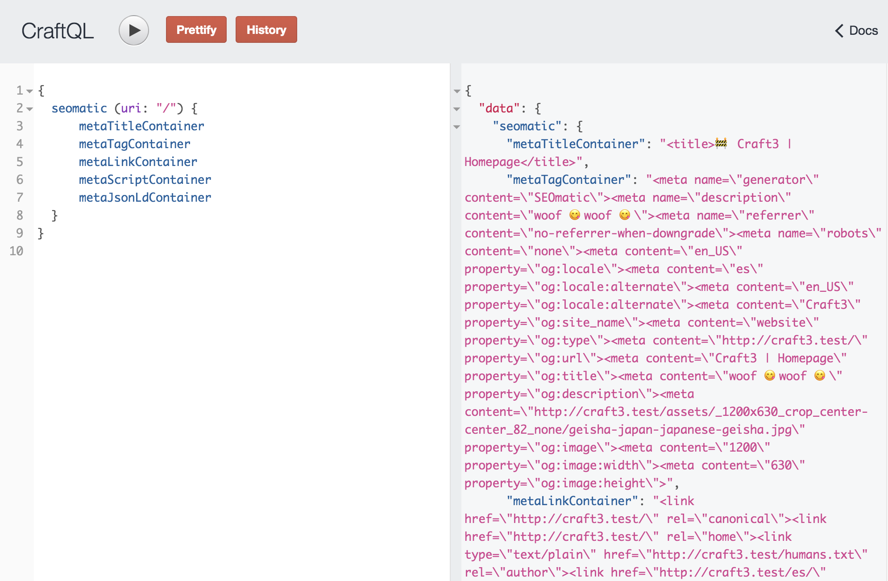

You can also piggyback on an entries query, to return all of your data for an entry as well as the SEOmatic metadata in one request:
```gql
{
  entry(section: homepage) {
    id
    title
    ... on Homepage {
      seomatic {
        metaTitleContainer
        metaTagContainer
        metaLinkContainer
        metaScriptContainer
        metaJsonLdContainer
      }
    }
  }
}
```

In this case, no arguments are passed in, because the URI and siteId will be taken from the parent Entry element.

## SEOmatic Roadmap

Some things to do, and ideas for potential features:

* **Content Analytics** - Add content analytics, potentially in the "Pro" edition

Brought to you by [nystudio107](https://nystudio107.com/)
