# Configuring SEOmatic

As soon as you install SEOmatic, it automatically will render meta data on your web pages, and create sitemaps for all of your Sections, Category Groups, and Commerce Product Types that have public URLs. You don't need to add any template code for this to happen.


All of SEOmatic's settings are multi-site aware, allowing you to have different settings for each site/language combination.

For SEOmatic to be truly useful, you need to configure it so that it knows where to _pull_ SEO content from.

**N.B.** Please ensure that you set up your [Multi-Environment Config Settings](#multi-environment-config-settings) if you will be using SEOmatic across multiple environments.

## Dashboard

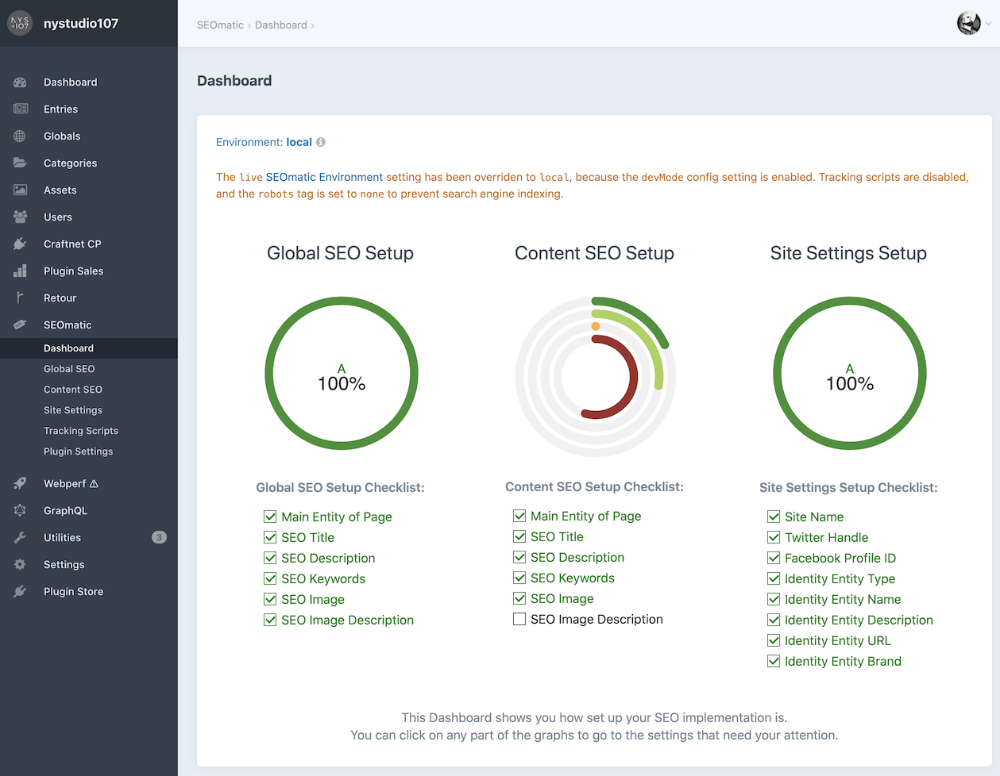

The Dashboard gives you an overview of how fully set up your SEO setting in SEOmatic are, for Global SEO, Content SEO, and Site Settings.

Click on any of the graphs to jump to the section in question to fill things out in more detail.

## Global SEO

**Global SEO** is where you set all of the default site-wide settings.

### General

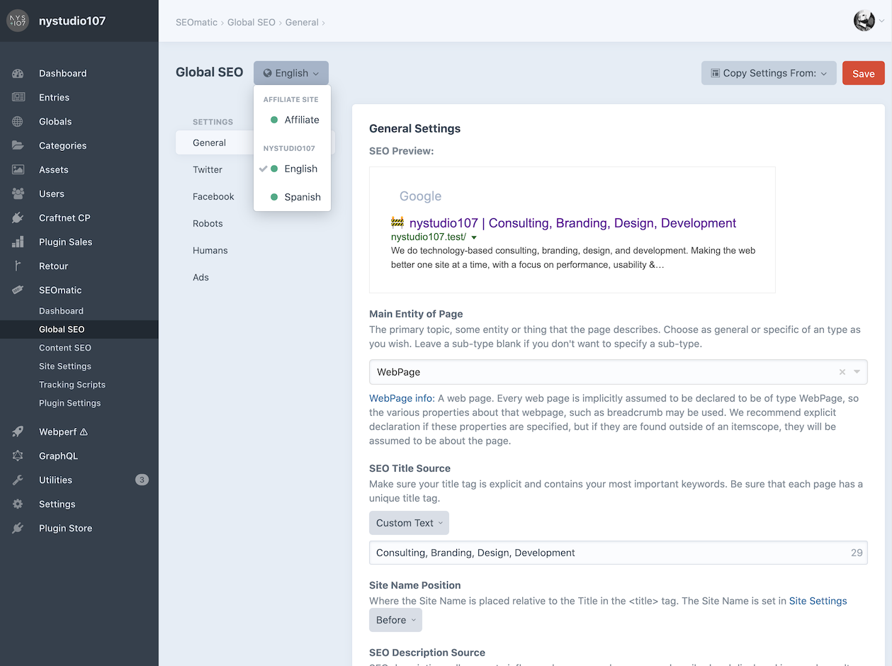

Best practices for modern SEO are for the meta information to _reflect your content_, so you should set up the fields that SEOmatic _pulls_ the **SEO Title**, **SEO Description**, and **SEO Image** from.

### Twitter


By default, the Twitter and Facebook settings will mirror what you set in the **General** section, but you can customize them to your heart's content.

### Facebook


By default, the Twitter and Facebook settings will mirror what you set in the **General** section, but you can customize them to your heart's content.

### Robots

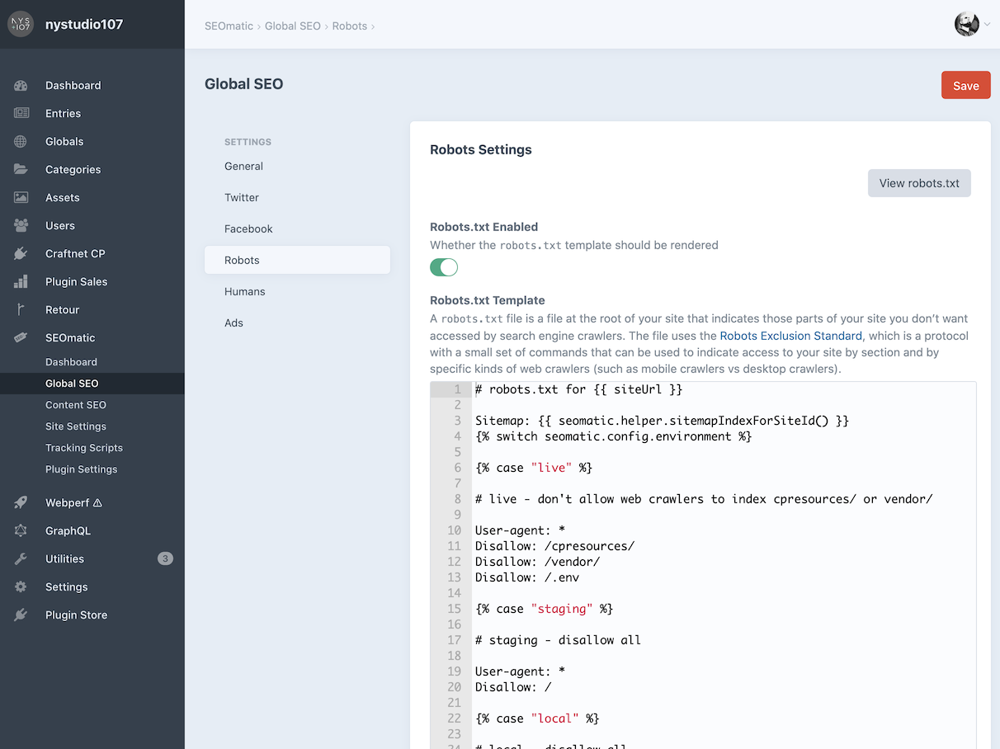

A `robots.txt` file is a file at the root of your site that indicates those parts of your site you don’t want accessed by search engine crawlers. The file uses the [Robots Exclusion Standard](http://www.robotstxt.org/robotstxt.html), which is a protocol with a small set of commands that can be used to indicate access to your site by section and by specific kinds of web crawlers (such as mobile crawlers vs desktop crawlers).

You shouldn't need to edit the default `robots.txt` Template, but you can if you like.

SEOmatic automatically handles requests for `/robots.txt`. For this to work, make sure that you do not have an actual `robots.txt` file in your `web/` folder (because that will take precedence).

If you are running Nginx, make sure that you don't have a line like:

    location = /robots.txt  { access_log off; log_not_found off; }
    
...in your config file.  A directive like this will prevent SEOmatic from being able to service the request for `/robots.txt`.  If you do have a line like this in your config file, just comment it out, and restart Nginx with `sudo nginx -s reload`.

The **View robots.txt** button lets you view your rendered `robots.txt`.

### Humans


[Humans.txt](http://humanstxt.org/) is an initiative for knowing the people behind a website. It's a text file that contains information about the different people who have contributed to building the website. By adding a text file, you can prove your authorship (not your property) in an external, fast, easy and accessible way.

Feel free to edit the default `humans.txt` Template to your heart's content.

The **View humans.txt** button lets you view your rendered `humans.txt`.

### Ads


The [ads.txt](https://iabtechlab.com/ads-txt/) project is simple: Increase transparency in the programmatic advertising ecosystem. ads.txt stands for Authorized Digital Sellers and is a simple, flexible and secure method that publishers and distributors can use to publicly declare the companies they authorize to sell their digital inventory.

Feel free to edit the default `ads.txt` Template to your heart's content.

The **View ads.txt** button lets you view your rendered `ads.txt`.

### Global SEO Control Panel Fields

The fields in the Control Panel Global SEO settings are parsed as Twig object templates, so in addition to plain old text, you can also put single and double bracket Twig expressions.

SEOmatic fields are also parsed for aliases, and in Craft 3.1, for [environment variables](https://docs.craftcms.com/v3/config/environments.html#control-panel-settings) as well.

This is entirely optional; in typical usage the controls you have in the Control Panel for pulling from other fields will be all you need. But the ability is there if you need it.

For example, the following will output the contents of the **companyInfo** field from the **siteInfo** Global:

```twig
{{ siteInfo.companyInfo }}
```

You can even do complex expressions, such as the following which outputs the first field that isn't empty, or a default text:

```twig
{{ siteInfo.companyInfo ??? siteInfo.companySummary ??? "Some default text" }}
```

The above uses the `???` empty coalesce operator that comes with SEOmatic; check out [SEOmatic's ??? Empty Coalesce operator](#seomatics--empty-coalesce-operator) for details.

You can also access SEOmatic global variables (discussed below):

```twig
{seomatic.meta.seoTitle}
```
Normal Twig double bracket syntax is supported too, but you'll need to preface it with `object.` for any `seomatic` variables:

```twig
{{ object.seomatic.meta.seoTitle }}
```
The single bracket syntax is just a shortcut that automatically prefixes any variables with `object.`, and it used for micro-template parsing.

## Content SEO

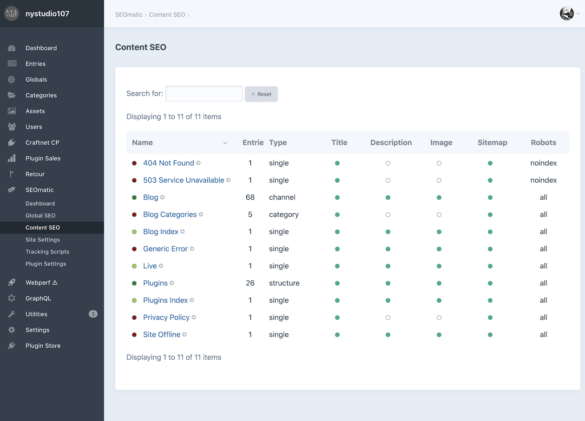

**Content SEO** is where you can configure each Section, Category Group and Commerce Product Type that has public URLs. You'll see a list of all of your Sections, Category Groups, and Commerce Product Types that have public URLs, with status indicators letting you know what has been configured for each.

Click on a Section, Category Group, or Commerce Product Type name to edit its settings.

### General

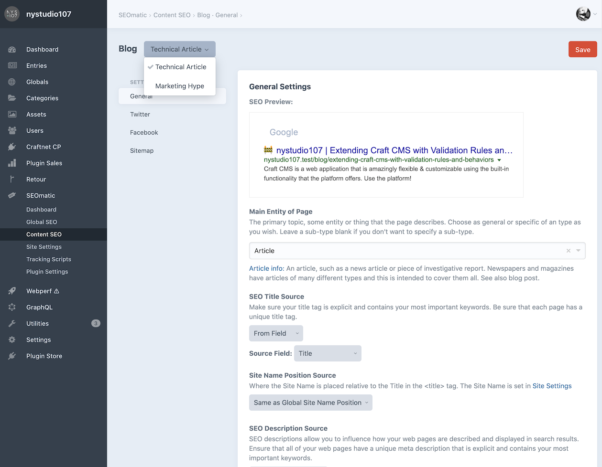

Best practices for modern SEO are for the meta information to _reflect your content_, so you should set up the fields that SEOmatic _pulls_ the **SEO Title**, **SEO Description**, and **SEO Image** from.

### Twitter

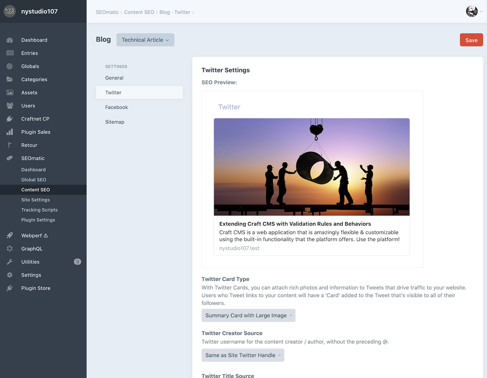

By default, the Twitter and Facebook settings will mirror what you set in the **General** section, but you can customize them to your heart's content.

### Facebook


By default, the Twitter and Facebook settings will mirror what you set in the **General** section, but you can customize them to your heart's content.

### Sitemap

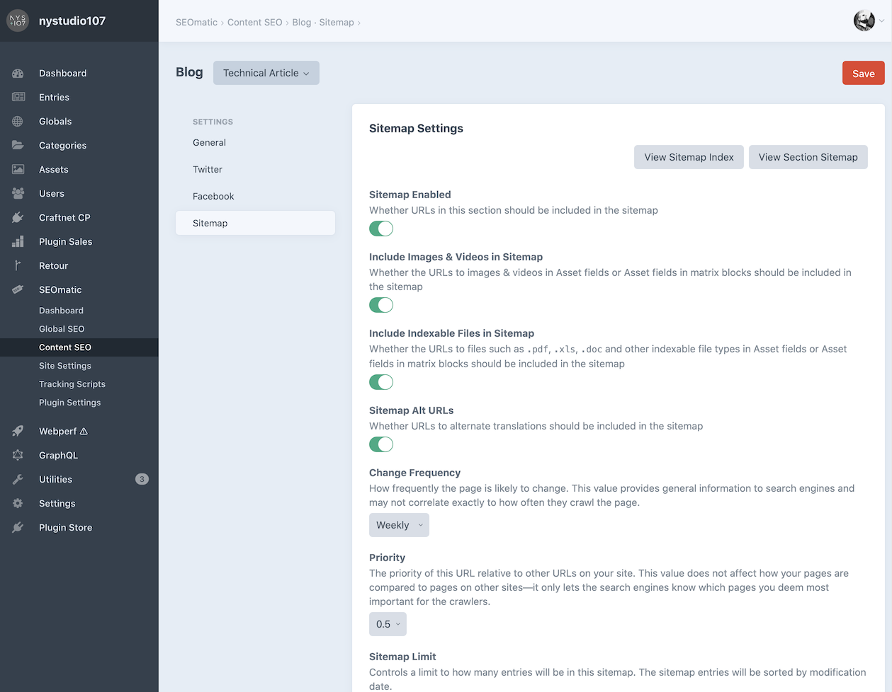

SEOmatic automatically creates a sitemap index for each of your Site Groups. This sitemap index points to individual sitemaps for each of your Sections, Category Groups, and Commerce Product Types.

Instead of one massive sitemap that must be updated any time anything changes, only the sitemap for the Section, Category Group, or Commerce Product Type will be updated when something changes in it.

SEOmatic can automatically include files such as `.pdf`, `.xls`, `.doc` and other indexable file types in Asset fields or Asset fields in matrix or Neo blocks.

In addition, SEOmatic can automatically create [Image sitemaps](https://support.google.com/webmasters/answer/178636?hl=en) and [Video sitemaps](https://developers.google.com/webmasters/videosearch/sitemaps) from images & videos in Asset fields or Asset fields in matrix or Neo blocks

Sitemap Indexes are automatically submitted to search engines whenever a new Section, Category Group, or Commerce Product Type is added.

Section Sitemaps are automatically submitted to search engines whenever a new Element in that Section, Category Group, or Commerce Product Type is added.

#### Sitemap Generation

Because XML sitemaps can be quite time-intensive to generate as the number of entries scales up, SEOmatic creates your sitemaps via a Queue job, and caches the result. The cache is automatically broken whenever something in that sitemap is changed, and a new Queue job is created to regenerate it.

If `runQueueAutomatically` is set to `false` in [General Config Settings](https://docs.craftcms.com/v3/config/config-settings.html#runqueueautomatically) the Queue job to create the sitemap will not be run during the http request for the sitemap. You'll need to run it manually via whatever means you use to run the Queue.

Normally SEOmatic will regenerate the sitemap for a Section, Category Group, or Product any time you save an element. However, if you are importing a large number of elements, or prefer to regenerate the sitemap manually you can set disable the **Regenerate Sitemaps Automatically** option in SEOmatic's Plugin Settings.


You can then regenerate the sitemap via CLI. This will regenerate all sitemaps:

```bash
./craft seomatic/sitemap/generate
```

You can also limit it to a specific Section, Category Group, or Product handle:

```bash
./craft seomatic/sitemap/generate --handle=blog
```

...or you can regenerate all sitemaps for a specific `siteId`:

```bash
./craft seomatic/sitemap/generate --siteId=1
```

...or both:

```bash
./craft seomatic/sitemap/generate --handle=blog --siteId=1
```
**N.B.:** If you do disable **Regenerate Sitemaps Automatically** sitemaps will _not_ be updated unless you do so manually via the CLI, or clear SEOmatic's sitemap caches via Utilities->Clear Caches.

#### Additional Sitemaps

If you have custom sitemaps that are not in the CMS, you can manually add them to their own Sitemap Index via **Site Settings** → **Sitemap**.

You can also add to it via a plugin:

```php
use nystudio107\seomatic\events\RegisterSitemapsEvent;
use nystudio107\seomatic\models\SitemapIndexTemplate;
use yii\base\Event;
Event::on(SitemapIndexTemplate::class, SitemapIndexTemplate::EVENT_REGISTER_SITEMAPS, function(RegisterSitemapsEvent $e) {
    $e->sitemaps[] = [
        'loc' => $url,
        'lastmod' => $lastMod,
    ];
});
```

#### Additional Sitemap URLs

If you have custom URLs that are not in the CMS, you can manually add them to their own Sitemap Index via **Site Settings** → **Sitemap**.

You can also add to it via a plugin:

```php
use nystudio107\seomatic\events\RegisterSitemapUrlsEvent;
use nystudio107\seomatic\models\SitemapCustomTemplate;
use yii\base\Event;
Event::on(SitemapCustomTemplate::class, SitemapCustomTemplate::EVENT_REGISTER_SITEMAP_URLS, function(RegisterSitemapUrlsEvent $e) {
    $e->sitemaps[] = [
         'loc' => $url,
         'changefreq' => $changeFreq,
         'priority' => $priority,
         'lastmod' => $lastMod,
     ];
 });
```

### Content SEO Control Panel Fields

The fields in the Control Panel Content SEO settings are parsed as Twig object templates, so in addition to plain old text, you can also put single and double bracket Twig expressions.

SEOmatic fields are also parsed for aliases, and in Craft 3.1, for [environment variables](https://docs.craftcms.com/v3/config/environments.html#control-panel-settings) as well.

This is entirely optional; in typical usage the controls you have in the Control Panel for pulling from other fields will be all you need. But the ability is there if you need it.

For example, the following will output the contents of the **description** field from the current **Entry**:

```twig
{entry.description}
```

Normal Twig double bracket syntax is supported too, but you'll need to preface it with `object.`:

```twig
{{ object.entry.description }}
```
The single bracket syntax is just a shortcut that automatically prefixes any variables with `object.`, and it used for micro-template parsing.

The same applies to any SEOmatic global variables (discussed below):

```twig
{seomatic.meta.seoTitle}
```
Is the same as:

```twig
{{ object.seomatic.meta.seoTitle }}
```

You can even do complex expressions, such as the following which outputs the first field that isn't empty, or a default text:

```twig
{{ object.entry.description ??? object.entry.summary ??? "Some default text" }}
```

The above uses the `???` empty coalesce operator that comes with SEOmatic; check out [SEOmatic's ??? Empty Coalesce operator](#seomatics--empty-coalesce-operator) for details.

## Site Settings

### Identity

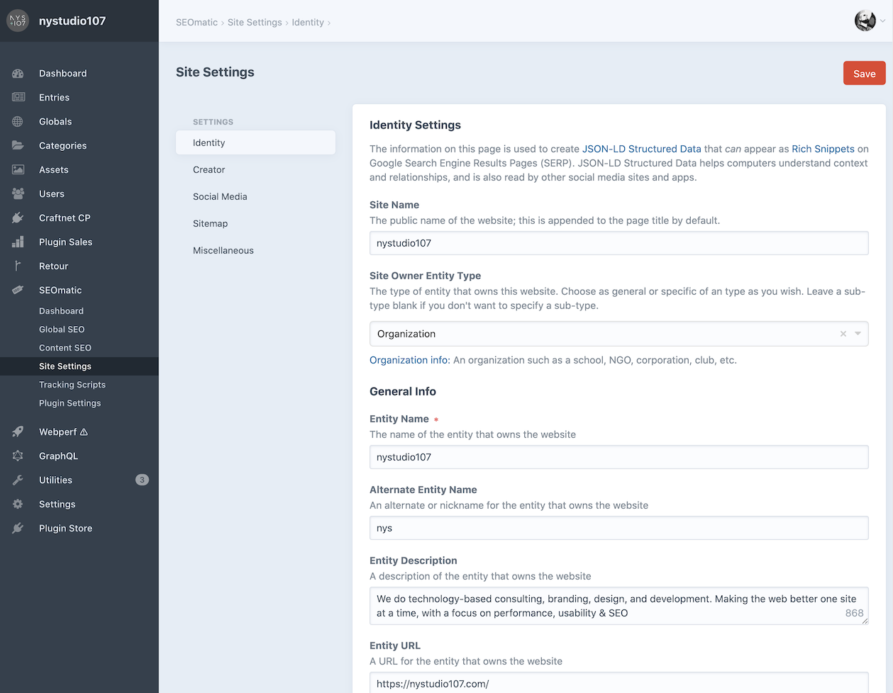

These Site Identity settings are used to globally define the identity and ownership of the website.

They are used in combination with the SEO Template Meta settings to generate [JSON-LD](https://developers.google.com/schemas/formats/json-ld?hl=en) microdata.

The Site Owner type determines the JSON-LD schema that will be used to identity the website to search engines.

Leave any fields blank that aren't applicable or which you do not want as part of the SEO schema.

### Creator

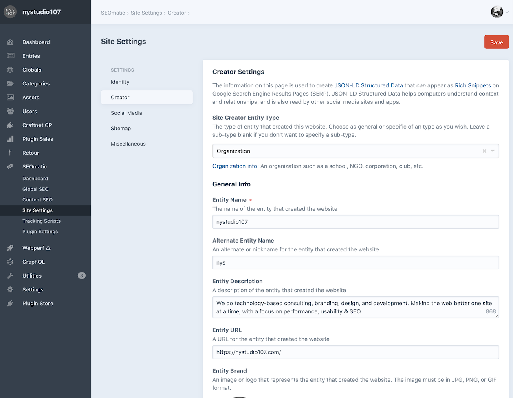

These Site Creator settings are used to globally define the _creator_ (such as the agency or freelancer) of the website.

They are used in combination with the SEO Template Meta settings to generate [JSON-LD](https://developers.google.com/schemas/formats/json-ld?hl=en) microdata as well as the `humans.txt` file.

The Site Creator type determines the JSON-LD schema that will be used to identity the website to search engines.

Leave any fields blank that aren't applicable or which you do not want as part of the SEO schema.

### Social Media

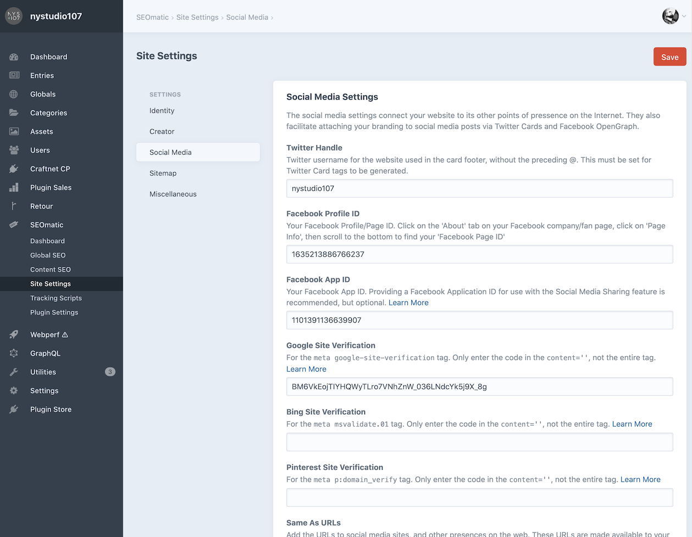

The social media settings connect your website to its other points of pressence on the Internet. They also facilitate attaching your branding to social media posts via Twitter Cards and Facebook OpenGraph.


## Tracking Scripts

None of the Tracking Scripts are included on the page unless the SEOmatic environment is set to `live` production. If `devMode` is enabled, the SEOmatic environment is automatically set to `local` development.

### Google Analytics

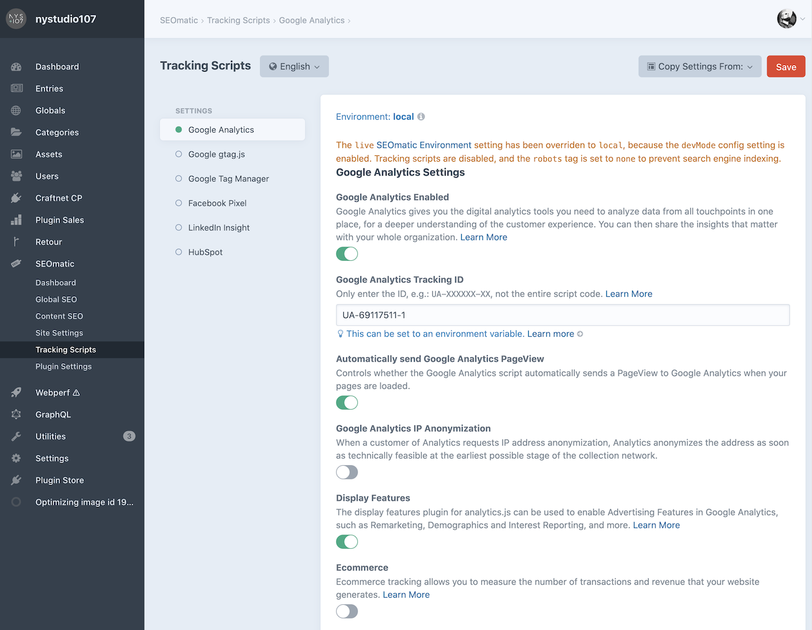

Google Analytics gives you the digital analytics tools you need to analyze data from all touchpoints in one place, for a deeper understanding of the customer experience. You can then share the insights that matter with your whole organization. [Learn More](https://www.google.com/analytics/analytics/#?modal_active=none)

If you want to include the Google Analytics script despite `devMode` being enabled, you can do:

```twig

```

### Google `gtag.js`

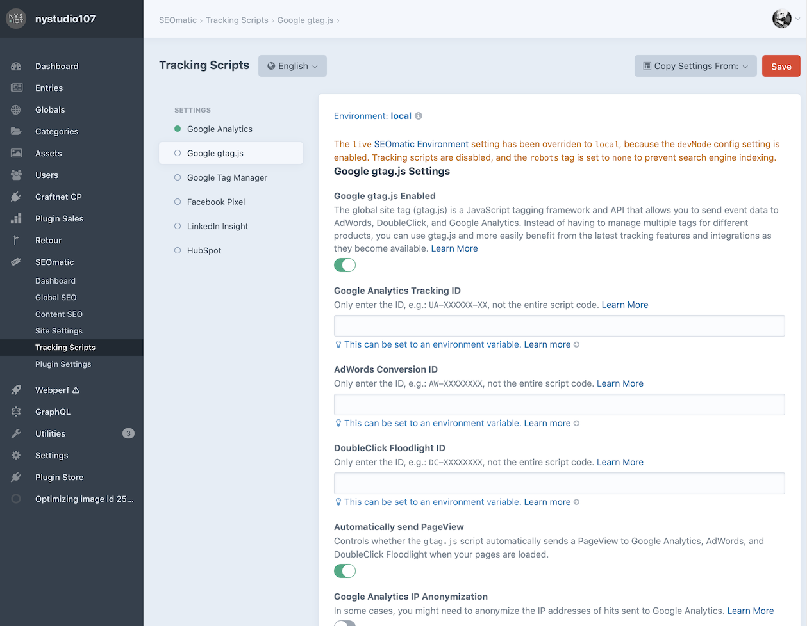

The global site tag (gtag.js) is a JavaScript tagging framework and API that allows you to send event data to AdWords, DoubleClick, and Google Analytics. Instead of having to manage multiple tags for different products, you can use gtag.js and more easily benefit from the latest tracking features and integrations as they become available. [Learn More](https://developers.google.com/gtagjs/)

If you want to include the gtag script despite `devMode` being enabled, you can do:

```twig

```

### Google Tag Manager

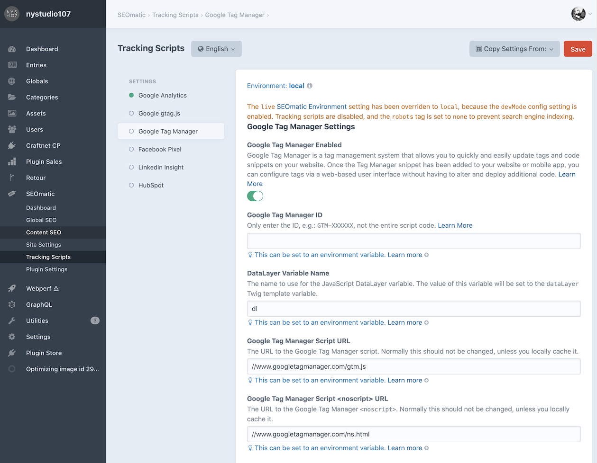

Google Tag Manager is a tag management system that allows you to quickly and easily update tags and code snippets on your website. Once the Tag Manager snippet has been added to your website or mobile app, you can configure tags via a web-based user interface without having to alter and deploy additional code. [Learn More](https://support.google.com/tagmanager/answer/6102821?hl=en)

You can set the `dataLayer` passed in to Google Tag Manager via Twig:

```twig

```

If you want to include the Google Tag Manager script despite `devMode` being enabled, you can do:

```twig

```

### Facebook Pixel

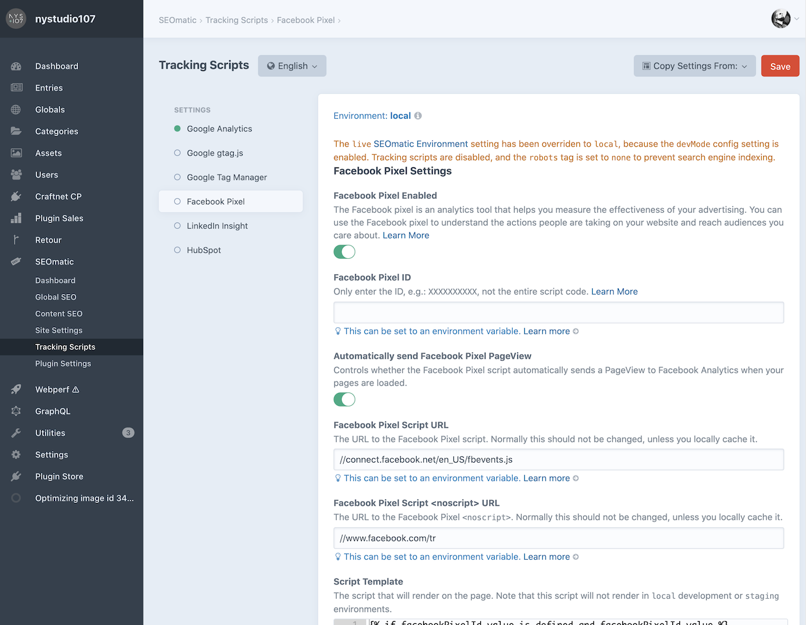

The Facebook pixel is an analytics tool that helps you measure the effectiveness of your advertising. You can use the Facebook pixel to understand the actions people are taking on your website and reach audiences you care about. [Learn More](https://www.facebook.com/business/help/651294705016616)

If you want to include the Facebook Pixel script despite `devMode` being enabled, you can do:

```twig

```

### Plugin Settings


The Plugin Settings lets you control various SEOmatic settings globally (across all sites/languages).

* **Plugin name** - This is the name that will be used for the plugin everywhere it is referenced in the Control Panel GUI
* **Automatic Render Enabled** - Controls whether SEOmatic will automatically render metadata on your pages. If you turn this off, you will need to manually render the metadata via `seomatic.tag.render()`, `seomatic.link.render()`, etc. You can selectively disable rendering via Twig with `
* **Sitemaps Enabled** - Controls whether SEOmatic will automatically render frontend sitemaps for your website.
* **HTTP Headers Enabled** - Controls whether SEOmatic will automatically add `X-Robots-Tag`, `canonical`, & `Referrer-Policy` to the http response headers.
* **Environment** - The server environment, either `live`, `staging`, or `local`. If `devMode` is on, SEOmatic will override this setting to local Development. This setting controls whether certain things render; for instance only in the `live` production environment will Google Analytics and other tracking tags send analytics data. SEOmatic also automatically sets the `robots` tag to `none` for everything but the `live` production environment.
* **Display Sidebar SEO Preview** - Controls whether to display the Google, Twitter, and Facebook social media previews in the sidebar on entry. category, and product pages.
* **Sidebar SEO Preview Sites** - The social media platforms that should be displayed in the SEO Preview sidebar
* **devMode `<title>` prefix** - If devMode is on, prefix the `<title>` with this string
* **Control Panel `<title>` prefix** - Prefix the Control Panel `<title>` with this string
* **devMode Control Panel `<title>` prefix** - If devMode is on, prefix the Control Panel `<title>` with this string
* **Separator Character** - The separator character to use for the `<title>` tag
* **Max SEO Title Length** - The max number of characters in the `<title>` tag; anything beyond this will be truncated on word boundaries
* **Max SEO Description Length** - The max number of characters in the `meta description` tag
* **Site Groups define logically separate sites** - If you are using Site Groups to logically separate 'sister sites', turn this on.
* **Add `hreflang` Tags** - Controls whether SEOmatic will automatically add `hreflang` and `og:locale:alternate` tags.
* **Generator Enabled** - Controls whether SEOmatic will include the meta `generator` tag and `X-Powered-By` header

#### Multi-Environment Config Settings

SEOmatic does different things depending on the SEOmatic environment it is running in. This is a separate setting from your Craft environment, because you can name those anything you like.

SEOmatic needs some way to map what you call your local, staging, and production environments to a normalized representation.

In `local` dev and `staging` environments, the following things change:

1. `<meta name="robots">` tags are rendered with `none` to prevent Google from indexing the pages
2. The `robots.txt` page is rendered to disallow all indexing
3. No scripts are loaded on the page, to prevent errant data being sent to endpoints

You can override all of these things as you see fit, but they are automatically changed in this manner to help protect you from having pages indexed or sending data from environments where you should not.

If you're using a multi-environment config, you can map your environment settings using SEOmatic's `config.php` something like this:

```php
<?php 
return [
    // The public-facing name of the plugin
    'pluginName' => 'SEOmatic',

    // Should SEOmatic render metadata?
    'renderEnabled' => true,

    // Should SEOmatic render frontend sitemaps?
    'sitemapsEnabled' => true,

    // Should sitemaps be regenerated automatically?
    'regenerateSitemapsAutomatically' => true,

    // Should SEOmatic add to the http response headers?
    'headersEnabled' => true,

    // The server environment, either `live`, `staging`, or `local`
    'environment' => 'live',

    // Should SEOmatic display the SEO Preview sidebar?
    'displayPreviewSidebar' => true,

    // Should SEOmatic add a Social Media Preview Target?
    'socialMediaPreviewTarget' => true,

    // The social media platforms that should be displayed in the SEO Preview sidebar
    'sidebarDisplayPreviewTypes' => [
        'google',
        'twitter',
        'facebook'
    ],

    // Should SEOmatic display the SEO Analysis sidebar?
    'displayAnalysisSidebar' => true,

    // If `devMode` is on, prefix the <title> with this string
    'devModeTitlePrefix' => '&#x1f6a7; ',

     //  Prefix the Control Panel <title> with this string
    'cpTitlePrefix' => '&#x2699; ',

    // If `devMode` is on, prefix the Control Panel <title> with this string
    'devModeCpTitlePrefix' => '&#x1f6a7;&#x2699; ',

    // The separator character to use for the `<title>` tag
    'separatorChar' => '|',

    // The max number of characters in the `<title>` tag
    'maxTitleLength' => 70,

    // The max number of characters in the `<meta name="description">` tag
    'maxDescriptionLength' => 155,

    // Site Groups define logically separate sites
    'siteGroupsSeparate' => true,

    // Whether to dynamically include the hreflang tags
    'addHrefLang' => true,

    // Should the meta generator tag and X-Powered-By header be included?
    'generatorEnabled' => true,

    // SeoElementInterface[] The default SeoElement type classes
    'defaultSeoElementTypes' => [
    ],
];
```
Just copy the `config.php` to your Craft `config/` directory as `seomatic.php` and you can configure the settings in a multi-environment friendly way. See the [Craft Environments](https://docs.craftcms.com/v3/config/environments.html#config-files) page for details, and **N.B.:**

> The `'*'` key is required here so Craft knows to treat it as a multi-environment key, but the other keys are up to you

This is how you can make your multi-environment nomenclature to SEOmatic's. This works exactly like Craft's [multi-environment config](https://docs.craftcms.com/v3/configuration.html#application-config) files such as `general.php` and `db.php`. See SEOmatic's `config.php` for details.

## Access Permissions

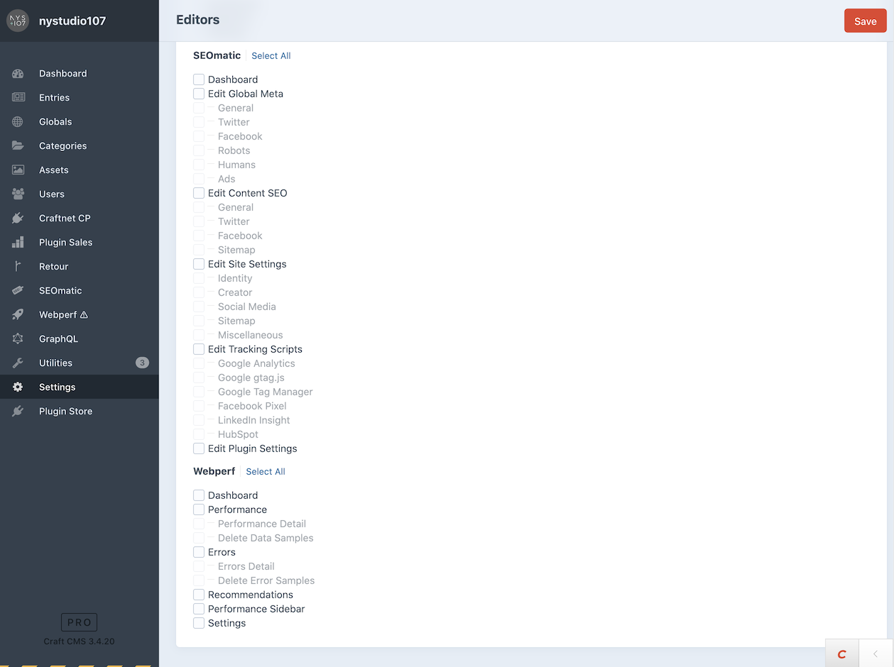

SEOmatic allows you to restrict access to various parts of the plugin based on User Group Permissions:

* Dashboard
* Edit Global Meta
  * General
  * Twitter
  * Facebook
  * Robots
  * Humans
  * Ads
* Edit Content SEO
  * General
  * Twitter
  * Facebook
  * Sitemap
* Edit Site Settings
  * Identity
  * Creator
  * Social Media
  * Miscellaneous
* Edit Tracking Scripts
  * Google Analytics
  * Google gtag.js
  * Google Tag Manager
  * Facebook Pixel
* Edit Plugin Settings

Brought to you by [nystudio107](https://nystudio107.com/)
