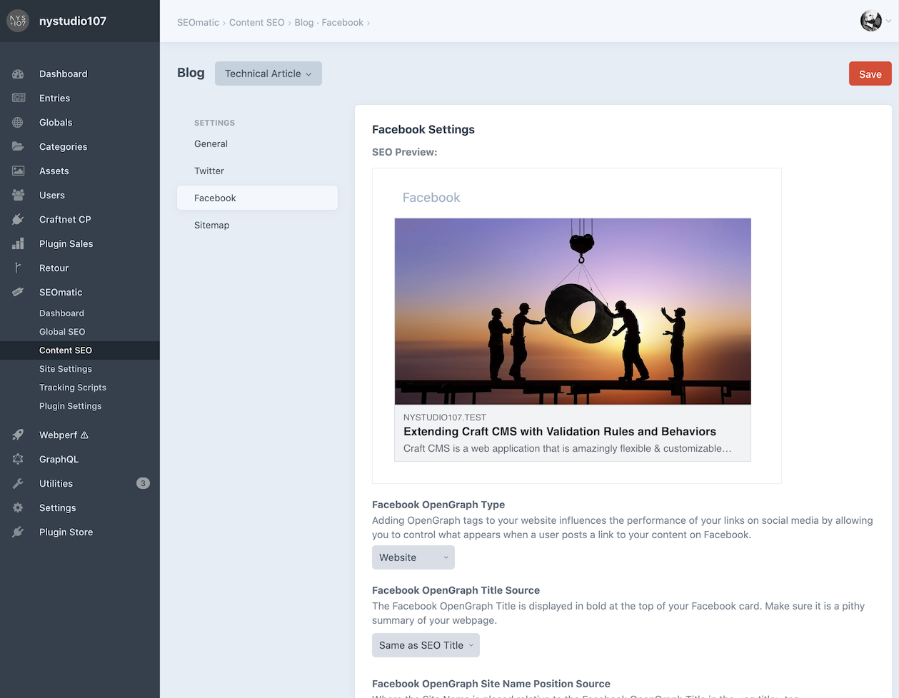

# Content SEO

Content SEO is where you can configure each Section, Category Group and Commerce Product Type that has public URLs.

A list of these content types includes status indicators identifying what’s been configured for each one:


SEOmatic allows you to have different Content SEO settings on both a per-site and per-[Entry Type](https://craftcms.com/docs/5.x/entries.html#entry-types) basis.

Click the name of any listed item to edit its settings.

::: tip Settings are unique for each type!
Unlike the previous [Global SEO](./global-seo.md) section, the settings below each correspond with a specific Content SEO section or entry type you’ve chosen.
:::

## General Settings


This is where you can set up the fields from which SEOmatic extracts the **SEO Title**, **SEO Description**, and **SEO Image**. These per-section Content SEO settings, when they have values, will override the Global SEO general settings.

## Twitter Settings


By default, Twitter settings will mirror what you set in the **General** section, but you can customize them to your heart’s content.

## Facebook Settings



Facebook settings will also mirror what you set in the **General** section, but you can customize them here.

## Sitemap Settings


SEOmatic automatically creates a sitemap index for each of your Site Groups. This sitemap index points to individual sitemaps for each of your Sections, Category Groups, and Commerce Product Types.

Instead of one massive sitemap that must be updated any time anything changes, only the sitemap for the Section, Category Group, or Commerce Product Type will be updated when something changes in it.

SEOmatic can automatically include files such as `.pdf`, `.xls`, `.doc` and other indexable file types in Asset fields or Asset fields in matrix or Neo blocks.

In addition, SEOmatic can automatically create [Image sitemaps](https://support.google.com/webmasters/answer/178636?hl=en) and [Video sitemaps](https://developers.google.com/webmasters/videosearch/sitemaps) from images & videos in Asset fields or Asset fields in matrix or Neo blocks.

Sitemap Indexes are automatically submitted to search engines whenever a new Section, Category Group, or Commerce Product Type is added.

Section Sitemaps are automatically submitted to search engines whenever a new Element in that Section, Category Group, or Commerce Product Type is added.

### Sitemap Generation

Because XML sitemaps can be time-intensive to generate with a growing number of entries, SEOmatic creates your sitemaps via a queue job and caches the result. The cache is automatically broken whenever something in that sitemap is changed, and a new queue job is created to regenerate it.

If `runQueueAutomatically` is set to `false` in [General Config Settings](https://craftcms.com/docs/5.x/config/general.html#runqueueautomatically) the Queue job to create the sitemap will not be run during the http request for the sitemap. You’ll need to run it manually via whatever means you use to run the Queue.

Normally SEOmatic will regenerate the sitemap for a Section, Category Group, or Product any time you save an element. However, if you are importing a large number of elements, or prefer to regenerate the sitemap manually you can set disable the **Regenerate Sitemaps Automatically** option in SEOmatic’s Plugin Settings.


You can then regenerate the sitemap via CLI. This will regenerate all sitemaps:

```bash
./craft seomatic/sitemap/generate
```

You can also limit it to a specific Section, Category Group, or Product handle:

```bash
./craft seomatic/sitemap/generate --handle=blog
```

...or you can regenerate all sitemaps for a specific `siteId`:

```bash
./craft seomatic/sitemap/generate --siteId=1
```

...or both:

```bash
./craft seomatic/sitemap/generate --handle=blog --siteId=1
```

::: tip Manually Updating Sitemaps
If you disable **Regenerate Sitemaps Automatically**, sitemaps can _only_ be updated via CLI command, or by clearing SEOmatic’s sitemap caches via **Utilities** → **Clear Caches**.
:::

### Additional Sitemaps

If you have custom sitemaps that are not in the CMS, you can manually add them to their own Sitemap Index via **Site Settings** → **Sitemap**.

You can also add to it via plugin:

```php
use nystudio107\seomatic\events\RegisterSitemapsEvent;
use nystudio107\seomatic\models\SitemapIndexTemplate;
use yii\base\Event;

Event::on(
    SitemapIndexTemplate::class,
    SitemapIndexTemplate::EVENT_REGISTER_SITEMAPS,
    function(RegisterSitemapsEvent $event) {
        $event->sitemaps[] = [
            'loc' => $url,
            'lastmod' => $lastMod,
        ];
    }
);
```

### Additional Sitemap URLs

If you have custom URLs that are not in the CMS, you can manually add them to their own Sitemap Index via **Site Settings** → **Sitemap**.

You can also add to it via a plugin:

```php
use nystudio107\seomatic\events\RegisterSitemapUrlsEvent;
use nystudio107\seomatic\models\SitemapCustomTemplate;
use yii\base\Event;

Event::on(
    SitemapCustomTemplate::class,
    SitemapCustomTemplate::EVENT_REGISTER_SITEMAP_URLS,
    function(RegisterSitemapUrlsEvent $event) {
        $event->sitemaps[] = [
            'loc' => $url,
            'changefreq' => $changeFreq,
            'priority' => $priority,
            'lastmod' => $lastMod,
        ];
    }
);
```
