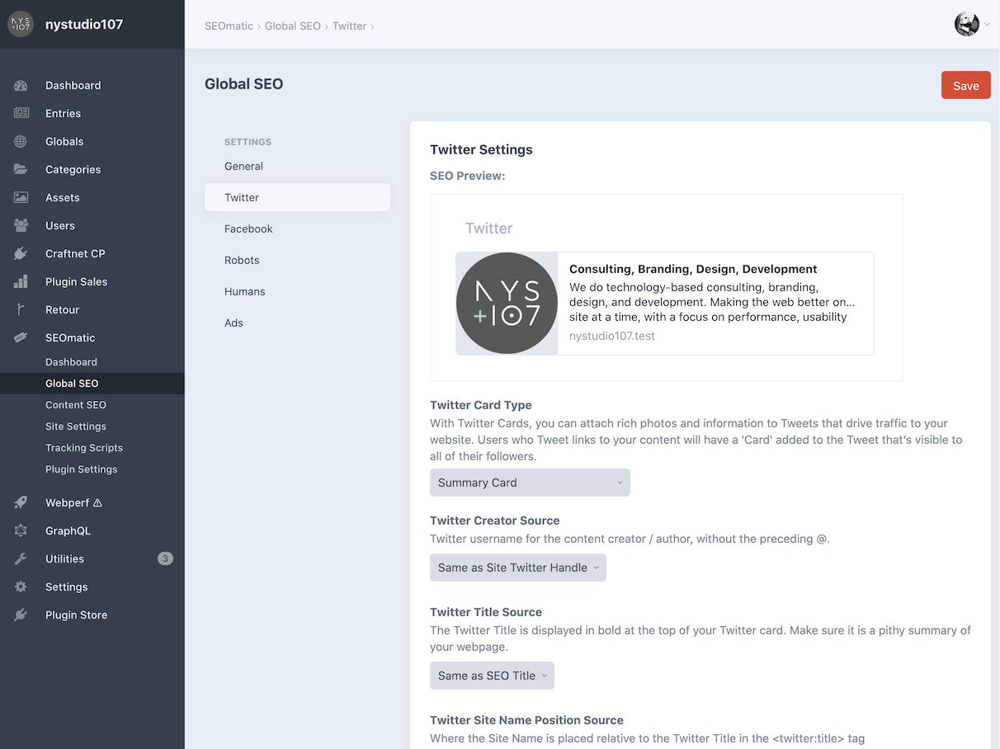
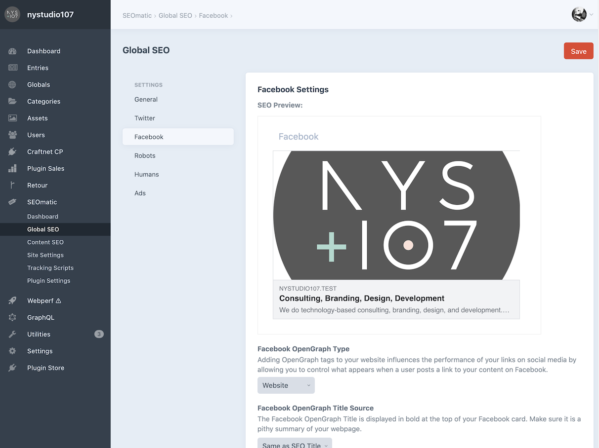
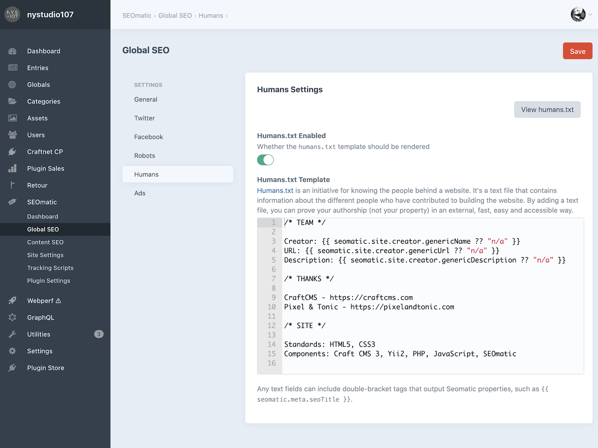
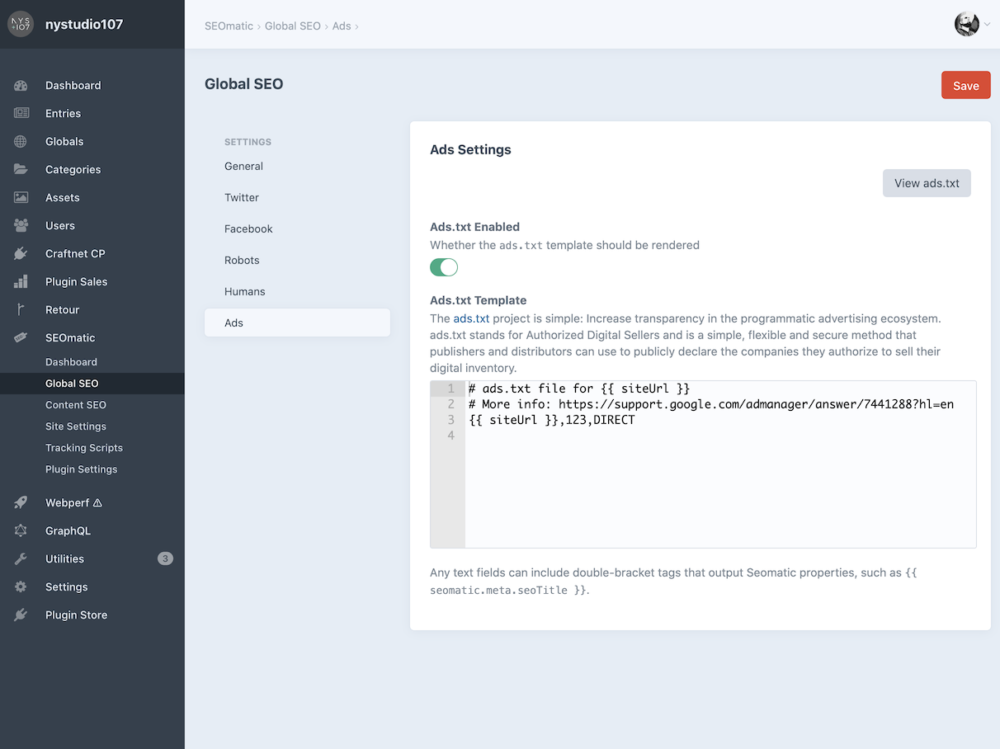

# Global SEO

Global SEO is where you set default site-wide settings, on a per-site basis.

The **Copy Settings From:** dropdown lets you copy settings from one site to another.

## General Settings


Because meta information should reflect your content, you’ll want designate the fields that SEOmatic extracts the **SEO Title**, **SEO Description**, and **SEO Image** from.

## Twitter Settings



By default, the Twitter settings will mirror what you set in the [General section](#general-settings), but you can customize them to your heart’s content.

## Facebook Settings



Like the Twitter settings, Facebook settings will also mirror whatever you’ve set in the [General section](#general-settings), but you can further customize them here.

## Robots Settings


A `robots.txt` file at the root of your site tells search engine crawlers what they’re allowed to access.

The file uses the [Robots Exclusion Standard](http://www.robotstxt.org/robotstxt.html), which is a protocol with a small set of commands that can be used to indicate access to your site by section and by specific kinds of web crawlers (such as mobile crawlers vs desktop crawlers).

You shouldn’t need to edit the default **Robots.txt Template** setting, but you can if you like. Click **View robots.txt** to see how `robots.txt` is rendered by the template.

### Troubleshooting

Two things could prevent SEOmatic from automatically handling `/robots.txt` requests:

1. An actual `robots.txt` file in your `web/` folder, which will take precedence.
2. An nginx directive that prevents Craft CMS from handling the `robots.txt` URL.

If you’re running nginx, make sure that you _don’t_ have a line like this in your config file:

```nginx
location = /robots.txt { access_log off; log_not_found off; }
```

A directive like this will prevent SEOmatic from being able to service the request for `/robots.txt`. If you do have a line like this in your config file, comment it out and restart nginx by running `sudo nginx -s reload`.

### Humans Settings



[Humans.txt](http://humanstxt.org/) is an initiative for including a text file identifying a site’s creators. By adding a text file, you can prove your authorship (not your property) in an external, fast, easy and accessible way.

Edit the default **Humans.txt Template** to your heart’s content. Click **View humans.txt** to view the rendered `humans.txt` output.

## Ads Settings



The [ads.txt](https://web.archive.org/web/20231230052053/https://iabtechlab.com/ads-txt/) project aims to increase transparency in the programmatic advertising ecosystem. “Ads.txt” stands for Authorized Digital Sellers and is a simple, flexible and secure method that publishers and distributors can use to publicly declare the companies they authorize to sell their digital inventory.

Edit the **Ads.txt Template** as needed and click **View ads.txt** to view the rendered output.

## Security Settings

The [security.txt](https://securitytxt.org/) defines a standard to help organizations define the process for security researchers to disclose security vulnerabilities securely.

Edit the default **Security.txt Template** as needed and click **View security.txt** to view the rendered `security.txt` output.
