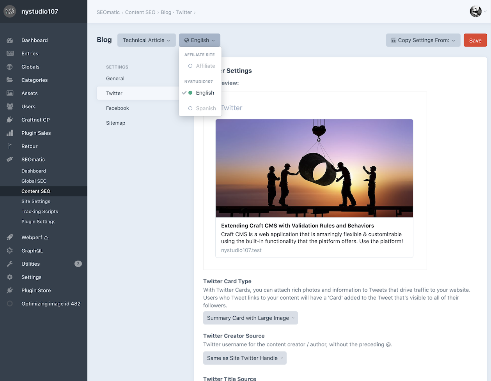

# Configuring SEOmatic

SEOmatic gets working as soon as you install it, but it needs to be configured for your site to be truly useful.

This section covers [what SEOmatic does automatically](#automatic-behavior) and common [text field features](#control-panel-settings-fields), then walks through each of the SEOmatic settings sections.

## Automatic Behavior

As soon as you install SEOmatic, it automatically will render metadata on your web pages, and create sitemaps for all of your Sections, Category Groups, and Commerce Product Types that have public URLs. You don’t need to add any template code for this to happen.



All of SEOmatic’s settings are multi-site aware, allowing you to have different settings for each site/language combination.

::: tip Check Your Multi-Environment Settings
Make sure you’ve set up your [Multi-Environment Config Settings](#multi-environment-config-settings) properly if you’re using SEOmatic in multiple environments.
:::

## Control Panel Settings Fields

While you may not normally need to take advantage of it, SEOmatic’s text input fields for the [Global SEO](#global-seo) and [Content SEO](#content-seo) settings have bonus perks:

- They’re parsed as Twig object templates, so you can use single- and double-bracket Twig expressions in them along with plain old text.
- They’re parsed for aliases and [environment variables](https://docs.craftcms.com/v3/config/environments.html#control-panel-settings).
- They have access to SEOmatic’s global variables.

#### Examples

This outputs the contents of the **companyInfo** field from the **siteInfo** global:

```twig
{{ siteInfo.companyInfo }}
```

This outputs the contents of the **description** field from the current entry, which would be relevant to a [Content SEO](#content-seo) setting:

```twig
{{ entry.description }}
```

This complex expression uses SEOmatic’s [empty coalesce operator](#seomatics--empty-coalesce-operator) (`???`) to output the first global field that isn’t empty, or fallback text:

```twig
{{ siteInfo.companyInfo ??? siteInfo.companyText ??? "Some default text" }}
```

You could do the exact same thing with the `entry` variable when that’s available:

```twig
{{ entry.description ??? entry.summary ??? "Some default text" }}
```

You can access SEOmatic global variables using Twig’s usual double-bracket syntax:

```twig
{{ seomatic.meta.seoTitle }}
```

Single-bracket syntax is available for compatibility with previous SEOmatic versions:

```twig
{seomatic.meta.seoTitle}
```
