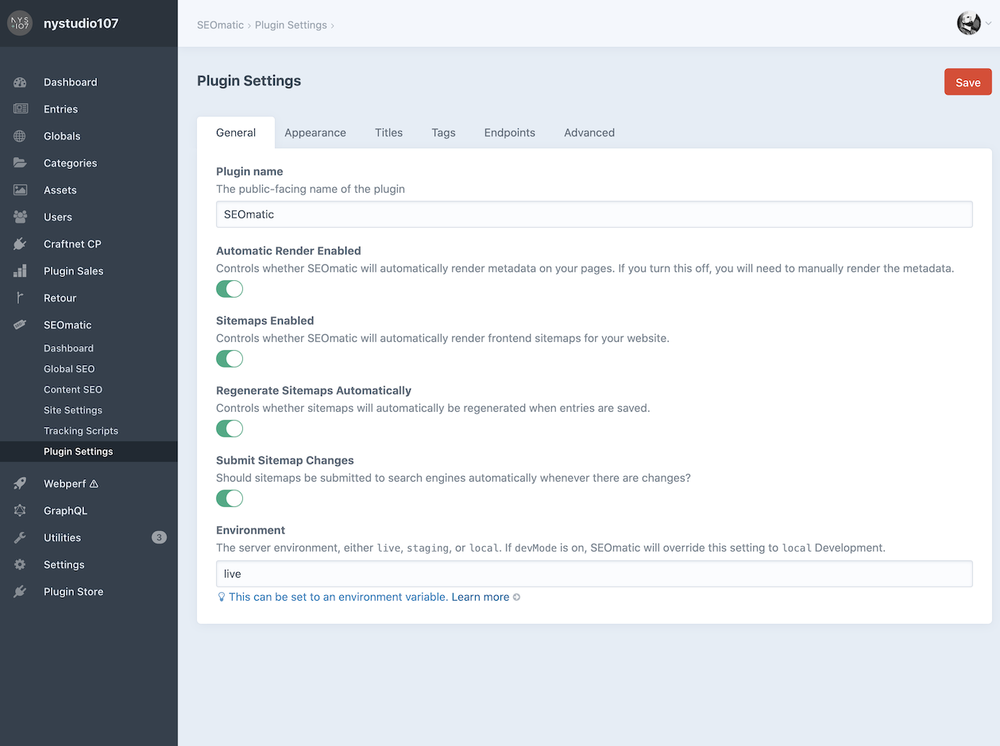

# Plugin Settings

Plugin Settings let you control various SEOmatic settings across all sites/languages.

## General Plugin Settings

* **Plugin name** – The name used for the plugin throughout the control panel.
* **Automatic Render Enabled** – Controls whether SEOmatic automatically renders metadata on your pages. If you turn this off, you will need to manually render the metadata via `seomatic.tag.render()`, `seomatic.link.render()`, etc. Selectively disable rendering via Twig with ``.
* **Sitemaps Enabled** – Controls whether SEOmatic will automatically render front-end sitemaps for your site.
* **Regenerate Sitemaps Automatically** – Controls whether sitemaps will automatically be regenerated when entries are saved.
* **Submit Sitemap Changes** – Should sitemaps be submitted to search engines automatically whenever there are changes?
* **Include Homepage in Breadcrumbs** – Should the homepage be included in the generated Breadcrumbs JSON-LD?
* **Manually Set SEOmatic Environment** – If off, SEOmatic will automatically attempt to determine the current environment. Turn this on to manually set the environment.
* **Environment** – The server environment, either `live`, `staging`, or `local`. If `devMode` is on, SEOmatic will override this setting to local Development. This setting controls whether certain things render; for instance only in the `live` production environment will Google Analytics and other tracking tags send analytics data. SEOmatic also automatically sets the `robots` tag to `none` for everything but the `live` production environment.

## Appearance Plugin Settings

* **Display Sidebar SEO Preview** – Controls whether to display the Google, Twitter, and Facebook social media previews in the sidebar on entry. Category, and product pages.
* **Add Social Media Preview Target** – Controls whether to add the Google, Twitter, Facebook, etc. social media previews as a Preview Target.
* **SEO Preview Sites** – Social media platforms that should be displayed in the SEO Preview.

## Title Plugin Settings

* **devMode `<title>` prefix** – If devMode is on, prefix the `<title>` with this string.
* **Control Panel `<title>` prefix** – Prefix the Control Panel `<title>` with this string.
* **devMode Control Panel `<title>` prefix** – If devMode is on, prefix the Control Panel `<title>` with this string.
* **Separator Character** – The separator character to use for the `<title>` tag.
* **Max SEO Title Length** – The max number of characters in the `<title>` tag; anything beyond this will be truncated on word boundaries.
* **Max SEO Description Length** – The max number of characters in the `meta description` tag.
* **Truncate Title Tags** – Should Title tags be truncated at the max length, on word boundaries?
* **Truncate Description Tags** – Should Description tags be truncated at the max length, on word boundaries?

## Tags Plugin Settings

* **Add `hreflang` Tags** – Controls whether SEOmatic will automatically add `hreflang` and `og:locale:alternate` tags.
* **Include `x-default` hreflang Tag** – Controls whether SEOmatic will automatically include an x-default hreflang tag.
* **Include Paginated `hreflang` Tags** – Controls whether SEOmatic will automatically include hreflang tags on paginated pages
* **Generator Enabled** – Controls whether SEOmatic will include the meta `generator` tag and `X-Powered-By` header
* **HTTP Headers Enabled** – Controls whether SEOmatic will automatically add `X-Robots-Tag`, `canonical`, & `Referrer-Policy` to the http response headers.
* **Nonces for `<script>` tags** – Whether SEOmatic should automatically add script-src [Content Security Policy](https://developer.mozilla.org/en-US/docs/Web/HTTP/Headers/Content-Security-Policy/script-src) (CSP) nonces to `<script>` tags (including JSON-LD).
* **Fixed `script-src` Content Security Policies** – Fixed [Content Security Policy](https://developer.mozilla.org/en-US/docs/Web/HTTP/Headers/Content-Security-Policy/script-src) (CSP) script-src policies that should be added before the Nonces.

## Endpoints Plugin Settings

* **Meta Container Endpoint Access** – Whether anonymous access to the Meta Container endpoint should be allowed.
* **JSON-LD Endpoint Access** – Whether anonymous access to the JSON-LD endpoint should be allowed.

## Advanced Plugin Settings

* **Site Groups define logically separate sites** – If you are using Site Groups to logically separate 'sister sites’, turn this on.
* **Lowercase Canonical URL** – Should the Canonical URL be automatically lower-cased?
* **Site URL Override** – SEOmatic uses the Craft siteUrl to generate the external URLs. If you are using it in a non-standard environment, such as a headless GraphQL or ElementAPI server, you can override what it uses for the `siteUrl`.
* **Meta Cache Duration** – The duration of the SEOmatic meta cache. The default Unlimited setting is typically desired, as SEOmatic will break the cache as needed. If devMode is on, caches last 30 seconds.

