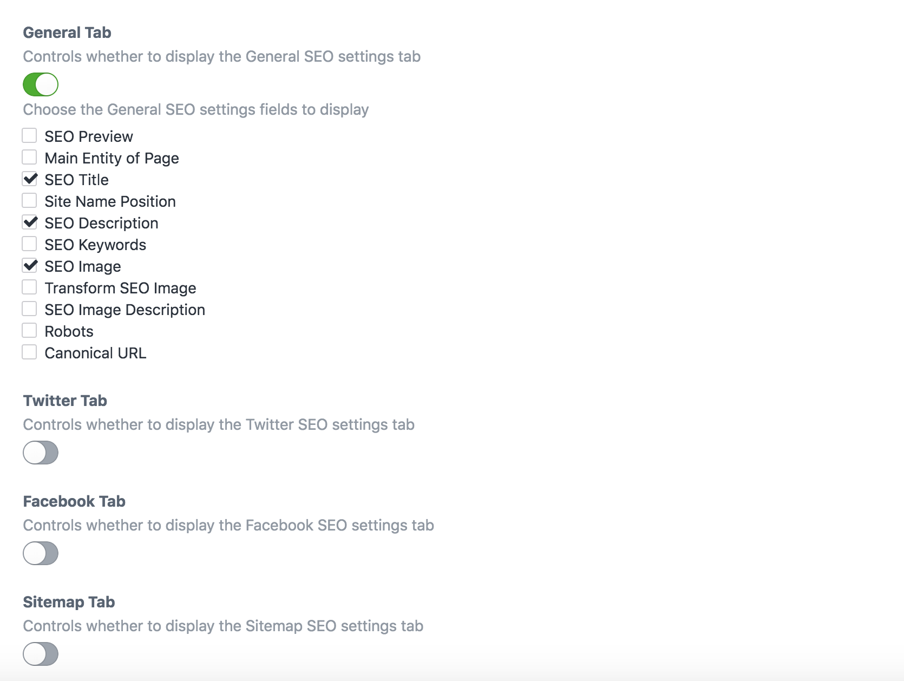

# SEOmatic Fields

## SEO Settings Field

SEOmatic has an SEO Settings Field that you can add to your Field Layouts. For most sites, the Field is not needed; instead set up the fields to pull from in the Content SEO settings for each Section.

Modern SEO works best if it actually reflects what is on the page, visible to the user, so pulling from your page’s content will work well in most cases.

### Using SEO Settings Fields

However, in some cases you may want more control over page SEO for specific entries. That’s where the SEO Settings field comes in. Add it to your Section’s Field Layout, and you can override specific SEO settings on a per-entry basis.

When a new entry is created with an SEO Settings field in it, the field values will default to the Content SEO settings for the Section that the field is in. Any setting that you leave blank or empty in the SEO Settings field will just default to the Content SEO and/or Global SEO setting.

The Field settings let you control exactly what fields will appear and be visible for you or your client to override:



By default, just a few sensible settings are made visible in the Field:


Any setting left blank will just fall back on the Content SEO settings for that Section, so you can use the Field only for the exceptional cases.

You can enable every possible field to be displayed in the SEO Settings field if you like:


But it’s probably best to limit it to just the things that you or your client might want to change on a per-entry basis.

If you enable an SEO Settings field in an Element Index’s Table Columns, you’ll see an SEO preview there as well:


You can control whether the preview will be from Google, Facebook, or Twitter in the Field Settings.


### Template Access

To access your SEOmatic field’s data directly in a template, you can do so via:

```twig
{{ entry.mySeoSettingsField.metaGlobalVars.seoTitle }}
```

All of the variables listed in the [General Variables](#general-variables) can be accessed in this manner.

There may be occasions where you want to output the final parsed value of an SEOmatic variable on the frontend. You can do that via `entry.mySeoSettingsField.metaGlobalVars.parsedValue()`. For example:

```twig
{{ entry.mySeoSettingsField.metaGlobalVars.parsedValue('seoDescription') }}
```

This will output the final parsed value of the `entry.mySeoSettingsField.metaGlobalVars.seoDescription` variable.

This parsing is done automatically by SEOmatic just before the meta information is added to your page.

Brought to you by [nystudio107](https://nystudio107.com/)
